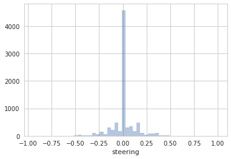
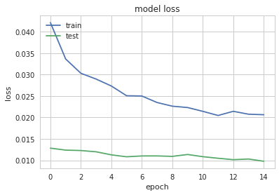
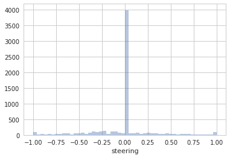
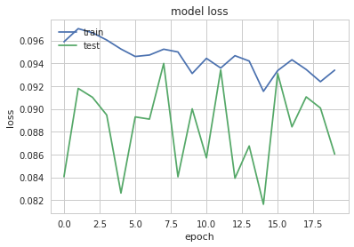

### In my opinion this project truly highlights the importance of choosing proper training data as the model is very sensitive to the training data choice.  

     In the begining I spent trying simple models with the data set provided by Udacity. I incorporated, left and right images , changing brigtness and flipping images using training generator as told in lectures but car always seems to go out of road after crossing the bridge.  
     
    In 2nd part i tried Nvidia model with the udacity data. Model is taking too much time so i added max pooling layer in Nvida model to do faster training but still car is going off road after crosing bridge. Model is able to run quite well in straight road with not so sharp turn but it fails to perform well for sharp turns. 
    
    To solve above issue i collected data using simulator for sharp turns and as well as training data from mountain track. In training data i changed logic to add images which as steering angle more than 2 so that model should be able to learn important turns etc.  
    
    Also during final testing i observed car has velocity set to 9 but i was collecting simulator data at max speed around 30 . despite model is not learning steering angle with speed but i feeel it is important at what speed simulator data is collected as at higher speed less steering angle is sufficient at sharp turns while at slow speed higher steering angle is required at low speed. So itried collecting above data at speed 9 .    


```python
## Imports
import glob
import os
from PIL import Image
import csv
import numpy as np
import cv2
import random
import pandas as pd
from pandas import DataFrame
import matplotlib.pyplot as plt
import matplotlib.image as mpimg
from pathlib import Path

## Link to Udacity's sample data
paths = "data/"
os.chdir(r"data/data")
%matplotlib inline
```


```python

## Link to my collected  data
path_mydata = "data/"
cwd = os.getcwd()
print(cwd)
#Check size of images
new_path = os.path.join(cwd, "IMG/", "*.jpg")
print(new_path)
for infile in glob.glob(new_path)[:2]:
    im = Image.open(infile)
    print(im.size, im.mode)
```

    /home/ashutosh/Development/udacity/Behavioral-Cloning/data/data
    /home/ashutosh/Development/udacity/Behavioral-Cloning/data/data/IMG/*.jpg
    (320, 160) RGB
    (320, 160) RGB


```python

# Import as a dataframe and plot steering
df = pd.read_csv('driving_log.csv', header=0)
df.columns = ["center_image", "left_image", "right_image", "steering", "throttle", "break", "speed"]
df.drop(['throttle', 'break', 'speed'], axis = 1, inplace = True)

```


```python

import seaborn as sns
sns.set(style="whitegrid", color_codes=True)
sns.distplot(df['steering'], kde = False)


```


    <matplotlib.axes._subplots.AxesSubplot at 0x7f0a671617b8>





Characteristics of the data:
* All images are 320x160 pixels
* The data is heavily skewed to zero steering as shown below:


```python
print(len(df))
```

    8036


```python
dftoList=df.values.tolist()
```


```python
# Break into training and validation samples
from sklearn.model_selection import train_test_split
train_samples, validation_samples = train_test_split(dftoList, test_size=0.20)
```


```python

print(len(train_samples), len(validation_samples))
batch_size = 128
```

    6428 1608


#### We built training and validation generator using left , right and straight images. Also added random brightness and flipped images to have equal data for left as well as right steering data . Also most of the time car is going straight so i added logic that in every batch to model training add 50% images having angle less tha 2 and rest traing data having steering angle more than 2.


```python
# Start with train generator shared in the class and add image augmentations
def train_generator(samples, batch_size=batch_size):
    num_samples = len(samples)
    print(num_samples)
    while 1: # Loop forever so the generator never terminates
        from sklearn.utils import shuffle
        shuffle(samples)
        for offset in range(0, num_samples, batch_size):
            batch_samples = samples[offset:offset+batch_size]
            straight_count=0
            images = []
            angles = []
            #print(batch_samples[0])
            # Read center, left and right images from a folder containing Udacity data and my data
            for sample_index,batch_sample in enumerate(batch_samples):
                cwd = os.getcwd()
                #print(cwd)
                #print(batch_sample)
                
                #print(batch_sample)
                center_angle = float(batch_sample[3])                
                # Limit angles of less than absolute value of .1 to no more than 1/2 of data
                # to reduce bias of car driving straight
                if abs(center_angle) < .1:
                    straight_count += 1
                if straight_count > (batch_size * .5):
                    while abs(batch_samples[sample_index][3]) < .1:
                        sample_index = random.randrange(len(batch_samples))
                    
                    batch_sample=batch_samples[sample_index]
                    
                center_name = cwd+'/'+batch_sample[0].strip()#.split('/')[-1]
                if Path(center_name).exists():
                    center_image = cv2.imread(center_name)
                else:
                    print("not Found:-"+str(center_name))
                    continue
                #print(center_image.shape)
                #center_image = cv2.cvtColor(center_image, cv2.COLOR_BGR2RGB)
                
                left_name = cwd+'/'+batch_sample[1].strip()#.split('/')[-1]
                if Path(left_name).exists():
                    left_image = cv2.imread(left_name)
                else:
                    print("not Found:-"+str(left_name))
                    continue
                #left_image = cv2.cvtColor(left_image, cv2.COLOR_BGR2RGB)
                
                right_name = cwd+'/'+batch_sample[2].strip()#.split('/')[-1]
                if Path(right_name).exists():
                    right_image = cv2.imread(right_name)
                else:
                    print("not Found:-"+str(batch_sample))
                    continue
                #right_image = cv2.cvtColor(right_image, cv2.COLOR_BGR2RGB)


                
                # Apply correction for left and right steering
                correction = 0.20
                left_angle = center_angle + correction
                right_angle = center_angle - correction

                # Randomly include either center, left or right image
                num = random.random()
                #print(num)
                if num <= 0.33:
                    select_image = center_image
                    select_angle = center_angle
                    images.append(select_image)
                    angles.append(select_angle)
                elif num>0.33 and num<=0.66:
                    select_image = left_image
                    select_angle = left_angle
                    images.append(select_image)
                    angles.append(select_angle)
                    #print(select_image)
                else:
                    select_image = right_image
                    select_angle = right_angle
                    images.append(select_image)
                    angles.append(select_angle)
                    #print(select_image)

                # Randomly horizontally flip selected images with 80% probability
                keep_prob = random.random()
                if keep_prob >0.20:
                    #print(select_image)
                    flip_image = np.fliplr(select_image)
                    flip_angle = -1*select_angle
                    images.append(flip_image)
                    angles.append(flip_angle)

                # Augment with images of different brightness
                # Randomly select a percent change
                change_pct = random.uniform(0.4, 1.2)

                # Change to HSV to change the brightness V
                hsv = cv2.cvtColor(select_image, cv2.COLOR_RGB2HSV)

                hsv[:, :, 2] = hsv[:, :, 2] * change_pct
                # Convert back to RGB and append

                bright_img = cv2.cvtColor(hsv, cv2.COLOR_HSV2RGB)
                images.append(bright_img)
                angles.append(select_angle)

                ## Randomly shear image with 80% probability
                shear_prob = random.random()
                if shear_prob >=0.20:
                    shear_range = 40
                    rows, cols, ch = select_image.shape
                    dx = np.random.randint(-shear_range, shear_range + 1)
                    #    print('dx',dx)
                    random_point = [cols / 2 + dx, rows / 2]
                    pts1 = np.float32([[0, rows], [cols, rows], [cols / 2, rows / 2]])
                    pts2 = np.float32([[0, rows], [cols, rows], random_point])
                    dsteering = dx / (rows / 2) * 360 / (2 * np.pi * 25.0) / 10.0
                    M = cv2.getAffineTransform(pts1, pts2)
                    shear_image = cv2.warpAffine(center_image, M, (cols, rows), borderMode=1)
                    shear_angle = select_angle + dsteering
                    images.append(shear_image)
                    angles.append(shear_angle)

            # trim image to only see section with road
            X_train = np.array(images)
            y_train = np.array(angles)
            print(X_train.shape)
            yield shuffle(X_train, y_train)

def valid_generator(samples, batch_size=batch_size):
        num_samples = len(samples)
        print(cwd)
        while 1:  # Loop forever so the generator never terminates
            from sklearn.utils import shuffle
            shuffle(samples)
            for offset in range(0, num_samples, batch_size):
                batch_samples = samples[offset:offset + batch_size]

                images = []
                angles = []
               
                #Validation generator only has center images and no augmentations
                for batch_sample in batch_samples:
                    
                    #print(batch_sample)
                    center_name = cwd+'/' + batch_sample[0].strip()#.split('/')[-1]
                    if Path(center_name).exists():
                        center_image = cv2.imread(center_name)
                    else:
                        print("not Found:-"+str(center_name))
                        continue
                    
                    #center_image = cv2.cvtColor(center_image, cv2.COLOR_BGR2RGB)

                    center_angle = float(batch_sample[3])

                    images.append(center_image)
                    angles.append(center_angle)

                X_train = np.array(images)
                y_train = np.array(angles)
                print(X_train.shape)
                yield shuffle(X_train, y_train)


```


```python
import tensorflow as tf
from keras.models import Sequential
from keras.layers import Dense, Dropout, Flatten, Lambda, ELU, Activation
from keras.layers.convolutional import Convolution2D, Cropping2D, ZeroPadding2D, MaxPooling2D
from keras.optimizers import SGD, Adam, RMSprop

```

    Using TensorFlow backend.


```python
def resize_normalize(image):
    import cv2
    from keras.backend import tf as ktf   
    
    # resize to width 200 and high 66 liek recommended
    # in the nvidia paper for the used CNN
    # image = cv2.resize(image, (66, 200)) #first try
    resized = ktf.image.resize_images(image, (64, 64))
    #normalize 0-1
    resized = resized/255.0 - 0.5

    return resized
```


```python

#Params
row, col, ch = 160, 320, 3
nb_classes = 1

```


```python

model = Sequential()
model.add(ZeroPadding2D((1, 1), input_shape=(row, col, ch)))
# Crop pixels from top and bottom of image
model.add(Cropping2D(cropping=((60, 20), (0, 0))))

# Resise data within the neural network
model.add(Lambda(resize_normalize))

# First convolution layer so the model can automatically figure out the best color space for the hypothesis
model.add(Convolution2D(3, 1, 1, border_mode='same', name='color_conv'))

# CNN model

model.add(Convolution2D(32, 3,3 ,border_mode='same', subsample=(2,2), name='conv1'))
model.add(Activation('relu'))
model.add(MaxPooling2D(pool_size=(2,2),strides=(1,1), name='pool1'))

model.add(Convolution2D(64, 3,3 ,border_mode='same',subsample=(2,2), name='conv2'))
model.add(Activation('relu',name='relu2'))
model.add(MaxPooling2D(pool_size=(2,2), name='pool2'))

model.add(Convolution2D(128, 3,3,border_mode='same',subsample=(1,1), name='conv3'))
model.add(Activation('relu'))
model.add(MaxPooling2D(pool_size= (2,2), name='pool3'))

model.add(Flatten())
model.add(Dropout(0.5))

model.add(Dense(128, name='dense1'))
model.add(Activation('relu'))
model.add(Dropout(0.5))

model.add(Dense(128, name='dense2'))

model.add(Dense(1,name='output'))

model.compile(optimizer=Adam(lr= 0.0001), loss="mse")

```


```python
print(model.summary())
```

    ____________________________________________________________________________________________________
    Layer (type)                     Output Shape          Param #     Connected to                     
    ====================================================================================================
    zeropadding2d_8 (ZeroPadding2D)  (None, 162, 322, 3)   0           zeropadding2d_input_8[0][0]      
    ____________________________________________________________________________________________________
    cropping2d_8 (Cropping2D)        (None, 82, 322, 3)    0           zeropadding2d_8[0][0]            
    ____________________________________________________________________________________________________
    lambda_12 (Lambda)               (None, 64, 64, 3)     0           cropping2d_8[0][0]               
    ____________________________________________________________________________________________________
    color_conv (Convolution2D)       (None, 64, 64, 3)     12          lambda_12[0][0]                  
    ____________________________________________________________________________________________________
    conv1 (Convolution2D)            (None, 32, 32, 32)    896         color_conv[0][0]                 
    ____________________________________________________________________________________________________
    activation_22 (Activation)       (None, 32, 32, 32)    0           conv1[0][0]                      
    ____________________________________________________________________________________________________
    pool1 (MaxPooling2D)             (None, 31, 31, 32)    0           activation_22[0][0]              
    ____________________________________________________________________________________________________
    conv2 (Convolution2D)            (None, 16, 16, 64)    18496       pool1[0][0]                      
    ____________________________________________________________________________________________________
    relu2 (Activation)               (None, 16, 16, 64)    0           conv2[0][0]                      
    ____________________________________________________________________________________________________
    pool2 (MaxPooling2D)             (None, 8, 8, 64)      0           relu2[0][0]                      
    ____________________________________________________________________________________________________
    conv3 (Convolution2D)            (None, 8, 8, 128)     73856       pool2[0][0]                      
    ____________________________________________________________________________________________________
    activation_23 (Activation)       (None, 8, 8, 128)     0           conv3[0][0]                      
    ____________________________________________________________________________________________________
    pool3 (MaxPooling2D)             (None, 4, 4, 128)     0           activation_23[0][0]              
    ____________________________________________________________________________________________________
    flatten_8 (Flatten)              (None, 2048)          0           pool3[0][0]                      
    ____________________________________________________________________________________________________
    dropout_15 (Dropout)             (None, 2048)          0           flatten_8[0][0]                  
    ____________________________________________________________________________________________________
    dense1 (Dense)                   (None, 128)           262272      dropout_15[0][0]                 
    ____________________________________________________________________________________________________
    activation_24 (Activation)       (None, 128)           0           dense1[0][0]                     
    ____________________________________________________________________________________________________
    dropout_16 (Dropout)             (None, 128)           0           activation_24[0][0]              
    ____________________________________________________________________________________________________
    dense2 (Dense)                   (None, 128)           16512       dropout_16[0][0]                 
    ____________________________________________________________________________________________________
    output (Dense)                   (None, 1)             129         dense2[0][0]                     
    ====================================================================================================
    Total params: 372,173
    Trainable params: 372,173
    Non-trainable params: 0
    ____________________________________________________________________________________________________
    None


```python
#save every model using Keras checkpoint
from keras.callbacks import ModelCheckpoint
filepath="check-{epoch:02d}-{val_loss:.4f}.hdf5"
checkpoint = ModelCheckpoint(filepath= filepath, verbose=1, save_best_only=False)
callbacks_list = [checkpoint]
```


```python

nb_epoch = 5
samples_per_epoch = 2000
nb_val_samples = 2000

```


```python
train_generator = train_generator(train_samples, batch_size=batch_size)
validation_generator = valid_generator(validation_samples, batch_size=batch_size)
```


```python
#Model fit generator
history_object = model.fit_generator(train_generator, samples_per_epoch= samples_per_epoch,
                                     validation_data=validation_generator,
                                     nb_val_samples=nb_val_samples, nb_epoch=nb_epoch, verbose=1, callbacks=callbacks_list)

```

    6428
    Epoch 1/15
    (469, 160, 320, 3)
    (456, 160, 320, 3)
    (472, 160, 320, 3)
      469/20000 [..............................] - ETA: 108s - loss: 0.0521(458, 160, 320, 3)
      925/20000 [>.............................] - ETA: 87s - loss: 0.0590 (452, 160, 320, 3)
    (457, 160, 320, 3)
     1397/20000 [=>............................] - ETA: 80s - loss: 0.0575(465, 160, 320, 3)
    (456, 160, 320, 3)
     1855/20000 [=>............................] - ETA: 76s - loss: 0.0554(464, 160, 320, 3)
    (461, 160, 320, 3)
     2307/20000 [==>...........................] - ETA: 72s - loss: 0.0545(448, 160, 320, 3)
     2764/20000 [===>..........................] - ETA: 69s - loss: 0.0544(470, 160, 320, 3)
    (450, 160, 320, 3)
     3229/20000 [===>..........................] - ETA: 83s - loss: 0.0538(471, 160, 320, 3)
    (459, 160, 320, 3)
     3685/20000 [====>.........................] - ETA: 101s - loss: 0.0519(451, 160, 320, 3)
     4149/20000 [=====>........................] - ETA: 114s - loss: 0.0506(467, 160, 320, 3)
    (462, 160, 320, 3)
     4610/20000 [=====>........................] - ETA: 120s - loss: 0.0495(466, 160, 320, 3)
    (455, 160, 320, 3)
     5058/20000 [======>.......................] - ETA: 124s - loss: 0.0487(463, 160, 320, 3)
     5528/20000 [=======>......................] - ETA: 127s - loss: 0.0473(460, 160, 320, 3)
    (462, 160, 320, 3)
     5978/20000 [=======>......................] - ETA: 127s - loss: 0.0467(461, 160, 320, 3)
     6449/20000 [========>.....................] - ETA: 127s - loss: 0.0460(467, 160, 320, 3)
     6908/20000 [=========>....................] - ETA: 126s - loss: 0.0460(466, 160, 320, 3)
     7359/20000 [==========>...................] - ETA: 125s - loss: 0.0457(450, 160, 320, 3)
     7826/20000 [==========>...................] - ETA: 125s - loss: 0.0459(459, 160, 320, 3)
     8288/20000 [===========>..................] - ETA: 122s - loss: 0.0464(458, 160, 320, 3)
     8754/20000 [============>.................] - ETA: 120s - loss: 0.0464(464, 160, 320, 3)
     9209/20000 [============>.................] - ETA: 117s - loss: 0.0460(462, 160, 320, 3)
     9672/20000 [=============>................] - ETA: 113s - loss: 0.0455(468, 160, 320, 3)
    10132/20000 [==============>...............] - ETA: 109s - loss: 0.0454(462, 160, 320, 3)
    10594/20000 [==============>...............] - ETA: 105s - loss: 0.0447(469, 160, 320, 3)
    11055/20000 [===============>..............] - ETA: 101s - loss: 0.0446(456, 160, 320, 3)
    11522/20000 [================>.............] - ETA: 96s - loss: 0.0442 (462, 160, 320, 3)
    11988/20000 [================>.............] - ETA: 91s - loss: 0.0439(461, 160, 320, 3)
    12438/20000 [=================>............] - ETA: 87s - loss: 0.0436(464, 160, 320, 3)
    12897/20000 [==================>...........] - ETA: 82s - loss: 0.0436(461, 160, 320, 3)
    13355/20000 [===================>..........] - ETA: 77s - loss: 0.0433(472, 160, 320, 3)
    13819/20000 [===================>..........] - ETA: 72s - loss: 0.0433(464, 160, 320, 3)
    14281/20000 [====================>.........] - ETA: 67s - loss: 0.0431(463, 160, 320, 3)
    14749/20000 [=====================>........] - ETA: 62s - loss: 0.0432(469, 160, 320, 3)
    15211/20000 [=====================>........] - ETA: 57s - loss: 0.0429(468, 160, 320, 3)
    15680/20000 [======================>.......] - ETA: 51s - loss: 0.0432(461, 160, 320, 3)
    16136/20000 [=======================>......] - ETA: 45s - loss: 0.0432(465, 160, 320, 3)
    16598/20000 [=======================>......] - ETA: 39s - loss: 0.0431(466, 160, 320, 3)
    17059/20000 [========================>.....] - ETA: 33s - loss: 0.0430(461, 160, 320, 3)
    17523/20000 [=========================>....] - ETA: 27s - loss: 0.0432(459, 160, 320, 3)
    17984/20000 [=========================>....] - ETA: 22s - loss: 0.0430(456, 160, 320, 3)
    18456/20000 [==========================>...] - ETA: 16s - loss: 0.0427(105, 160, 320, 3)
    18920/20000 [===========================>..] - ETA: 11s - loss: 0.0424(466, 160, 320, 3)
    19383/20000 [============================>.] - ETA: 6s - loss: 0.0423 (465, 160, 320, 3)
    19852/20000 [============================>.] - ETA: 1s - loss: 0.0423(448, 160, 320, 3)


    /media/ashutosh/unix-extra1/anaconda3/envs/carnd-term1/lib/python3.5/site-packages/keras/engine/training.py:1569: UserWarning: Epoch comprised more than `samples_per_epoch` samples, which might affect learning results. Set `samples_per_epoch` correctly to avoid this warning.
      warnings.warn('Epoch comprised more than '


    /media/ashutosh/unix-extra1/udacity/udacitycCarND/Behavioral Cloning/data
    (128, 160, 320, 3)
    (128, 160, 320, 3)
    (128, 160, 320, 3)
    (128, 160, 320, 3)
    (128, 160, 320, 3)
    (128, 160, 320, 3)
    (128, 160, 320, 3)
    (128, 160, 320, 3)
    (128, 160, 320, 3)
    (128, 160, 320, 3)
    (128, 160, 320, 3)
    (128, 160, 320, 3)
    (72, 160, 320, 3)
    (128, 160, 320, 3)
    (128, 160, 320, 3)
    (128, 160, 320, 3)
    (128, 160, 320, 3)
    (128, 160, 320, 3)
    (128, 160, 320, 3)
    (128, 160, 320, 3)
    (128, 160, 320, 3)
    (128, 160, 320, 3)
    (128, 160, 320, 3)
    (128, 160, 320, 3)
    (128, 160, 320, 3)
    (72, 160, 320, 3)
    (128, 160, 320, 3)
    Epoch 00000: saving model to check-00-0.0128.hdf5
    20320/20000 [==============================] - 214s - loss: 0.0421 - val_loss: 0.0128
    Epoch 2/15
    (458, 160, 320, 3)
      461/20000 [..............................] - ETA: 77s - loss: 0.0313(471, 160, 320, 3)
      926/20000 [>.............................] - ETA: 75s - loss: 0.0329(469, 160, 320, 3)
     1392/20000 [=>............................] - ETA: 71s - loss: 0.0317(458, 160, 320, 3)
     1853/20000 [=>............................] - ETA: 69s - loss: 0.0333(464, 160, 320, 3)
     2312/20000 [==>...........................] - ETA: 67s - loss: 0.0339(461, 160, 320, 3)
     2873/20000 [===>..........................] - ETA: 65s - loss: 0.0359(460, 160, 320, 3)
    (456, 160, 320, 3)
     3339/20000 [====>.........................] - ETA: 67s - loss: 0.0356(470, 160, 320, 3)
     3804/20000 [====>.........................] - ETA: 65s - loss: 0.0352(459, 160, 320, 3)
     4252/20000 [=====>........................] - ETA: 62s - loss: 0.0350(462, 160, 320, 3)
     4710/20000 [======>.......................] - ETA: 60s - loss: 0.0347(464, 160, 320, 3)
     5181/20000 [======>.......................] - ETA: 58s - loss: 0.0345(455, 160, 320, 3)
     5650/20000 [=======>......................] - ETA: 56s - loss: 0.0348(453, 160, 320, 3)
     6108/20000 [========>.....................] - ETA: 54s - loss: 0.0347(459, 160, 320, 3)
     6572/20000 [========>.....................] - ETA: 52s - loss: 0.0347(456, 160, 320, 3)
     7033/20000 [=========>....................] - ETA: 50s - loss: 0.0342(464, 160, 320, 3)
     7493/20000 [==========>...................] - ETA: 48s - loss: 0.0342(454, 160, 320, 3)
     7949/20000 [==========>...................] - ETA: 47s - loss: 0.0340(465, 160, 320, 3)
     8419/20000 [===========>..................] - ETA: 45s - loss: 0.0340(462, 160, 320, 3)
     8878/20000 [============>.................] - ETA: 43s - loss: 0.0337(452, 160, 320, 3)
     9340/20000 [=============>................] - ETA: 41s - loss: 0.0336(467, 160, 320, 3)
     9804/20000 [=============>................] - ETA: 40s - loss: 0.0340(465, 160, 320, 3)
    10259/20000 [==============>...............] - ETA: 38s - loss: 0.0344(453, 160, 320, 3)
    10712/20000 [===============>..............] - ETA: 36s - loss: 0.0343(461, 160, 320, 3)
    11171/20000 [===============>..............] - ETA: 34s - loss: 0.0343(465, 160, 320, 3)
    11627/20000 [================>.............] - ETA: 32s - loss: 0.0346(463, 160, 320, 3)
    12091/20000 [=================>............] - ETA: 31s - loss: 0.0345(462, 160, 320, 3)
    12545/20000 [=================>............] - ETA: 29s - loss: 0.0345(457, 160, 320, 3)
    13010/20000 [==================>...........] - ETA: 27s - loss: 0.0345(460, 160, 320, 3)
    13472/20000 [===================>..........] - ETA: 25s - loss: 0.0342(459, 160, 320, 3)
    13924/20000 [===================>..........] - ETA: 23s - loss: 0.0342(466, 160, 320, 3)
    14391/20000 [====================>.........] - ETA: 22s - loss: 0.0342(460, 160, 320, 3)
    14856/20000 [=====================>........] - ETA: 20s - loss: 0.0339(450, 160, 320, 3)
    15309/20000 [=====================>........] - ETA: 18s - loss: 0.0337(458, 160, 320, 3)
    15770/20000 [======================>.......] - ETA: 16s - loss: 0.0338(457, 160, 320, 3)
    16235/20000 [=======================>......] - ETA: 14s - loss: 0.0338(459, 160, 320, 3)
    16698/20000 [========================>.....] - ETA: 13s - loss: 0.0338(456, 160, 320, 3)
    17160/20000 [========================>.....] - ETA: 11s - loss: 0.0336(470, 160, 320, 3)
    17617/20000 [=========================>....] - ETA: 9s - loss: 0.0336 (449, 160, 320, 3)
    18077/20000 [==========================>...] - ETA: 7s - loss: 0.0335(460, 160, 320, 3)
    18536/20000 [==========================>...] - ETA: 5s - loss: 0.0335(463, 160, 320, 3)
    19002/20000 [===========================>..] - ETA: 3s - loss: 0.0334(451, 160, 320, 3)
    19462/20000 [============================>.] - ETA: 2s - loss: 0.0335(468, 160, 320, 3)
    19912/20000 [============================>.] - ETA: 0s - loss: 0.0334(456, 160, 320, 3)
    (128, 160, 320, 3)
    (128, 160, 320, 3)
    (128, 160, 320, 3)
    (128, 160, 320, 3)
    (128, 160, 320, 3)
    (128, 160, 320, 3)
    (128, 160, 320, 3)
    (128, 160, 320, 3)
    (128, 160, 320, 3)
    (128, 160, 320, 3)
    (128, 160, 320, 3)
    (72, 160, 320, 3)
    (128, 160, 320, 3)
    (128, 160, 320, 3)
    (128, 160, 320, 3)
    (128, 160, 320, 3)
    (128, 160, 320, 3)
    (128, 160, 320, 3)
    (128, 160, 320, 3)
    (128, 160, 320, 3)
    (128, 160, 320, 3)
    (128, 160, 320, 3)
    (128, 160, 320, 3)
    (128, 160, 320, 3)
    (72, 160, 320, 3)
    (128, 160, 320, 3)
    (128, 160, 320, 3)
    Epoch 00001: saving model to check-01-0.0124.hdf5
    20370/20000 [==============================] - 86s - loss: 0.0337 - val_loss: 0.0124
    Epoch 3/15
    (460, 160, 320, 3)
      457/20000 [..............................] - ETA: 85s - loss: 0.0316(458, 160, 320, 3)
      916/20000 [>.............................] - ETA: 83s - loss: 0.0280(101, 160, 320, 3)
     1372/20000 [=>............................] - ETA: 80s - loss: 0.0273(461, 160, 320, 3)
     1842/20000 [=>............................] - ETA: 77s - loss: 0.0288(449, 160, 320, 3)
     2291/20000 [==>...........................] - ETA: 74s - loss: 0.0309(466, 160, 320, 3)
     2751/20000 [===>..........................] - ETA: 71s - loss: 0.0314(459, 160, 320, 3)
     3214/20000 [===>..........................] - ETA: 67s - loss: 0.0315(469, 160, 320, 3)
     3665/20000 [====>.........................] - ETA: 65s - loss: 0.0311(458, 160, 320, 3)
     4133/20000 [=====>........................] - ETA: 62s - loss: 0.0308(457, 160, 320, 3)
     4589/20000 [=====>........................] - ETA: 59s - loss: 0.0306(469, 160, 320, 3)
     5049/20000 [======>.......................] - ETA: 57s - loss: 0.0307(459, 160, 320, 3)
     5608/20000 [=======>......................] - ETA: 55s - loss: 0.0316(460, 160, 320, 3)
    (462, 160, 320, 3)
     6069/20000 [========>.....................] - ETA: 53s - loss: 0.0314(480, 160, 320, 3)
     6518/20000 [========>.....................] - ETA: 51s - loss: 0.0318(451, 160, 320, 3)
     6984/20000 [=========>....................] - ETA: 49s - loss: 0.0317(464, 160, 320, 3)
     7443/20000 [==========>...................] - ETA: 47s - loss: 0.0312(457, 160, 320, 3)
     7912/20000 [==========>...................] - ETA: 45s - loss: 0.0310(445, 160, 320, 3)
     8370/20000 [===========>..................] - ETA: 43s - loss: 0.0309(468, 160, 320, 3)
     8827/20000 [============>.................] - ETA: 41s - loss: 0.0311(454, 160, 320, 3)
     9296/20000 [============>.................] - ETA: 39s - loss: 0.0311(466, 160, 320, 3)
     9755/20000 [=============>................] - ETA: 37s - loss: 0.0309(463, 160, 320, 3)
    10215/20000 [==============>...............] - ETA: 36s - loss: 0.0307(459, 160, 320, 3)
    10677/20000 [===============>..............] - ETA: 34s - loss: 0.0305(462, 160, 320, 3)
    11157/20000 [===============>..............] - ETA: 32s - loss: 0.0304(464, 160, 320, 3)
    11608/20000 [================>.............] - ETA: 30s - loss: 0.0303(459, 160, 320, 3)
    12072/20000 [=================>............] - ETA: 28s - loss: 0.0302(456, 160, 320, 3)
    12529/20000 [=================>............] - ETA: 27s - loss: 0.0302(461, 160, 320, 3)
    12974/20000 [==================>...........] - ETA: 25s - loss: 0.0302(455, 160, 320, 3)
    13442/20000 [===================>..........] - ETA: 23s - loss: 0.0304(467, 160, 320, 3)
    13896/20000 [===================>..........] - ETA: 22s - loss: 0.0306(460, 160, 320, 3)
    14362/20000 [====================>.........] - ETA: 20s - loss: 0.0308(468, 160, 320, 3)
    14825/20000 [=====================>........] - ETA: 18s - loss: 0.0307(461, 160, 320, 3)
    15284/20000 [=====================>........] - ETA: 17s - loss: 0.0306(461, 160, 320, 3)
    15746/20000 [======================>.......] - ETA: 15s - loss: 0.0306(458, 160, 320, 3)
    16210/20000 [=======================>......] - ETA: 13s - loss: 0.0304(453, 160, 320, 3)
    16669/20000 [========================>.....] - ETA: 12s - loss: 0.0305(465, 160, 320, 3)
    17125/20000 [========================>.....] - ETA: 10s - loss: 0.0304(470, 160, 320, 3)
    17586/20000 [=========================>....] - ETA: 8s - loss: 0.0304 (455, 160, 320, 3)
    18041/20000 [==========================>...] - ETA: 7s - loss: 0.0303(461, 160, 320, 3)
    18508/20000 [==========================>...] - ETA: 5s - loss: 0.0303(461, 160, 320, 3)
    18968/20000 [===========================>..] - ETA: 3s - loss: 0.0303(473, 160, 320, 3)
    19436/20000 [============================>.] - ETA: 2s - loss: 0.0304(455, 160, 320, 3)
    19897/20000 [============================>.] - ETA: 0s - loss: 0.0303(461, 160, 320, 3)
    (128, 160, 320, 3)
    (128, 160, 320, 3)
    (128, 160, 320, 3)
    (128, 160, 320, 3)
    (128, 160, 320, 3)
    (128, 160, 320, 3)
    (128, 160, 320, 3)
    (128, 160, 320, 3)
    (128, 160, 320, 3)
    (128, 160, 320, 3)
    (72, 160, 320, 3)
    (128, 160, 320, 3)
    (128, 160, 320, 3)
    (128, 160, 320, 3)
    (128, 160, 320, 3)
    (128, 160, 320, 3)
    (128, 160, 320, 3)
    (128, 160, 320, 3)
    (128, 160, 320, 3)
    (128, 160, 320, 3)
    (128, 160, 320, 3)
    (128, 160, 320, 3)
    (128, 160, 320, 3)
    (72, 160, 320, 3)
    (128, 160, 320, 3)
    (128, 160, 320, 3)
    (128, 160, 320, 3)
    Epoch 00002: saving model to check-02-0.0123.hdf5
    20358/20000 [==============================] - 79s - loss: 0.0303 - val_loss: 0.0123
    Epoch 4/15
    (461, 160, 320, 3)
      458/20000 [..............................] - ETA: 64s - loss: 0.0280(464, 160, 320, 3)
      911/20000 [>.............................] - ETA: 79s - loss: 0.0344(454, 160, 320, 3)
     1376/20000 [=>............................] - ETA: 73s - loss: 0.0329(461, 160, 320, 3)
     1846/20000 [=>............................] - ETA: 76s - loss: 0.0329(467, 160, 320, 3)
     2301/20000 [==>...........................] - ETA: 71s - loss: 0.0319(458, 160, 320, 3)
     2762/20000 [===>..........................] - ETA: 70s - loss: 0.0337(458, 160, 320, 3)
     3223/20000 [===>..........................] - ETA: 68s - loss: 0.0337(456, 160, 320, 3)
     3696/20000 [====>.........................] - ETA: 66s - loss: 0.0322(103, 160, 320, 3)
     4151/20000 [=====>........................] - ETA: 63s - loss: 0.0312(455, 160, 320, 3)
     4612/20000 [=====>........................] - ETA: 61s - loss: 0.0308(466, 160, 320, 3)
     5073/20000 [======>.......................] - ETA: 59s - loss: 0.0311(468, 160, 320, 3)
     5537/20000 [=======>......................] - ETA: 56s - loss: 0.0310(452, 160, 320, 3)
     5991/20000 [=======>......................] - ETA: 54s - loss: 0.0311(469, 160, 320, 3)
     6452/20000 [========>.....................] - ETA: 52s - loss: 0.0311(452, 160, 320, 3)
     6919/20000 [=========>....................] - ETA: 50s - loss: 0.0306(464, 160, 320, 3)
     7377/20000 [==========>...................] - ETA: 48s - loss: 0.0301(466, 160, 320, 3)
     7835/20000 [==========>...................] - ETA: 46s - loss: 0.0302(458, 160, 320, 3)
     8394/20000 [===========>..................] - ETA: 44s - loss: 0.0309(450, 160, 320, 3)
    (466, 160, 320, 3)
     8849/20000 [============>.................] - ETA: 42s - loss: 0.0305(462, 160, 320, 3)
     9315/20000 [============>.................] - ETA: 40s - loss: 0.0304(454, 160, 320, 3)
     9783/20000 [=============>................] - ETA: 38s - loss: 0.0301(466, 160, 320, 3)
    10235/20000 [==============>...............] - ETA: 36s - loss: 0.0299(456, 160, 320, 3)
    10704/20000 [===============>..............] - ETA: 34s - loss: 0.0298(474, 160, 320, 3)
    11156/20000 [===============>..............] - ETA: 33s - loss: 0.0296(450, 160, 320, 3)
    11620/20000 [================>.............] - ETA: 31s - loss: 0.0296(459, 160, 320, 3)
    12086/20000 [=================>............] - ETA: 29s - loss: 0.0296(462, 160, 320, 3)
    12544/20000 [=================>............] - ETA: 27s - loss: 0.0295(448, 160, 320, 3)
    12994/20000 [==================>...........] - ETA: 25s - loss: 0.0295(459, 160, 320, 3)
    13460/20000 [===================>..........] - ETA: 24s - loss: 0.0293(457, 160, 320, 3)
    13922/20000 [===================>..........] - ETA: 22s - loss: 0.0292(459, 160, 320, 3)
    14376/20000 [====================>.........] - ETA: 20s - loss: 0.0291(451, 160, 320, 3)
    14842/20000 [=====================>........] - ETA: 18s - loss: 0.0289(465, 160, 320, 3)
    15298/20000 [=====================>........] - ETA: 17s - loss: 0.0290(460, 160, 320, 3)
    15772/20000 [======================>.......] - ETA: 15s - loss: 0.0295(458, 160, 320, 3)
    16222/20000 [=======================>......] - ETA: 13s - loss: 0.0294(465, 160, 320, 3)
    16681/20000 [========================>.....] - ETA: 12s - loss: 0.0296(454, 160, 320, 3)
    17143/20000 [========================>.....] - ETA: 10s - loss: 0.0295(471, 160, 320, 3)
    17591/20000 [=========================>....] - ETA: 8s - loss: 0.0296 (461, 160, 320, 3)
    18050/20000 [==========================>...] - ETA: 7s - loss: 0.0294(460, 160, 320, 3)
    18507/20000 [==========================>...] - ETA: 5s - loss: 0.0295(458, 160, 320, 3)
    18966/20000 [===========================>..] - ETA: 3s - loss: 0.0292(455, 160, 320, 3)
    19417/20000 [============================>.] - ETA: 2s - loss: 0.0292(470, 160, 320, 3)
    19882/20000 [============================>.] - ETA: 0s - loss: 0.0291(448, 160, 320, 3)
    (128, 160, 320, 3)
    (128, 160, 320, 3)
    (128, 160, 320, 3)
    (128, 160, 320, 3)
    (128, 160, 320, 3)
    (128, 160, 320, 3)
    (128, 160, 320, 3)
    (128, 160, 320, 3)
    (128, 160, 320, 3)
    (72, 160, 320, 3)
    (128, 160, 320, 3)
    (128, 160, 320, 3)
    (128, 160, 320, 3)
    (128, 160, 320, 3)
    (128, 160, 320, 3)
    (128, 160, 320, 3)
    (128, 160, 320, 3)
    (128, 160, 320, 3)
    (128, 160, 320, 3)
    (128, 160, 320, 3)
    (128, 160, 320, 3)
    (128, 160, 320, 3)
    (72, 160, 320, 3)
    (128, 160, 320, 3)
    (128, 160, 320, 3)
    (128, 160, 320, 3)
    (128, 160, 320, 3)
    Epoch 00003: saving model to check-03-0.0120.hdf5
    20342/20000 [==============================] - 79s - loss: 0.0290 - val_loss: 0.0120
    Epoch 5/15
    (453, 160, 320, 3)
      458/20000 [..............................] - ETA: 70s - loss: 0.0281(451, 160, 320, 3)
      923/20000 [>.............................] - ETA: 69s - loss: 0.0291(457, 160, 320, 3)
     1377/20000 [=>............................] - ETA: 69s - loss: 0.0278(453, 160, 320, 3)
     1848/20000 [=>............................] - ETA: 68s - loss: 0.0276(473, 160, 320, 3)
     2309/20000 [==>...........................] - ETA: 66s - loss: 0.0267(459, 160, 320, 3)
     2769/20000 [===>..........................] - ETA: 64s - loss: 0.0267(465, 160, 320, 3)
     3227/20000 [===>..........................] - ETA: 62s - loss: 0.0263(455, 160, 320, 3)
     3682/20000 [====>.........................] - ETA: 60s - loss: 0.0276(468, 160, 320, 3)
     4152/20000 [=====>........................] - ETA: 58s - loss: 0.0279(468, 160, 320, 3)
     4600/20000 [=====>........................] - ETA: 56s - loss: 0.0283(466, 160, 320, 3)
     5053/20000 [======>.......................] - ETA: 55s - loss: 0.0282(473, 160, 320, 3)
     5504/20000 [=======>......................] - ETA: 53s - loss: 0.0293(463, 160, 320, 3)
     5961/20000 [=======>......................] - ETA: 51s - loss: 0.0293(452, 160, 320, 3)
     6414/20000 [========>.....................] - ETA: 49s - loss: 0.0290(104, 160, 320, 3)
     6887/20000 [=========>....................] - ETA: 47s - loss: 0.0286(457, 160, 320, 3)
     7346/20000 [==========>...................] - ETA: 46s - loss: 0.0284(473, 160, 320, 3)
     7811/20000 [==========>...................] - ETA: 44s - loss: 0.0284(469, 160, 320, 3)
     8266/20000 [===========>..................] - ETA: 42s - loss: 0.0282(463, 160, 320, 3)
     8734/20000 [============>.................] - ETA: 40s - loss: 0.0280(448, 160, 320, 3)
     9202/20000 [============>.................] - ETA: 39s - loss: 0.0278(457, 160, 320, 3)
     9668/20000 [=============>................] - ETA: 37s - loss: 0.0277(456, 160, 320, 3)
    10141/20000 [==============>...............] - ETA: 35s - loss: 0.0275(463, 160, 320, 3)
    10604/20000 [==============>...............] - ETA: 33s - loss: 0.0274(453, 160, 320, 3)
    11160/20000 [===============>..............] - ETA: 31s - loss: 0.0278(449, 160, 320, 3)
    (462, 160, 320, 3)
    11617/20000 [================>.............] - ETA: 30s - loss: 0.0278(458, 160, 320, 3)
    12090/20000 [=================>............] - ETA: 28s - loss: 0.0277(453, 160, 320, 3)
    12559/20000 [=================>............] - ETA: 26s - loss: 0.0277(462, 160, 320, 3)
    13022/20000 [==================>...........] - ETA: 25s - loss: 0.0276(446, 160, 320, 3)
    13470/20000 [===================>..........] - ETA: 23s - loss: 0.0275(463, 160, 320, 3)
    13927/20000 [===================>..........] - ETA: 21s - loss: 0.0274(455, 160, 320, 3)
    14383/20000 [====================>.........] - ETA: 20s - loss: 0.0274(461, 160, 320, 3)
    14846/20000 [=====================>........] - ETA: 18s - loss: 0.0274(463, 160, 320, 3)
    15299/20000 [=====================>........] - ETA: 16s - loss: 0.0273(455, 160, 320, 3)
    15748/20000 [======================>.......] - ETA: 15s - loss: 0.0272(465, 160, 320, 3)
    16210/20000 [=======================>......] - ETA: 13s - loss: 0.0271(472, 160, 320, 3)
    16668/20000 [========================>.....] - ETA: 11s - loss: 0.0270(462, 160, 320, 3)
    17121/20000 [========================>.....] - ETA: 10s - loss: 0.0269(461, 160, 320, 3)
    17583/20000 [=========================>....] - ETA: 8s - loss: 0.0269 (455, 160, 320, 3)
    18029/20000 [==========================>...] - ETA: 7s - loss: 0.0269(459, 160, 320, 3)
    18492/20000 [==========================>...] - ETA: 5s - loss: 0.0271(458, 160, 320, 3)
    18947/20000 [===========================>..] - ETA: 3s - loss: 0.0272(467, 160, 320, 3)
    19408/20000 [============================>.] - ETA: 2s - loss: 0.0272(460, 160, 320, 3)
    19871/20000 [============================>.] - ETA: 0s - loss: 0.0273(459, 160, 320, 3)
    (128, 160, 320, 3)
    (128, 160, 320, 3)
    (128, 160, 320, 3)
    (128, 160, 320, 3)
    (128, 160, 320, 3)
    (128, 160, 320, 3)
    (128, 160, 320, 3)
    (128, 160, 320, 3)
    (72, 160, 320, 3)
    (128, 160, 320, 3)
    (128, 160, 320, 3)
    (128, 160, 320, 3)
    (128, 160, 320, 3)
    (128, 160, 320, 3)
    (128, 160, 320, 3)
    (128, 160, 320, 3)
    (128, 160, 320, 3)
    (128, 160, 320, 3)
    (128, 160, 320, 3)
    (128, 160, 320, 3)
    (128, 160, 320, 3)
    (72, 160, 320, 3)
    (128, 160, 320, 3)
    (128, 160, 320, 3)
    (128, 160, 320, 3)
    (128, 160, 320, 3)
    (128, 160, 320, 3)
    Epoch 00004: saving model to check-04-0.0113.hdf5
    20326/20000 [==============================] - 80s - loss: 0.0273 - val_loss: 0.0113
    Epoch 6/15
    (466, 160, 320, 3)
      465/20000 [..............................] - ETA: 73s - loss: 0.0232(467, 160, 320, 3)
      937/20000 [>.............................] - ETA: 69s - loss: 0.0264(466, 160, 320, 3)
     1399/20000 [=>............................] - ETA: 67s - loss: 0.0241(460, 160, 320, 3)
     1860/20000 [=>............................] - ETA: 66s - loss: 0.0242(460, 160, 320, 3)
     2315/20000 [==>...........................] - ETA: 64s - loss: 0.0241(465, 160, 320, 3)
     2774/20000 [===>..........................] - ETA: 63s - loss: 0.0245(465, 160, 320, 3)
     3232/20000 [===>..........................] - ETA: 62s - loss: 0.0246(446, 160, 320, 3)
     3699/20000 [====>.........................] - ETA: 61s - loss: 0.0246(466, 160, 320, 3)
     4159/20000 [=====>........................] - ETA: 59s - loss: 0.0244(452, 160, 320, 3)
     4618/20000 [=====>........................] - ETA: 58s - loss: 0.0243(456, 160, 320, 3)
     5084/20000 [======>.......................] - ETA: 55s - loss: 0.0246(457, 160, 320, 3)
     5551/20000 [=======>......................] - ETA: 53s - loss: 0.0246(464, 160, 320, 3)
     6017/20000 [========>.....................] - ETA: 53s - loss: 0.0246(455, 160, 320, 3)
     6477/20000 [========>.....................] - ETA: 50s - loss: 0.0253(471, 160, 320, 3)
     6937/20000 [=========>....................] - ETA: 50s - loss: 0.0255(459, 160, 320, 3)
     7402/20000 [==========>...................] - ETA: 48s - loss: 0.0256(463, 160, 320, 3)
     7867/20000 [==========>...................] - ETA: 47s - loss: 0.0257(461, 160, 320, 3)
     8313/20000 [===========>..................] - ETA: 44s - loss: 0.0258(452, 160, 320, 3)
     8779/20000 [============>.................] - ETA: 43s - loss: 0.0259(471, 160, 320, 3)
     9231/20000 [============>.................] - ETA: 41s - loss: 0.0257(103, 160, 320, 3)
     9687/20000 [=============>................] - ETA: 40s - loss: 0.0254(446, 160, 320, 3)
    10144/20000 [==============>...............] - ETA: 38s - loss: 0.0255(457, 160, 320, 3)
    10608/20000 [==============>...............] - ETA: 36s - loss: 0.0256(462, 160, 320, 3)
    11063/20000 [===============>..............] - ETA: 34s - loss: 0.0256(465, 160, 320, 3)
    11534/20000 [================>.............] - ETA: 33s - loss: 0.0256(455, 160, 320, 3)
    11993/20000 [================>.............] - ETA: 31s - loss: 0.0256(463, 160, 320, 3)
    12456/20000 [=================>............] - ETA: 29s - loss: 0.0254(456, 160, 320, 3)
    12917/20000 [==================>...........] - ETA: 28s - loss: 0.0254(464, 160, 320, 3)
    13369/20000 [===================>..........] - ETA: 26s - loss: 0.0253(469, 160, 320, 3)
    13943/20000 [===================>..........] - ETA: 24s - loss: 0.0257(465, 160, 320, 3)
    (465, 160, 320, 3)
    14389/20000 [====================>.........] - ETA: 22s - loss: 0.0255(452, 160, 320, 3)
    14846/20000 [=====================>........] - ETA: 20s - loss: 0.0255(461, 160, 320, 3)
    15308/20000 [=====================>........] - ETA: 18s - loss: 0.0255(456, 160, 320, 3)
    15773/20000 [======================>.......] - ETA: 16s - loss: 0.0253(455, 160, 320, 3)
    16228/20000 [=======================>......] - ETA: 15s - loss: 0.0252(461, 160, 320, 3)
    16691/20000 [========================>.....] - ETA: 13s - loss: 0.0252(468, 160, 320, 3)
    17147/20000 [========================>.....] - ETA: 11s - loss: 0.0252(463, 160, 320, 3)
    17611/20000 [=========================>....] - ETA: 9s - loss: 0.0252 (465, 160, 320, 3)
    18080/20000 [==========================>...] - ETA: 7s - loss: 0.0251(477, 160, 320, 3)
    18545/20000 [==========================>...] - ETA: 5s - loss: 0.0252(458, 160, 320, 3)
    19010/20000 [===========================>..] - ETA: 3s - loss: 0.0252(467, 160, 320, 3)
    19462/20000 [============================>.] - ETA: 2s - loss: 0.0252(450, 160, 320, 3)
    19923/20000 [============================>.] - ETA: 0s - loss: 0.0251(469, 160, 320, 3)
    (128, 160, 320, 3)
    (128, 160, 320, 3)
    (128, 160, 320, 3)
    (128, 160, 320, 3)
    (128, 160, 320, 3)
    (128, 160, 320, 3)
    (128, 160, 320, 3)
    (72, 160, 320, 3)
    (128, 160, 320, 3)
    (128, 160, 320, 3)
    (128, 160, 320, 3)
    (128, 160, 320, 3)
    (128, 160, 320, 3)
    (128, 160, 320, 3)
    (128, 160, 320, 3)
    (128, 160, 320, 3)
    (128, 160, 320, 3)
    (128, 160, 320, 3)
    (128, 160, 320, 3)
    (128, 160, 320, 3)
    (72, 160, 320, 3)
    (128, 160, 320, 3)
    (128, 160, 320, 3)
    (128, 160, 320, 3)
    (128, 160, 320, 3)
    (128, 160, 320, 3)
    (128, 160, 320, 3)
    Epoch 00005: saving model to check-05-0.0108.hdf5
    20379/20000 [==============================] - 89s - loss: 0.0251 - val_loss: 0.0108
    Epoch 7/15
    (464, 160, 320, 3)
      455/20000 [..............................] - ETA: 97s - loss: 0.0309(461, 160, 320, 3)
      916/20000 [>.............................] - ETA: 81s - loss: 0.0325(459, 160, 320, 3)
     1384/20000 [=>............................] - ETA: 83s - loss: 0.0311(475, 160, 320, 3)
     1847/20000 [=>............................] - ETA: 76s - loss: 0.0306(459, 160, 320, 3)
     2312/20000 [==>...........................] - ETA: 76s - loss: 0.0292(459, 160, 320, 3)
     2789/20000 [===>..........................] - ETA: 72s - loss: 0.0286(468, 160, 320, 3)
     3247/20000 [===>..........................] - ETA: 72s - loss: 0.0277(469, 160, 320, 3)
     3714/20000 [====>.........................] - ETA: 68s - loss: 0.0280(462, 160, 320, 3)
     4164/20000 [=====>........................] - ETA: 65s - loss: 0.0269(455, 160, 320, 3)
     4633/20000 [=====>........................] - ETA: 62s - loss: 0.0262(473, 160, 320, 3)
     5097/20000 [======>.......................] - ETA: 61s - loss: 0.0258(459, 160, 320, 3)
     5558/20000 [=======>......................] - ETA: 60s - loss: 0.0253(459, 160, 320, 3)
     6017/20000 [========>.....................] - ETA: 58s - loss: 0.0252(460, 160, 320, 3)
     6492/20000 [========>.....................] - ETA: 55s - loss: 0.0251(462, 160, 320, 3)
     6951/20000 [=========>....................] - ETA: 54s - loss: 0.0250(466, 160, 320, 3)
     7410/20000 [==========>...................] - ETA: 51s - loss: 0.0250(460, 160, 320, 3)
     7878/20000 [==========>...................] - ETA: 50s - loss: 0.0250(455, 160, 320, 3)
     8347/20000 [===========>..................] - ETA: 48s - loss: 0.0252(461, 160, 320, 3)
     8809/20000 [============>.................] - ETA: 46s - loss: 0.0249(465, 160, 320, 3)
     9264/20000 [============>.................] - ETA: 44s - loss: 0.0250(460, 160, 320, 3)
     9737/20000 [=============>................] - ETA: 42s - loss: 0.0250(454, 160, 320, 3)
    10196/20000 [==============>...............] - ETA: 40s - loss: 0.0253(458, 160, 320, 3)
    10655/20000 [==============>...............] - ETA: 39s - loss: 0.0253(454, 160, 320, 3)
    11115/20000 [===============>..............] - ETA: 36s - loss: 0.0257(465, 160, 320, 3)
    11577/20000 [================>.............] - ETA: 35s - loss: 0.0258(458, 160, 320, 3)
    12043/20000 [=================>............] - ETA: 33s - loss: 0.0256(100, 160, 320, 3)
    12503/20000 [=================>............] - ETA: 31s - loss: 0.0253(464, 160, 320, 3)
    12958/20000 [==================>...........] - ETA: 29s - loss: 0.0252(450, 160, 320, 3)
    13419/20000 [===================>..........] - ETA: 27s - loss: 0.0256(447, 160, 320, 3)
    13884/20000 [===================>..........] - ETA: 25s - loss: 0.0255(467, 160, 320, 3)
    14344/20000 [====================>.........] - ETA: 23s - loss: 0.0254(468, 160, 320, 3)
    14798/20000 [=====================>........] - ETA: 21s - loss: 0.0253(461, 160, 320, 3)
    15256/20000 [=====================>........] - ETA: 19s - loss: 0.0252(460, 160, 320, 3)
    15710/20000 [======================>.......] - ETA: 17s - loss: 0.0253(468, 160, 320, 3)
    16175/20000 [=======================>......] - ETA: 15s - loss: 0.0254(468, 160, 320, 3)
    16733/20000 [========================>.....] - ETA: 13s - loss: 0.0256(465, 160, 320, 3)
    (457, 160, 320, 3)
    17197/20000 [========================>.....] - ETA: 11s - loss: 0.0254(460, 160, 320, 3)
    17647/20000 [=========================>....] - ETA: 9s - loss: 0.0254 (464, 160, 320, 3)
    18094/20000 [==========================>...] - ETA: 7s - loss: 0.0253(459, 160, 320, 3)
    18561/20000 [==========================>...] - ETA: 5s - loss: 0.0252(460, 160, 320, 3)
    19029/20000 [===========================>..] - ETA: 4s - loss: 0.0251(457, 160, 320, 3)
    19490/20000 [============================>.] - ETA: 2s - loss: 0.0251(463, 160, 320, 3)
    19950/20000 [============================>.] - ETA: 0s - loss: 0.0250(465, 160, 320, 3)
    (128, 160, 320, 3)
    (128, 160, 320, 3)
    (128, 160, 320, 3)
    (128, 160, 320, 3)
    (128, 160, 320, 3)
    (128, 160, 320, 3)
    (72, 160, 320, 3)
    (128, 160, 320, 3)
    (128, 160, 320, 3)
    (128, 160, 320, 3)
    (128, 160, 320, 3)
    (128, 160, 320, 3)
    (128, 160, 320, 3)
    (128, 160, 320, 3)
    (128, 160, 320, 3)
    (128, 160, 320, 3)
    (128, 160, 320, 3)
    (128, 160, 320, 3)
    (128, 160, 320, 3)
    (72, 160, 320, 3)
    (128, 160, 320, 3)
    (128, 160, 320, 3)
    (128, 160, 320, 3)
    (128, 160, 320, 3)
    (128, 160, 320, 3)
    (128, 160, 320, 3)
    (128, 160, 320, 3)
    Epoch 00006: saving model to check-06-0.0110.hdf5
    20418/20000 [==============================] - 91s - loss: 0.0250 - val_loss: 0.0110
    Epoch 8/15
    (467, 160, 320, 3)
      468/20000 [..............................] - ETA: 64s - loss: 0.0238(456, 160, 320, 3)
      933/20000 [>.............................] - ETA: 78s - loss: 0.0218(453, 160, 320, 3)
     1390/20000 [=>............................] - ETA: 71s - loss: 0.0208(454, 160, 320, 3)
     1850/20000 [=>............................] - ETA: 74s - loss: 0.0202(451, 160, 320, 3)
     2314/20000 [==>...........................] - ETA: 70s - loss: 0.0204(464, 160, 320, 3)
     2773/20000 [===>..........................] - ETA: 71s - loss: 0.0207(470, 160, 320, 3)
     3233/20000 [===>..........................] - ETA: 67s - loss: 0.0211(465, 160, 320, 3)
     3690/20000 [====>.........................] - ETA: 67s - loss: 0.0220(473, 160, 320, 3)
     4153/20000 [=====>........................] - ETA: 65s - loss: 0.0222(458, 160, 320, 3)
     4618/20000 [=====>........................] - ETA: 62s - loss: 0.0228(468, 160, 320, 3)
     5085/20000 [======>.......................] - ETA: 60s - loss: 0.0237(460, 160, 320, 3)
     5541/20000 [=======>......................] - ETA: 58s - loss: 0.0238(464, 160, 320, 3)
     5994/20000 [=======>......................] - ETA: 56s - loss: 0.0234(460, 160, 320, 3)
     6448/20000 [========>.....................] - ETA: 54s - loss: 0.0234(457, 160, 320, 3)
     6899/20000 [=========>....................] - ETA: 52s - loss: 0.0230(462, 160, 320, 3)
     7363/20000 [==========>...................] - ETA: 50s - loss: 0.0231(457, 160, 320, 3)
     7833/20000 [==========>...................] - ETA: 47s - loss: 0.0228(463, 160, 320, 3)
     8298/20000 [===========>..................] - ETA: 45s - loss: 0.0227(468, 160, 320, 3)
     8771/20000 [============>.................] - ETA: 43s - loss: 0.0227(459, 160, 320, 3)
     9229/20000 [============>.................] - ETA: 42s - loss: 0.0229(446, 160, 320, 3)
     9697/20000 [=============>................] - ETA: 40s - loss: 0.0230(455, 160, 320, 3)
    10157/20000 [==============>...............] - ETA: 38s - loss: 0.0233(468, 160, 320, 3)
    10621/20000 [==============>...............] - ETA: 36s - loss: 0.0232(454, 160, 320, 3)
    11081/20000 [===============>..............] - ETA: 34s - loss: 0.0232(452, 160, 320, 3)
    11538/20000 [================>.............] - ETA: 32s - loss: 0.0231(476, 160, 320, 3)
    12000/20000 [=================>............] - ETA: 30s - loss: 0.0232(451, 160, 320, 3)
    12457/20000 [=================>............] - ETA: 29s - loss: 0.0235(458, 160, 320, 3)
    12920/20000 [==================>...........] - ETA: 27s - loss: 0.0235(451, 160, 320, 3)
    13388/20000 [===================>..........] - ETA: 25s - loss: 0.0234(456, 160, 320, 3)
    13847/20000 [===================>..........] - ETA: 24s - loss: 0.0237(465, 160, 320, 3)
    14293/20000 [====================>.........] - ETA: 22s - loss: 0.0236(475, 160, 320, 3)
    14748/20000 [=====================>........] - ETA: 20s - loss: 0.0235(99, 160, 320, 3)
    15216/20000 [=====================>........] - ETA: 18s - loss: 0.0233(454, 160, 320, 3)
    15670/20000 [======================>.......] - ETA: 17s - loss: 0.0233(459, 160, 320, 3)
    16122/20000 [=======================>......] - ETA: 15s - loss: 0.0234(457, 160, 320, 3)
    16598/20000 [=======================>......] - ETA: 13s - loss: 0.0235(463, 160, 320, 3)
    17049/20000 [========================>.....] - ETA: 11s - loss: 0.0235(455, 160, 320, 3)
    17507/20000 [=========================>....] - ETA: 9s - loss: 0.0236 (457, 160, 320, 3)
    17958/20000 [=========================>....] - ETA: 8s - loss: 0.0234(465, 160, 320, 3)
    18414/20000 [==========================>...] - ETA: 6s - loss: 0.0234(454, 160, 320, 3)
    18879/20000 [===========================>..] - ETA: 4s - loss: 0.0233(459, 160, 320, 3)
    19453/20000 [============================>.] - ETA: 2s - loss: 0.0235(453, 160, 320, 3)
    (464, 160, 320, 3)
    19907/20000 [============================>.] - ETA: 0s - loss: 0.0234(465, 160, 320, 3)
    (128, 160, 320, 3)
    (128, 160, 320, 3)
    (128, 160, 320, 3)
    (128, 160, 320, 3)
    (128, 160, 320, 3)
    (72, 160, 320, 3)
    (128, 160, 320, 3)
    (128, 160, 320, 3)
    (128, 160, 320, 3)
    (128, 160, 320, 3)
    (128, 160, 320, 3)
    (128, 160, 320, 3)
    (128, 160, 320, 3)
    (128, 160, 320, 3)
    (128, 160, 320, 3)
    (128, 160, 320, 3)
    (128, 160, 320, 3)
    (128, 160, 320, 3)
    (72, 160, 320, 3)
    (128, 160, 320, 3)
    (128, 160, 320, 3)
    (128, 160, 320, 3)
    (128, 160, 320, 3)
    (128, 160, 320, 3)
    (128, 160, 320, 3)
    (128, 160, 320, 3)
    (128, 160, 320, 3)
    Epoch 00007: saving model to check-07-0.0110.hdf5
    20366/20000 [==============================] - 86s - loss: 0.0235 - val_loss: 0.0110
    Epoch 9/15
    (465, 160, 320, 3)
      457/20000 [..............................] - ETA: 70s - loss: 0.0205(463, 160, 320, 3)
      920/20000 [>.............................] - ETA: 69s - loss: 0.0200(466, 160, 320, 3)
     1375/20000 [=>............................] - ETA: 69s - loss: 0.0204(457, 160, 320, 3)
     1832/20000 [=>............................] - ETA: 68s - loss: 0.0213(453, 160, 320, 3)
     2297/20000 [==>...........................] - ETA: 66s - loss: 0.0219(453, 160, 320, 3)
     2751/20000 [===>..........................] - ETA: 64s - loss: 0.0215(467, 160, 320, 3)
     3210/20000 [===>..........................] - ETA: 62s - loss: 0.0212(464, 160, 320, 3)
     3663/20000 [====>.........................] - ETA: 60s - loss: 0.0215(467, 160, 320, 3)
     4127/20000 [=====>........................] - ETA: 59s - loss: 0.0214(462, 160, 320, 3)
     4592/20000 [=====>........................] - ETA: 57s - loss: 0.0214(459, 160, 320, 3)
     5057/20000 [======>.......................] - ETA: 55s - loss: 0.0212(462, 160, 320, 3)
     5520/20000 [=======>......................] - ETA: 53s - loss: 0.0210(463, 160, 320, 3)
     5986/20000 [=======>......................] - ETA: 51s - loss: 0.0215(455, 160, 320, 3)
     6443/20000 [========>.....................] - ETA: 49s - loss: 0.0217(463, 160, 320, 3)
     6896/20000 [=========>....................] - ETA: 47s - loss: 0.0219(457, 160, 320, 3)
     7349/20000 [==========>...................] - ETA: 46s - loss: 0.0223(465, 160, 320, 3)
     7816/20000 [==========>...................] - ETA: 44s - loss: 0.0222(466, 160, 320, 3)
     8280/20000 [===========>..................] - ETA: 42s - loss: 0.0223(459, 160, 320, 3)
     8747/20000 [============>.................] - ETA: 41s - loss: 0.0221(459, 160, 320, 3)
     9209/20000 [============>.................] - ETA: 39s - loss: 0.0224(466, 160, 320, 3)
     9668/20000 [=============>................] - ETA: 38s - loss: 0.0223(459, 160, 320, 3)
    10130/20000 [==============>...............] - ETA: 36s - loss: 0.0224(459, 160, 320, 3)
    10593/20000 [==============>...............] - ETA: 34s - loss: 0.0224(448, 160, 320, 3)
    11048/20000 [===============>..............] - ETA: 33s - loss: 0.0224(467, 160, 320, 3)
    11511/20000 [================>.............] - ETA: 31s - loss: 0.0222(456, 160, 320, 3)
    11968/20000 [================>.............] - ETA: 29s - loss: 0.0223(458, 160, 320, 3)
    12433/20000 [=================>............] - ETA: 27s - loss: 0.0223(458, 160, 320, 3)
    12899/20000 [==================>...........] - ETA: 26s - loss: 0.0224(466, 160, 320, 3)
    13358/20000 [===================>..........] - ETA: 24s - loss: 0.0225(459, 160, 320, 3)
    13817/20000 [===================>..........] - ETA: 22s - loss: 0.0224(458, 160, 320, 3)
    14283/20000 [====================>.........] - ETA: 21s - loss: 0.0224(474, 160, 320, 3)
    14742/20000 [=====================>........] - ETA: 19s - loss: 0.0225(459, 160, 320, 3)
    15201/20000 [=====================>........] - ETA: 17s - loss: 0.0225(464, 160, 320, 3)
    15649/20000 [======================>.......] - ETA: 15s - loss: 0.0226(464, 160, 320, 3)
    16116/20000 [=======================>......] - ETA: 14s - loss: 0.0225(462, 160, 320, 3)
    16572/20000 [=======================>......] - ETA: 12s - loss: 0.0227(469, 160, 320, 3)
    17030/20000 [========================>.....] - ETA: 10s - loss: 0.0228(464, 160, 320, 3)
    17488/20000 [=========================>....] - ETA: 9s - loss: 0.0227 (101, 160, 320, 3)
    17954/20000 [=========================>....] - ETA: 7s - loss: 0.0226(468, 160, 320, 3)
    18413/20000 [==========================>...] - ETA: 5s - loss: 0.0226(462, 160, 320, 3)
    18871/20000 [===========================>..] - ETA: 4s - loss: 0.0228(469, 160, 320, 3)
    19345/20000 [============================>.] - ETA: 2s - loss: 0.0227(470, 160, 320, 3)
    19804/20000 [============================>.] - ETA: 0s - loss: 0.0227(451, 160, 320, 3)
    (128, 160, 320, 3)
    (128, 160, 320, 3)
    (128, 160, 320, 3)
    (128, 160, 320, 3)
    (72, 160, 320, 3)
    (128, 160, 320, 3)
    (128, 160, 320, 3)
    (128, 160, 320, 3)
    (128, 160, 320, 3)
    (128, 160, 320, 3)
    (128, 160, 320, 3)
    (128, 160, 320, 3)
    (128, 160, 320, 3)
    (128, 160, 320, 3)
    (128, 160, 320, 3)
    (128, 160, 320, 3)
    (128, 160, 320, 3)
    (72, 160, 320, 3)
    (128, 160, 320, 3)
    (128, 160, 320, 3)
    (128, 160, 320, 3)
    (128, 160, 320, 3)
    (128, 160, 320, 3)
    (128, 160, 320, 3)
    (128, 160, 320, 3)
    (128, 160, 320, 3)
    (128, 160, 320, 3)
    Epoch 00008: saving model to check-08-0.0109.hdf5
    20268/20000 [==============================] - 79s - loss: 0.0226 - val_loss: 0.0109
    Epoch 10/15
    (461, 160, 320, 3)
      464/20000 [..............................] - ETA: 78s - loss: 0.0195(465, 160, 320, 3)
      926/20000 [>.............................] - ETA: 73s - loss: 0.0213(463, 160, 320, 3)
     1395/20000 [=>............................] - ETA: 70s - loss: 0.0216(463, 160, 320, 3)
     1960/20000 [=>............................] - ETA: 67s - loss: 0.0227(457, 160, 320, 3)
    (470, 160, 320, 3)
     2428/20000 [==>...........................] - ETA: 66s - loss: 0.0219(465, 160, 320, 3)
     2890/20000 [===>..........................] - ETA: 64s - loss: 0.0228(454, 160, 320, 3)
     3359/20000 [====>.........................] - ETA: 62s - loss: 0.0225(469, 160, 320, 3)
     3829/20000 [====>.........................] - ETA: 60s - loss: 0.0219(462, 160, 320, 3)
     4280/20000 [=====>........................] - ETA: 58s - loss: 0.0218(462, 160, 320, 3)
     4741/20000 [======>.......................] - ETA: 56s - loss: 0.0215(453, 160, 320, 3)
     5206/20000 [======>.......................] - ETA: 54s - loss: 0.0218(465, 160, 320, 3)
     5669/20000 [=======>......................] - ETA: 52s - loss: 0.0221(465, 160, 320, 3)
     6132/20000 [========>.....................] - ETA: 50s - loss: 0.0219(462, 160, 320, 3)
     6589/20000 [========>.....................] - ETA: 49s - loss: 0.0216(454, 160, 320, 3)
     7059/20000 [=========>....................] - ETA: 47s - loss: 0.0214(465, 160, 320, 3)
     7524/20000 [==========>...................] - ETA: 45s - loss: 0.0213(460, 160, 320, 3)
     7978/20000 [==========>...................] - ETA: 44s - loss: 0.0212(468, 160, 320, 3)
     8447/20000 [===========>..................] - ETA: 42s - loss: 0.0215(454, 160, 320, 3)
     8909/20000 [============>.................] - ETA: 41s - loss: 0.0217(471, 160, 320, 3)
     9371/20000 [=============>................] - ETA: 39s - loss: 0.0220(454, 160, 320, 3)
     9824/20000 [=============>................] - ETA: 38s - loss: 0.0219(463, 160, 320, 3)
    10289/20000 [==============>...............] - ETA: 36s - loss: 0.0224(464, 160, 320, 3)
    10754/20000 [===============>..............] - ETA: 34s - loss: 0.0224(453, 160, 320, 3)
    11216/20000 [===============>..............] - ETA: 32s - loss: 0.0226(482, 160, 320, 3)
    11670/20000 [================>.............] - ETA: 31s - loss: 0.0224(462, 160, 320, 3)
    12135/20000 [=================>............] - ETA: 29s - loss: 0.0224(464, 160, 320, 3)
    12595/20000 [=================>............] - ETA: 27s - loss: 0.0222(472, 160, 320, 3)
    13063/20000 [==================>...........] - ETA: 25s - loss: 0.0221(459, 160, 320, 3)
    13517/20000 [===================>..........] - ETA: 24s - loss: 0.0221(459, 160, 320, 3)
    13988/20000 [===================>..........] - ETA: 22s - loss: 0.0219(446, 160, 320, 3)
    14442/20000 [====================>.........] - ETA: 20s - loss: 0.0219(463, 160, 320, 3)
    14905/20000 [=====================>........] - ETA: 18s - loss: 0.0220(460, 160, 320, 3)
    15369/20000 [======================>.......] - ETA: 17s - loss: 0.0218(454, 160, 320, 3)
    15822/20000 [======================>.......] - ETA: 15s - loss: 0.0218(457, 160, 320, 3)
    16304/20000 [=======================>......] - ETA: 13s - loss: 0.0218(466, 160, 320, 3)
    16766/20000 [========================>.....] - ETA: 11s - loss: 0.0219(461, 160, 320, 3)
    17230/20000 [========================>.....] - ETA: 10s - loss: 0.0219(453, 160, 320, 3)
    17702/20000 [=========================>....] - ETA: 8s - loss: 0.0221 (455, 160, 320, 3)
    18161/20000 [==========================>...] - ETA: 6s - loss: 0.0221(462, 160, 320, 3)
    18620/20000 [==========================>...] - ETA: 5s - loss: 0.0223(450, 160, 320, 3)
    19066/20000 [===========================>..] - ETA: 3s - loss: 0.0222(452, 160, 320, 3)
    19529/20000 [============================>.] - ETA: 1s - loss: 0.0225(466, 160, 320, 3)
    19989/20000 [============================>.] - ETA: 0s - loss: 0.0224(463, 160, 320, 3)
    (128, 160, 320, 3)
    (128, 160, 320, 3)
    (128, 160, 320, 3)
    (72, 160, 320, 3)
    (128, 160, 320, 3)
    (128, 160, 320, 3)
    (128, 160, 320, 3)
    (128, 160, 320, 3)
    (128, 160, 320, 3)
    (128, 160, 320, 3)
    (128, 160, 320, 3)
    (128, 160, 320, 3)
    (128, 160, 320, 3)
    (128, 160, 320, 3)
    (128, 160, 320, 3)
    (128, 160, 320, 3)
    (72, 160, 320, 3)
    (128, 160, 320, 3)
    (128, 160, 320, 3)
    (128, 160, 320, 3)
    (128, 160, 320, 3)
    (128, 160, 320, 3)
    (128, 160, 320, 3)
    (128, 160, 320, 3)
    (128, 160, 320, 3)
    (128, 160, 320, 3)
    (128, 160, 320, 3)
    Epoch 00009: saving model to check-09-0.0114.hdf5
    20443/20000 [==============================] - 81s - loss: 0.0223 - val_loss: 0.0114
    Epoch 11/15
    (101, 160, 320, 3)
      457/20000 [..............................] - ETA: 68s - loss: 0.0167(471, 160, 320, 3)
      923/20000 [>.............................] - ETA: 71s - loss: 0.0195(462, 160, 320, 3)
     1384/20000 [=>............................] - ETA: 70s - loss: 0.0228(472, 160, 320, 3)
     1837/20000 [=>............................] - ETA: 69s - loss: 0.0222(468, 160, 320, 3)
     2292/20000 [==>...........................] - ETA: 67s - loss: 0.0224(466, 160, 320, 3)
     2754/20000 [===>..........................] - ETA: 65s - loss: 0.0224(462, 160, 320, 3)
     3204/20000 [===>..........................] - ETA: 63s - loss: 0.0221(452, 160, 320, 3)
     3656/20000 [====>.........................] - ETA: 61s - loss: 0.0219(456, 160, 320, 3)
     4122/20000 [=====>........................] - ETA: 59s - loss: 0.0221(452, 160, 320, 3)
     4686/20000 [======>.......................] - ETA: 56s - loss: 0.0229(460, 160, 320, 3)
    (456, 160, 320, 3)
     5157/20000 [======>.......................] - ETA: 55s - loss: 0.0226(463, 160, 320, 3)
     5619/20000 [=======>......................] - ETA: 53s - loss: 0.0226(458, 160, 320, 3)
     6091/20000 [========>.....................] - ETA: 52s - loss: 0.0228(465, 160, 320, 3)
     6559/20000 [========>.....................] - ETA: 50s - loss: 0.0224(464, 160, 320, 3)
     7025/20000 [=========>....................] - ETA: 48s - loss: 0.0222(470, 160, 320, 3)
     7487/20000 [==========>...................] - ETA: 47s - loss: 0.0221(469, 160, 320, 3)
     7939/20000 [==========>...................] - ETA: 45s - loss: 0.0220(457, 160, 320, 3)
     8395/20000 [===========>..................] - ETA: 43s - loss: 0.0218(457, 160, 320, 3)
     8847/20000 [============>.................] - ETA: 41s - loss: 0.0217(469, 160, 320, 3)
     9307/20000 [============>.................] - ETA: 40s - loss: 0.0216(466, 160, 320, 3)
     9763/20000 [=============>................] - ETA: 38s - loss: 0.0215(458, 160, 320, 3)
    10226/20000 [==============>...............] - ETA: 36s - loss: 0.0215(455, 160, 320, 3)
    10684/20000 [===============>..............] - ETA: 34s - loss: 0.0215(465, 160, 320, 3)
    11149/20000 [===============>..............] - ETA: 32s - loss: 0.0215(470, 160, 320, 3)
    11613/20000 [================>.............] - ETA: 31s - loss: 0.0216(462, 160, 320, 3)
    12083/20000 [=================>............] - ETA: 29s - loss: 0.0219(463, 160, 320, 3)
    12552/20000 [=================>............] - ETA: 27s - loss: 0.0219(461, 160, 320, 3)
    13009/20000 [==================>...........] - ETA: 25s - loss: 0.0220(447, 160, 320, 3)
    13466/20000 [===================>..........] - ETA: 24s - loss: 0.0220(471, 160, 320, 3)
    13935/20000 [===================>..........] - ETA: 22s - loss: 0.0220(456, 160, 320, 3)
    14401/20000 [====================>.........] - ETA: 20s - loss: 0.0218(459, 160, 320, 3)
    14859/20000 [=====================>........] - ETA: 19s - loss: 0.0219(464, 160, 320, 3)
    15314/20000 [=====================>........] - ETA: 17s - loss: 0.0216(470, 160, 320, 3)
    15779/20000 [======================>.......] - ETA: 15s - loss: 0.0215(460, 160, 320, 3)
    16249/20000 [=======================>......] - ETA: 13s - loss: 0.0215(457, 160, 320, 3)
    16711/20000 [========================>.....] - ETA: 12s - loss: 0.0214(455, 160, 320, 3)
    17174/20000 [========================>.....] - ETA: 10s - loss: 0.0214(454, 160, 320, 3)
    17635/20000 [=========================>....] - ETA: 8s - loss: 0.0214 (468, 160, 320, 3)
    18082/20000 [==========================>...] - ETA: 7s - loss: 0.0213(469, 160, 320, 3)
    18553/20000 [==========================>...] - ETA: 5s - loss: 0.0214(463, 160, 320, 3)
    19009/20000 [===========================>..] - ETA: 3s - loss: 0.0215(463, 160, 320, 3)
    19468/20000 [============================>.] - ETA: 1s - loss: 0.0214(473, 160, 320, 3)
    19932/20000 [============================>.] - ETA: 0s - loss: 0.0213(454, 160, 320, 3)
    (128, 160, 320, 3)
    (128, 160, 320, 3)
    (72, 160, 320, 3)
    (128, 160, 320, 3)
    (128, 160, 320, 3)
    (128, 160, 320, 3)
    (128, 160, 320, 3)
    (128, 160, 320, 3)
    (128, 160, 320, 3)
    (128, 160, 320, 3)
    (128, 160, 320, 3)
    (128, 160, 320, 3)
    (128, 160, 320, 3)
    (128, 160, 320, 3)
    (128, 160, 320, 3)
    (72, 160, 320, 3)
    (128, 160, 320, 3)
    (128, 160, 320, 3)
    (128, 160, 320, 3)
    (128, 160, 320, 3)
    (128, 160, 320, 3)
    (128, 160, 320, 3)
    (128, 160, 320, 3)
    (128, 160, 320, 3)
    (128, 160, 320, 3)
    (128, 160, 320, 3)
    (128, 160, 320, 3)
    Epoch 00010: saving model to check-10-0.0109.hdf5
    20402/20000 [==============================] - 81s - loss: 0.0214 - val_loss: 0.0109
    Epoch 12/15
    (460, 160, 320, 3)
      460/20000 [..............................] - ETA: 74s - loss: 0.0253(468, 160, 320, 3)
      917/20000 [>.............................] - ETA: 74s - loss: 0.0268(459, 160, 320, 3)
     1372/20000 [=>............................] - ETA: 70s - loss: 0.0251(469, 160, 320, 3)
     1826/20000 [=>............................] - ETA: 68s - loss: 0.0261(460, 160, 320, 3)
     2294/20000 [==>...........................] - ETA: 66s - loss: 0.0253(460, 160, 320, 3)
     2763/20000 [===>..........................] - ETA: 63s - loss: 0.0243(101, 160, 320, 3)
     3226/20000 [===>..........................] - ETA: 61s - loss: 0.0231(466, 160, 320, 3)
     3689/20000 [====>.........................] - ETA: 60s - loss: 0.0229(462, 160, 320, 3)
     4162/20000 [=====>........................] - ETA: 59s - loss: 0.0233(467, 160, 320, 3)
     4616/20000 [=====>........................] - ETA: 57s - loss: 0.0228(466, 160, 320, 3)
     5076/20000 [======>.......................] - ETA: 56s - loss: 0.0224(456, 160, 320, 3)
     5544/20000 [=======>......................] - ETA: 54s - loss: 0.0221(457, 160, 320, 3)
     6003/20000 [========>.....................] - ETA: 52s - loss: 0.0217(464, 160, 320, 3)
     6472/20000 [========>.....................] - ETA: 50s - loss: 0.0215(470, 160, 320, 3)
     6932/20000 [=========>....................] - ETA: 48s - loss: 0.0214(458, 160, 320, 3)
     7493/20000 [==========>...................] - ETA: 46s - loss: 0.0216(466, 160, 320, 3)
    (460, 160, 320, 3)
     7959/20000 [==========>...................] - ETA: 45s - loss: 0.0213(448, 160, 320, 3)
     8421/20000 [===========>..................] - ETA: 43s - loss: 0.0212(461, 160, 320, 3)
     8888/20000 [============>.................] - ETA: 41s - loss: 0.0211(469, 160, 320, 3)
     9354/20000 [=============>................] - ETA: 39s - loss: 0.0208(466, 160, 320, 3)
     9810/20000 [=============>................] - ETA: 37s - loss: 0.0207(456, 160, 320, 3)
    10267/20000 [==============>...............] - ETA: 36s - loss: 0.0206(463, 160, 320, 3)
    10731/20000 [===============>..............] - ETA: 34s - loss: 0.0207(461, 160, 320, 3)
    11201/20000 [===============>..............] - ETA: 32s - loss: 0.0208(451, 160, 320, 3)
    11659/20000 [================>.............] - ETA: 30s - loss: 0.0207(453, 160, 320, 3)
    12125/20000 [=================>............] - ETA: 28s - loss: 0.0207(466, 160, 320, 3)
    12585/20000 [=================>............] - ETA: 27s - loss: 0.0205(464, 160, 320, 3)
    13033/20000 [==================>...........] - ETA: 25s - loss: 0.0205(450, 160, 320, 3)
    13494/20000 [===================>..........] - ETA: 23s - loss: 0.0204(463, 160, 320, 3)
    13963/20000 [===================>..........] - ETA: 22s - loss: 0.0204(473, 160, 320, 3)
    14429/20000 [====================>.........] - ETA: 20s - loss: 0.0204(457, 160, 320, 3)
    14885/20000 [=====================>........] - ETA: 18s - loss: 0.0206(450, 160, 320, 3)
    15348/20000 [======================>.......] - ETA: 17s - loss: 0.0206(468, 160, 320, 3)
    15809/20000 [======================>.......] - ETA: 15s - loss: 0.0208(466, 160, 320, 3)
    16260/20000 [=======================>......] - ETA: 13s - loss: 0.0208(448, 160, 320, 3)
    16713/20000 [========================>.....] - ETA: 12s - loss: 0.0208(457, 160, 320, 3)
    17179/20000 [========================>.....] - ETA: 10s - loss: 0.0208(455, 160, 320, 3)
    17643/20000 [=========================>....] - ETA: 8s - loss: 0.0208 (462, 160, 320, 3)
    18093/20000 [==========================>...] - ETA: 7s - loss: 0.0207(460, 160, 320, 3)
    18556/20000 [==========================>...] - ETA: 5s - loss: 0.0206(463, 160, 320, 3)
    19029/20000 [===========================>..] - ETA: 3s - loss: 0.0206(458, 160, 320, 3)
    19486/20000 [============================>.] - ETA: 1s - loss: 0.0205(456, 160, 320, 3)
    19936/20000 [============================>.] - ETA: 0s - loss: 0.0204(461, 160, 320, 3)
    (128, 160, 320, 3)
    (72, 160, 320, 3)
    (128, 160, 320, 3)
    (128, 160, 320, 3)
    (128, 160, 320, 3)
    (128, 160, 320, 3)
    (128, 160, 320, 3)
    (128, 160, 320, 3)
    (128, 160, 320, 3)
    (128, 160, 320, 3)
    (128, 160, 320, 3)
    (128, 160, 320, 3)
    (128, 160, 320, 3)
    (128, 160, 320, 3)
    (72, 160, 320, 3)
    (128, 160, 320, 3)
    (128, 160, 320, 3)
    (128, 160, 320, 3)
    (128, 160, 320, 3)
    (128, 160, 320, 3)
    (128, 160, 320, 3)
    (128, 160, 320, 3)
    (128, 160, 320, 3)
    (128, 160, 320, 3)
    (128, 160, 320, 3)
    (128, 160, 320, 3)
    (128, 160, 320, 3)
    Epoch 00011: saving model to check-11-0.0105.hdf5
    20404/20000 [==============================] - 81s - loss: 0.0205 - val_loss: 0.0105
    Epoch 13/15
    (463, 160, 320, 3)
      466/20000 [..............................] - ETA: 70s - loss: 0.0194(464, 160, 320, 3)
      914/20000 [>.............................] - ETA: 71s - loss: 0.0217(467, 160, 320, 3)
     1371/20000 [=>............................] - ETA: 71s - loss: 0.0211(473, 160, 320, 3)
     1826/20000 [=>............................] - ETA: 69s - loss: 0.0209(460, 160, 320, 3)
     2288/20000 [==>...........................] - ETA: 67s - loss: 0.0205(457, 160, 320, 3)
     2748/20000 [===>..........................] - ETA: 65s - loss: 0.0219(468, 160, 320, 3)
     3211/20000 [===>..........................] - ETA: 63s - loss: 0.0223(458, 160, 320, 3)
     3669/20000 [====>.........................] - ETA: 61s - loss: 0.0226(460, 160, 320, 3)
     4125/20000 [=====>........................] - ETA: 60s - loss: 0.0219(465, 160, 320, 3)
     4586/20000 [=====>........................] - ETA: 58s - loss: 0.0226(465, 160, 320, 3)
     5049/20000 [======>.......................] - ETA: 57s - loss: 0.0227(465, 160, 320, 3)
     5513/20000 [=======>......................] - ETA: 55s - loss: 0.0223(101, 160, 320, 3)
     5980/20000 [=======>......................] - ETA: 52s - loss: 0.0216(457, 160, 320, 3)
     6453/20000 [========>.....................] - ETA: 50s - loss: 0.0216(464, 160, 320, 3)
     6913/20000 [=========>....................] - ETA: 48s - loss: 0.0219(467, 160, 320, 3)
     7370/20000 [==========>...................] - ETA: 47s - loss: 0.0218(452, 160, 320, 3)
     7838/20000 [==========>...................] - ETA: 45s - loss: 0.0217(454, 160, 320, 3)
     8296/20000 [===========>..................] - ETA: 43s - loss: 0.0216(447, 160, 320, 3)
     8756/20000 [============>.................] - ETA: 42s - loss: 0.0214(468, 160, 320, 3)
     9221/20000 [============>.................] - ETA: 40s - loss: 0.0213(457, 160, 320, 3)
     9686/20000 [=============>................] - ETA: 38s - loss: 0.0213(458, 160, 320, 3)
    10252/20000 [==============>...............] - ETA: 36s - loss: 0.0218(461, 160, 320, 3)
    (482, 160, 320, 3)
    10709/20000 [===============>..............] - ETA: 34s - loss: 0.0217(458, 160, 320, 3)
    11173/20000 [===============>..............] - ETA: 33s - loss: 0.0217(451, 160, 320, 3)
    11640/20000 [================>.............] - ETA: 31s - loss: 0.0216(457, 160, 320, 3)
    12092/20000 [=================>............] - ETA: 29s - loss: 0.0215(468, 160, 320, 3)
    12546/20000 [=================>............] - ETA: 28s - loss: 0.0214(458, 160, 320, 3)
    12993/20000 [==================>...........] - ETA: 26s - loss: 0.0213(465, 160, 320, 3)
    13461/20000 [===================>..........] - ETA: 24s - loss: 0.0213(460, 160, 320, 3)
    13918/20000 [===================>..........] - ETA: 22s - loss: 0.0213(456, 160, 320, 3)
    14376/20000 [====================>.........] - ETA: 21s - loss: 0.0212(467, 160, 320, 3)
    14837/20000 [=====================>........] - ETA: 19s - loss: 0.0212(465, 160, 320, 3)
    15319/20000 [=====================>........] - ETA: 17s - loss: 0.0211(449, 160, 320, 3)
    15777/20000 [======================>.......] - ETA: 15s - loss: 0.0210(464, 160, 320, 3)
    16228/20000 [=======================>......] - ETA: 14s - loss: 0.0210(463, 160, 320, 3)
    16685/20000 [========================>.....] - ETA: 12s - loss: 0.0209(461, 160, 320, 3)
    17153/20000 [========================>.....] - ETA: 10s - loss: 0.0210(444, 160, 320, 3)
    17611/20000 [=========================>....] - ETA: 9s - loss: 0.0212 (457, 160, 320, 3)
    18076/20000 [==========================>...] - ETA: 7s - loss: 0.0212(450, 160, 320, 3)
    18536/20000 [==========================>...] - ETA: 5s - loss: 0.0213(460, 160, 320, 3)
    18992/20000 [===========================>..] - ETA: 3s - loss: 0.0214(448, 160, 320, 3)
    19459/20000 [============================>.] - ETA: 2s - loss: 0.0215(459, 160, 320, 3)
    19924/20000 [============================>.] - ETA: 0s - loss: 0.0214(459, 160, 320, 3)
    (72, 160, 320, 3)
    (128, 160, 320, 3)
    (128, 160, 320, 3)
    (128, 160, 320, 3)
    (128, 160, 320, 3)
    (128, 160, 320, 3)
    (128, 160, 320, 3)
    (128, 160, 320, 3)
    (128, 160, 320, 3)
    (128, 160, 320, 3)
    (128, 160, 320, 3)
    (128, 160, 320, 3)
    (128, 160, 320, 3)
    (72, 160, 320, 3)
    (128, 160, 320, 3)
    (128, 160, 320, 3)
    (128, 160, 320, 3)
    (128, 160, 320, 3)
    (128, 160, 320, 3)
    (128, 160, 320, 3)
    (128, 160, 320, 3)
    (128, 160, 320, 3)
    (128, 160, 320, 3)
    (128, 160, 320, 3)
    (128, 160, 320, 3)
    (128, 160, 320, 3)
    (72, 160, 320, 3)
    Epoch 00012: saving model to check-12-0.0102.hdf5
    20373/20000 [==============================] - 82s - loss: 0.0214 - val_loss: 0.0102
    Epoch 14/15
    (465, 160, 320, 3)
      464/20000 [..............................] - ETA: 72s - loss: 0.0141(463, 160, 320, 3)
      927/20000 [>.............................] - ETA: 69s - loss: 0.0166(457, 160, 320, 3)
     1388/20000 [=>............................] - ETA: 69s - loss: 0.0176(456, 160, 320, 3)
     1832/20000 [=>............................] - ETA: 68s - loss: 0.0174(472, 160, 320, 3)
     2289/20000 [==>...........................] - ETA: 67s - loss: 0.0170(468, 160, 320, 3)
     2739/20000 [===>..........................] - ETA: 65s - loss: 0.0176(465, 160, 320, 3)
     3199/20000 [===>..........................] - ETA: 63s - loss: 0.0177(469, 160, 320, 3)
     3647/20000 [====>.........................] - ETA: 61s - loss: 0.0183(468, 160, 320, 3)
     4106/20000 [=====>........................] - ETA: 59s - loss: 0.0185(468, 160, 320, 3)
     4565/20000 [=====>........................] - ETA: 58s - loss: 0.0189(446, 160, 320, 3)
     5030/20000 [======>.......................] - ETA: 56s - loss: 0.0188(453, 160, 320, 3)
     5493/20000 [=======>......................] - ETA: 54s - loss: 0.0195(453, 160, 320, 3)
     5950/20000 [=======>......................] - ETA: 53s - loss: 0.0196(461, 160, 320, 3)
     6406/20000 [========>.....................] - ETA: 51s - loss: 0.0199(468, 160, 320, 3)
     6878/20000 [=========>....................] - ETA: 49s - loss: 0.0198(471, 160, 320, 3)
     7346/20000 [==========>...................] - ETA: 47s - loss: 0.0205(464, 160, 320, 3)
     7811/20000 [==========>...................] - ETA: 45s - loss: 0.0206(465, 160, 320, 3)
     8280/20000 [===========>..................] - ETA: 43s - loss: 0.0204(103, 160, 320, 3)
     8748/20000 [============>.................] - ETA: 41s - loss: 0.0200(456, 160, 320, 3)
     9216/20000 [============>.................] - ETA: 39s - loss: 0.0202(460, 160, 320, 3)
     9662/20000 [=============>................] - ETA: 37s - loss: 0.0206(459, 160, 320, 3)
    10115/20000 [==============>...............] - ETA: 36s - loss: 0.0206(453, 160, 320, 3)
    10568/20000 [==============>...............] - ETA: 34s - loss: 0.0205(454, 160, 320, 3)
    11029/20000 [===============>..............] - ETA: 33s - loss: 0.0204(473, 160, 320, 3)
    11497/20000 [================>.............] - ETA: 31s - loss: 0.0204(466, 160, 320, 3)
    11968/20000 [================>.............] - ETA: 29s - loss: 0.0205(466, 160, 320, 3)
    12432/20000 [=================>............] - ETA: 28s - loss: 0.0206(454, 160, 320, 3)
    13000/20000 [==================>...........] - ETA: 26s - loss: 0.0208(448, 160, 320, 3)
    (462, 160, 320, 3)
    13456/20000 [===================>..........] - ETA: 24s - loss: 0.0207(465, 160, 320, 3)
    13916/20000 [===================>..........] - ETA: 22s - loss: 0.0208(473, 160, 320, 3)
    14375/20000 [====================>.........] - ETA: 20s - loss: 0.0208(459, 160, 320, 3)
    14828/20000 [=====================>........] - ETA: 19s - loss: 0.0206(464, 160, 320, 3)
    15282/20000 [=====================>........] - ETA: 17s - loss: 0.0206(455, 160, 320, 3)
    15755/20000 [======================>.......] - ETA: 15s - loss: 0.0207(459, 160, 320, 3)
    16221/20000 [=======================>......] - ETA: 14s - loss: 0.0207(465, 160, 320, 3)
    16687/20000 [========================>.....] - ETA: 12s - loss: 0.0208(457, 160, 320, 3)
    17141/20000 [========================>.....] - ETA: 10s - loss: 0.0209(463, 160, 320, 3)
    17589/20000 [=========================>....] - ETA: 9s - loss: 0.0209 (460, 160, 320, 3)
    18051/20000 [==========================>...] - ETA: 7s - loss: 0.0208(458, 160, 320, 3)
    18516/20000 [==========================>...] - ETA: 5s - loss: 0.0207(461, 160, 320, 3)
    18989/20000 [===========================>..] - ETA: 3s - loss: 0.0206(462, 160, 320, 3)
    19448/20000 [============================>.] - ETA: 2s - loss: 0.0205(454, 160, 320, 3)
    19912/20000 [============================>.] - ETA: 0s - loss: 0.0206(464, 160, 320, 3)
    (128, 160, 320, 3)
    (128, 160, 320, 3)
    (128, 160, 320, 3)
    (128, 160, 320, 3)
    (128, 160, 320, 3)
    (128, 160, 320, 3)
    (128, 160, 320, 3)
    (128, 160, 320, 3)
    (128, 160, 320, 3)
    (128, 160, 320, 3)
    (128, 160, 320, 3)
    (128, 160, 320, 3)
    (72, 160, 320, 3)
    (128, 160, 320, 3)
    (128, 160, 320, 3)
    (128, 160, 320, 3)
    (128, 160, 320, 3)
    (128, 160, 320, 3)
    (128, 160, 320, 3)
    (128, 160, 320, 3)
    (128, 160, 320, 3)
    (128, 160, 320, 3)
    (128, 160, 320, 3)
    (128, 160, 320, 3)
    (128, 160, 320, 3)
    (72, 160, 320, 3)
    (128, 160, 320, 3)
    Epoch 00013: saving model to check-13-0.0103.hdf5
    20367/20000 [==============================] - 83s - loss: 0.0208 - val_loss: 0.0103
    Epoch 15/15
    (454, 160, 320, 3)
      459/20000 [..............................] - ETA: 75s - loss: 0.0211(468, 160, 320, 3)
      924/20000 [>.............................] - ETA: 73s - loss: 0.0229(460, 160, 320, 3)
     1381/20000 [=>............................] - ETA: 71s - loss: 0.0222(461, 160, 320, 3)
     1844/20000 [=>............................] - ETA: 68s - loss: 0.0228(467, 160, 320, 3)
     2304/20000 [==>...........................] - ETA: 65s - loss: 0.0218(464, 160, 320, 3)
     2762/20000 [===>..........................] - ETA: 63s - loss: 0.0221(467, 160, 320, 3)
     3223/20000 [===>..........................] - ETA: 61s - loss: 0.0209(459, 160, 320, 3)
     3685/20000 [====>.........................] - ETA: 59s - loss: 0.0206(467, 160, 320, 3)
     4139/20000 [=====>........................] - ETA: 58s - loss: 0.0206(467, 160, 320, 3)
     4603/20000 [=====>........................] - ETA: 57s - loss: 0.0203(465, 160, 320, 3)
     5057/20000 [======>.......................] - ETA: 55s - loss: 0.0202(468, 160, 320, 3)
     5525/20000 [=======>......................] - ETA: 53s - loss: 0.0205(469, 160, 320, 3)
     5985/20000 [=======>......................] - ETA: 51s - loss: 0.0204(461, 160, 320, 3)
     6446/20000 [========>.....................] - ETA: 50s - loss: 0.0205(456, 160, 320, 3)
     6913/20000 [=========>....................] - ETA: 48s - loss: 0.0204(457, 160, 320, 3)
     7377/20000 [==========>...................] - ETA: 46s - loss: 0.0204(457, 160, 320, 3)
     7844/20000 [==========>...................] - ETA: 45s - loss: 0.0203(469, 160, 320, 3)
     8303/20000 [===========>..................] - ETA: 43s - loss: 0.0207(452, 160, 320, 3)
     8770/20000 [============>.................] - ETA: 41s - loss: 0.0207(466, 160, 320, 3)
     9237/20000 [============>.................] - ETA: 40s - loss: 0.0210(458, 160, 320, 3)
     9702/20000 [=============>................] - ETA: 38s - loss: 0.0209(457, 160, 320, 3)
    10170/20000 [==============>...............] - ETA: 36s - loss: 0.0214(445, 160, 320, 3)
    10639/20000 [==============>...............] - ETA: 35s - loss: 0.0212(459, 160, 320, 3)
    11100/20000 [===============>..............] - ETA: 33s - loss: 0.0211(106, 160, 320, 3)
    11556/20000 [================>.............] - ETA: 31s - loss: 0.0208(469, 160, 320, 3)
    12013/20000 [=================>............] - ETA: 29s - loss: 0.0208(455, 160, 320, 3)
    12470/20000 [=================>............] - ETA: 28s - loss: 0.0210(445, 160, 320, 3)
    12939/20000 [==================>...........] - ETA: 26s - loss: 0.0210(451, 160, 320, 3)
    13391/20000 [===================>..........] - ETA: 24s - loss: 0.0209(465, 160, 320, 3)
    13857/20000 [===================>..........] - ETA: 23s - loss: 0.0208(465, 160, 320, 3)
    14315/20000 [====================>.........] - ETA: 21s - loss: 0.0207(449, 160, 320, 3)
    14772/20000 [=====================>........] - ETA: 19s - loss: 0.0207(473, 160, 320, 3)
    15217/20000 [=====================>........] - ETA: 18s - loss: 0.0206(456, 160, 320, 3)
    15782/20000 [======================>.......] - ETA: 15s - loss: 0.0209(467, 160, 320, 3)
    (456, 160, 320, 3)
    16251/20000 [=======================>......] - ETA: 14s - loss: 0.0207(465, 160, 320, 3)
    16706/20000 [========================>.....] - ETA: 12s - loss: 0.0208(462, 160, 320, 3)
    17151/20000 [========================>.....] - ETA: 10s - loss: 0.0208(465, 160, 320, 3)
    17602/20000 [=========================>....] - ETA: 9s - loss: 0.0207 (462, 160, 320, 3)
    18067/20000 [==========================>...] - ETA: 7s - loss: 0.0207(466, 160, 320, 3)
    18532/20000 [==========================>...] - ETA: 5s - loss: 0.0206(456, 160, 320, 3)
    18981/20000 [===========================>..] - ETA: 3s - loss: 0.0207(463, 160, 320, 3)
    19454/20000 [============================>.] - ETA: 2s - loss: 0.0207(462, 160, 320, 3)
    19910/20000 [============================>.] - ETA: 0s - loss: 0.0207(464, 160, 320, 3)
    (128, 160, 320, 3)
    (128, 160, 320, 3)
    (128, 160, 320, 3)
    (128, 160, 320, 3)
    (128, 160, 320, 3)
    (128, 160, 320, 3)
    (128, 160, 320, 3)
    (128, 160, 320, 3)
    (128, 160, 320, 3)
    (128, 160, 320, 3)
    (128, 160, 320, 3)
    (72, 160, 320, 3)
    (128, 160, 320, 3)
    (128, 160, 320, 3)
    (128, 160, 320, 3)
    (128, 160, 320, 3)
    (128, 160, 320, 3)
    (128, 160, 320, 3)
    (128, 160, 320, 3)
    (128, 160, 320, 3)
    (128, 160, 320, 3)
    (128, 160, 320, 3)
    (128, 160, 320, 3)
    (128, 160, 320, 3)
    (72, 160, 320, 3)
    (128, 160, 320, 3)
    (128, 160, 320, 3)
    Epoch 00014: saving model to check-14-0.0098.hdf5
    20377/20000 [==============================] - 82s - loss: 0.0206 - val_loss: 0.0098


```python

#Plot losses
import matplotlib.pyplot as plt

print(history_object.history.keys())
plt.plot(history_object.history['loss'])
plt.plot(history_object.history['val_loss'])

plt.title('model loss')
plt.ylabel('loss')
plt.xlabel('epoch')
plt.legend(['train', 'test'], loc='upper left')
plt.show()
```

    dict_keys(['loss', 'val_loss'])





I saw that the validation score leveled off at around epoch 15, suggesting that the model was overfitting after that point, and testing epochs 10-20 found that epoch 15 performed the best (getting to the turn after the bridge).


```python

#Save model
from keras.models import model_from_json

# go one level up to save final model
model_json = model.to_json()
with open("model_final.json", "w") as json_file:
    json_file.write(model_json)


model.save("model_final.h5")
print("Saved model to disk")

print(model.summary())
# go one level up to save final model for simulator driver.py
os.path.dirname(os.path.dirname(cwd))
model.save("model_final.h5")
```

    Saved model to disk
    ____________________________________________________________________________________________________
    Layer (type)                     Output Shape          Param #     Connected to                     
    ====================================================================================================
    zeropadding2d_8 (ZeroPadding2D)  (None, 162, 322, 3)   0           zeropadding2d_input_8[0][0]      
    ____________________________________________________________________________________________________
    cropping2d_8 (Cropping2D)        (None, 82, 322, 3)    0           zeropadding2d_8[0][0]            
    ____________________________________________________________________________________________________
    lambda_12 (Lambda)               (None, 64, 64, 3)     0           cropping2d_8[0][0]               
    ____________________________________________________________________________________________________
    color_conv (Convolution2D)       (None, 64, 64, 3)     12          lambda_12[0][0]                  
    ____________________________________________________________________________________________________
    conv1 (Convolution2D)            (None, 32, 32, 32)    896         color_conv[0][0]                 
    ____________________________________________________________________________________________________
    activation_22 (Activation)       (None, 32, 32, 32)    0           conv1[0][0]                      
    ____________________________________________________________________________________________________
    pool1 (MaxPooling2D)             (None, 31, 31, 32)    0           activation_22[0][0]              
    ____________________________________________________________________________________________________
    conv2 (Convolution2D)            (None, 16, 16, 64)    18496       pool1[0][0]                      
    ____________________________________________________________________________________________________
    relu2 (Activation)               (None, 16, 16, 64)    0           conv2[0][0]                      
    ____________________________________________________________________________________________________
    pool2 (MaxPooling2D)             (None, 8, 8, 64)      0           relu2[0][0]                      
    ____________________________________________________________________________________________________
    conv3 (Convolution2D)            (None, 8, 8, 128)     73856       pool2[0][0]                      
    ____________________________________________________________________________________________________
    activation_23 (Activation)       (None, 8, 8, 128)     0           conv3[0][0]                      
    ____________________________________________________________________________________________________
    pool3 (MaxPooling2D)             (None, 4, 4, 128)     0           activation_23[0][0]              
    ____________________________________________________________________________________________________
    flatten_8 (Flatten)              (None, 2048)          0           pool3[0][0]                      
    ____________________________________________________________________________________________________
    dropout_15 (Dropout)             (None, 2048)          0           flatten_8[0][0]                  
    ____________________________________________________________________________________________________
    dense1 (Dense)                   (None, 128)           262272      dropout_15[0][0]                 
    ____________________________________________________________________________________________________
    activation_24 (Activation)       (None, 128)           0           dense1[0][0]                     
    ____________________________________________________________________________________________________
    dropout_16 (Dropout)             (None, 128)           0           activation_24[0][0]              
    ____________________________________________________________________________________________________
    dense2 (Dense)                   (None, 128)           16512       dropout_16[0][0]                 
    ____________________________________________________________________________________________________
    output (Dense)                   (None, 1)             129         dense2[0][0]                     
    ====================================================================================================
    Total params: 372,173
    Trainable params: 372,173
    Non-trainable params: 0
    ____________________________________________________________________________________________________
    None


```python
import imageio
```


```python
imageio.plugins.ffmpeg.download()
```

### Above approch causes to the car to drive on to dirt just after crossing the bridge. Two approach i think is may be usefull first to add more data corresponding to non staright driving as  data is skewed towards driving car in staring line. Second better architecture like Nvidia driving is usefull.

Nvidia architecture just added max pooling layer for faster convergence.


```python
model = Sequential()
model.add(ZeroPadding2D((1, 1), input_shape=(row, col, ch)))
# Crop pixels from top and bottom of image
model.add(Cropping2D(cropping=((60, 20), (0, 0))))

# Resise data within the neural network
model.add(Lambda(resize_normalize))

model.add(Convolution2D(24, 5, 5, border_mode='same', subsample=(2, 2)))
model.add(Activation('relu',name='relu1'))
model.add(MaxPooling2D(pool_size=(2, 2), strides=(1, 1)))
model.add(Convolution2D(36, 5, 5, border_mode='same', subsample=(2, 2)))
model.add(Activation('relu',name='relu2'))
model.add(MaxPooling2D(pool_size=(2, 2), strides=(1, 1)))
model.add(Convolution2D(48, 5, 5, border_mode='same', subsample=(2, 2)))
model.add(Activation('relu',name='relu3'))
model.add(MaxPooling2D(pool_size=(2, 2), strides=(1, 1)))
model.add(Convolution2D(64, 3, 3, border_mode='same', subsample=(1, 1)))
model.add(Activation('relu',name='relu4'))
model.add(MaxPooling2D(pool_size=(2, 2), strides=(1, 1)))
model.add(Convolution2D(64, 3, 3, border_mode='same', subsample=(1, 1)))
model.add(Activation('relu',name='relu5'))
model.add(MaxPooling2D(pool_size=(2, 2), strides=(1, 1)))
model.add(Flatten())
model.add(Dense(1164))
model.add(Activation('relu',name='relu6'))
model.add(Dense(100))
model.add(Activation('relu',name='relu7'))
model.add(Dense(50))
model.add(Activation('relu',name='relu8'))
model.add(Dense(10))
model.add(Activation('relu',name='relu9'))
model.add(Dense(1))
model.compile(optimizer=Adam(lr= 0.0001), loss="mse", )
```


```python
print(model.summary())
```

    ____________________________________________________________________________________________________
    Layer (type)                     Output Shape          Param #     Connected to                     
    ====================================================================================================
    zeropadding2d_2 (ZeroPadding2D)  (None, 162, 322, 3)   0           zeropadding2d_input_2[0][0]      
    ____________________________________________________________________________________________________
    cropping2d_2 (Cropping2D)        (None, 82, 322, 3)    0           zeropadding2d_2[0][0]            
    ____________________________________________________________________________________________________
    lambda_1 (Lambda)                (None, 64, 64, 3)     0           cropping2d_2[0][0]               
    ____________________________________________________________________________________________________
    convolution2d_1 (Convolution2D)  (None, 32, 32, 24)    1824        lambda_1[0][0]                   
    ____________________________________________________________________________________________________
    relu1 (Activation)               (None, 32, 32, 24)    0           convolution2d_1[0][0]            
    ____________________________________________________________________________________________________
    maxpooling2d_1 (MaxPooling2D)    (None, 31, 31, 24)    0           relu1[0][0]                      
    ____________________________________________________________________________________________________
    convolution2d_2 (Convolution2D)  (None, 16, 16, 36)    21636       maxpooling2d_1[0][0]             
    ____________________________________________________________________________________________________
    relu2 (Activation)               (None, 16, 16, 36)    0           convolution2d_2[0][0]            
    ____________________________________________________________________________________________________
    maxpooling2d_2 (MaxPooling2D)    (None, 15, 15, 36)    0           relu2[0][0]                      
    ____________________________________________________________________________________________________
    convolution2d_3 (Convolution2D)  (None, 8, 8, 48)      43248       maxpooling2d_2[0][0]             
    ____________________________________________________________________________________________________
    relu3 (Activation)               (None, 8, 8, 48)      0           convolution2d_3[0][0]            
    ____________________________________________________________________________________________________
    maxpooling2d_3 (MaxPooling2D)    (None, 7, 7, 48)      0           relu3[0][0]                      
    ____________________________________________________________________________________________________
    convolution2d_4 (Convolution2D)  (None, 7, 7, 64)      27712       maxpooling2d_3[0][0]             
    ____________________________________________________________________________________________________
    relu4 (Activation)               (None, 7, 7, 64)      0           convolution2d_4[0][0]            
    ____________________________________________________________________________________________________
    maxpooling2d_4 (MaxPooling2D)    (None, 6, 6, 64)      0           relu4[0][0]                      
    ____________________________________________________________________________________________________
    convolution2d_5 (Convolution2D)  (None, 6, 6, 64)      36928       maxpooling2d_4[0][0]             
    ____________________________________________________________________________________________________
    relu5 (Activation)               (None, 6, 6, 64)      0           convolution2d_5[0][0]            
    ____________________________________________________________________________________________________
    maxpooling2d_5 (MaxPooling2D)    (None, 5, 5, 64)      0           relu5[0][0]                      
    ____________________________________________________________________________________________________
    flatten_1 (Flatten)              (None, 1600)          0           maxpooling2d_5[0][0]             
    ____________________________________________________________________________________________________
    dense_1 (Dense)                  (None, 1164)          1863564     flatten_1[0][0]                  
    ____________________________________________________________________________________________________
    relu6 (Activation)               (None, 1164)          0           dense_1[0][0]                    
    ____________________________________________________________________________________________________
    dense_2 (Dense)                  (None, 100)           116500      relu6[0][0]                      
    ____________________________________________________________________________________________________
    relu7 (Activation)               (None, 100)           0           dense_2[0][0]                    
    ____________________________________________________________________________________________________
    dense_3 (Dense)                  (None, 50)            5050        relu7[0][0]                      
    ____________________________________________________________________________________________________
    relu8 (Activation)               (None, 50)            0           dense_3[0][0]                    
    ____________________________________________________________________________________________________
    dense_4 (Dense)                  (None, 10)            510         relu8[0][0]                      
    ____________________________________________________________________________________________________
    relu9 (Activation)               (None, 10)            0           dense_4[0][0]                    
    ____________________________________________________________________________________________________
    dense_5 (Dense)                  (None, 1)             11          relu9[0][0]                      
    ====================================================================================================
    Total params: 2,116,983
    Trainable params: 2,116,983
    Non-trainable params: 0
    ____________________________________________________________________________________________________
    None


```python
#save every model using Keras checkpoint
from keras.callbacks import ModelCheckpoint
filepath="Nvidias-check-{epoch:02d}-{val_loss:.4f}.hdf5"
checkpoint = ModelCheckpoint(filepath= filepath, verbose=1, save_best_only=False)
callbacks_list = [checkpoint]
```


```python

nb_epoch = 8
samples_per_epoch = 2000
nb_val_samples = 2000

```


```python
train_generator = train_generator(train_samples, batch_size=batch_size)
validation_generator = valid_generator(validation_samples, batch_size=batch_size)
```


```python
history_object = model.fit_generator(train_generator, samples_per_epoch= samples_per_epoch,
                                     validation_data=validation_generator,
                                     nb_val_samples=nb_val_samples, nb_epoch=nb_epoch, verbose=1, callbacks=callbacks_list)

```

    6428
    Epoch 1/25
    (470, 160, 320, 3)
    (461, 160, 320, 3)
      470/20000 [..............................] - ETA: 125s - loss: 0.0202(465, 160, 320, 3)
      931/20000 [>.............................] - ETA: 113s - loss: 0.0199(469, 160, 320, 3)
     1396/20000 [=>............................] - ETA: 97s - loss: 0.0189 (457, 160, 320, 3)
     1865/20000 [=>............................] - ETA: 96s - loss: 0.0204(448, 160, 320, 3)
    (457, 160, 320, 3)
     2322/20000 [==>...........................] - ETA: 89s - loss: 0.0194(466, 160, 320, 3)
     2770/20000 [===>..........................] - ETA: 88s - loss: 0.0190(468, 160, 320, 3)
     3227/20000 [===>..........................] - ETA: 83s - loss: 0.0192(467, 160, 320, 3)
     3693/20000 [====>.........................] - ETA: 81s - loss: 0.0194(456, 160, 320, 3)
     4161/20000 [=====>........................] - ETA: 80s - loss: 0.0190(460, 160, 320, 3)
     4628/20000 [=====>........................] - ETA: 75s - loss: 0.0192(476, 160, 320, 3)
     5084/20000 [======>.......................] - ETA: 74s - loss: 0.0195(465, 160, 320, 3)
     5544/20000 [=======>......................] - ETA: 70s - loss: 0.0195(454, 160, 320, 3)
     6020/20000 [========>.....................] - ETA: 68s - loss: 0.0198(458, 160, 320, 3)
    (462, 160, 320, 3)
     6485/20000 [========>.....................] - ETA: 65s - loss: 0.0198(460, 160, 320, 3)
    (467, 160, 320, 3)
     6939/20000 [=========>....................] - ETA: 64s - loss: 0.0198(460, 160, 320, 3)
    (452, 160, 320, 3)
     7397/20000 [==========>...................] - ETA: 62s - loss: 0.0196(469, 160, 320, 3)
    (464, 160, 320, 3)
     7859/20000 [==========>...................] - ETA: 59s - loss: 0.0196(463, 160, 320, 3)
    (457, 160, 320, 3)
     8319/20000 [===========>..................] - ETA: 57s - loss: 0.0194(458, 160, 320, 3)
    (462, 160, 320, 3)
     8786/20000 [============>.................] - ETA: 55s - loss: 0.0193(472, 160, 320, 3)
    (463, 160, 320, 3)
    (454, 160, 320, 3)
     9246/20000 [============>.................] - ETA: 53s - loss: 0.0191(470, 160, 320, 3)
     9698/20000 [=============>................] - ETA: 50s - loss: 0.0190(458, 160, 320, 3)
    10167/20000 [==============>...............] - ETA: 48s - loss: 0.0188(455, 160, 320, 3)
    10631/20000 [==============>...............] - ETA: 45s - loss: 0.0191(454, 160, 320, 3)
    11094/20000 [===============>..............] - ETA: 43s - loss: 0.0192(466, 160, 320, 3)
    11551/20000 [================>.............] - ETA: 41s - loss: 0.0195(461, 160, 320, 3)
    12009/20000 [=================>............] - ETA: 39s - loss: 0.0195(454, 160, 320, 3)
    12471/20000 [=================>............] - ETA: 37s - loss: 0.0195(474, 160, 320, 3)
    12943/20000 [==================>...........] - ETA: 34s - loss: 0.0196(465, 160, 320, 3)
    13406/20000 [===================>..........] - ETA: 32s - loss: 0.0195(461, 160, 320, 3)
    13860/20000 [===================>..........] - ETA: 30s - loss: 0.0195(463, 160, 320, 3)
    14330/20000 [====================>.........] - ETA: 27s - loss: 0.0198(461, 160, 320, 3)
    14788/20000 [=====================>........] - ETA: 25s - loss: 0.0199(457, 160, 320, 3)
    15243/20000 [=====================>........] - ETA: 23s - loss: 0.0198(459, 160, 320, 3)
    15697/20000 [======================>.......] - ETA: 20s - loss: 0.0197(462, 160, 320, 3)
    16163/20000 [=======================>......] - ETA: 18s - loss: 0.0198(455, 160, 320, 3)
    16624/20000 [=======================>......] - ETA: 16s - loss: 0.0198(459, 160, 320, 3)
    17078/20000 [========================>.....] - ETA: 14s - loss: 0.0197(463, 160, 320, 3)
    17552/20000 [=========================>....] - ETA: 11s - loss: 0.0196(475, 160, 320, 3)
    18017/20000 [==========================>...] - ETA: 9s - loss: 0.0196 (456, 160, 320, 3)
    18478/20000 [==========================>...] - ETA: 7s - loss: 0.0197(100, 160, 320, 3)
    18941/20000 [===========================>..] - ETA: 5s - loss: 0.0198(456, 160, 320, 3)
    19402/20000 [============================>.] - ETA: 2s - loss: 0.0198(460, 160, 320, 3)
    19859/20000 [============================>.] - ETA: 0s - loss: 0.0198(466, 160, 320, 3)


    /media/ashutosh/unix-extra1/anaconda3/envs/carnd-term1/lib/python3.5/site-packages/keras/engine/training.py:1569: UserWarning: Epoch comprised more than `samples_per_epoch` samples, which might affect learning results. Set `samples_per_epoch` correctly to avoid this warning.
      warnings.warn('Epoch comprised more than '


    /media/ashutosh/unix-extra1/udacity/udacitycCarND/Behavioral Cloning/data/data
    (128, 160, 320, 3)
    (128, 160, 320, 3)
    (128, 160, 320, 3)
    (128, 160, 320, 3)
    (128, 160, 320, 3)
    (128, 160, 320, 3)
    (128, 160, 320, 3)
    (128, 160, 320, 3)
    (128, 160, 320, 3)
    (128, 160, 320, 3)
    (128, 160, 320, 3)
    (128, 160, 320, 3)
    (72, 160, 320, 3)
    (128, 160, 320, 3)
    (128, 160, 320, 3)
    (128, 160, 320, 3)
    (128, 160, 320, 3)
    (128, 160, 320, 3)
    (128, 160, 320, 3)
    (128, 160, 320, 3)
    (128, 160, 320, 3)
    (128, 160, 320, 3)
    (128, 160, 320, 3)
    (128, 160, 320, 3)
    (128, 160, 320, 3)
    (72, 160, 320, 3)
    (128, 160, 320, 3)
    Epoch 00000: saving model to Nvidias-check-00-0.0116.hdf5
    20318/20000 [==============================] - 102s - loss: 0.0198 - val_loss: 0.0116
    Epoch 2/25
    (457, 160, 320, 3)
      462/20000 [..............................] - ETA: 84s - loss: 0.0236(464, 160, 320, 3)
      917/20000 [>.............................] - ETA: 82s - loss: 0.0228(459, 160, 320, 3)
     1376/20000 [=>............................] - ETA: 79s - loss: 0.0216(463, 160, 320, 3)
     1839/20000 [=>............................] - ETA: 77s - loss: 0.0220(467, 160, 320, 3)
     2314/20000 [==>...........................] - ETA: 80s - loss: 0.0210(448, 160, 320, 3)
     2870/20000 [===>..........................] - ETA: 77s - loss: 0.0205(442, 160, 320, 3)
    (455, 160, 320, 3)
     3326/20000 [===>..........................] - ETA: 77s - loss: 0.0208(463, 160, 320, 3)
     3786/20000 [====>.........................] - ETA: 77s - loss: 0.0206(461, 160, 320, 3)
     4252/20000 [=====>........................] - ETA: 73s - loss: 0.0201(465, 160, 320, 3)
     4709/20000 [======>.......................] - ETA: 72s - loss: 0.0202(455, 160, 320, 3)
     5173/20000 [======>.......................] - ETA: 69s - loss: 0.0199(473, 160, 320, 3)
     5632/20000 [=======>......................] - ETA: 68s - loss: 0.0196(456, 160, 320, 3)
     6095/20000 [========>.....................] - ETA: 65s - loss: 0.0196(449, 160, 320, 3)
     6562/20000 [========>.....................] - ETA: 63s - loss: 0.0196(457, 160, 320, 3)
     7010/20000 [=========>....................] - ETA: 62s - loss: 0.0198(472, 160, 320, 3)
     7452/20000 [==========>...................] - ETA: 59s - loss: 0.0198(460, 160, 320, 3)
     7907/20000 [==========>...................] - ETA: 58s - loss: 0.0199(459, 160, 320, 3)
     8370/20000 [===========>..................] - ETA: 55s - loss: 0.0198(451, 160, 320, 3)
     8831/20000 [============>.................] - ETA: 53s - loss: 0.0199(459, 160, 320, 3)
     9296/20000 [============>.................] - ETA: 51s - loss: 0.0199(468, 160, 320, 3)
     9751/20000 [=============>................] - ETA: 49s - loss: 0.0198(450, 160, 320, 3)
    10224/20000 [==============>...............] - ETA: 47s - loss: 0.0198(465, 160, 320, 3)
    10680/20000 [===============>..............] - ETA: 45s - loss: 0.0198(456, 160, 320, 3)
    11129/20000 [===============>..............] - ETA: 43s - loss: 0.0196(465, 160, 320, 3)
    11586/20000 [================>.............] - ETA: 40s - loss: 0.0195(467, 160, 320, 3)
    12058/20000 [=================>............] - ETA: 38s - loss: 0.0194(464, 160, 320, 3)
    12518/20000 [=================>............] - ETA: 36s - loss: 0.0193(464, 160, 320, 3)
    12977/20000 [==================>...........] - ETA: 34s - loss: 0.0193(464, 160, 320, 3)
    13428/20000 [===================>..........] - ETA: 31s - loss: 0.0196(454, 160, 320, 3)
    13887/20000 [===================>..........] - ETA: 29s - loss: 0.0196(464, 160, 320, 3)
    14355/20000 [====================>.........] - ETA: 27s - loss: 0.0196(446, 160, 320, 3)
    14805/20000 [=====================>........] - ETA: 25s - loss: 0.0196(457, 160, 320, 3)
    15270/20000 [=====================>........] - ETA: 22s - loss: 0.0197(455, 160, 320, 3)
    15726/20000 [======================>.......] - ETA: 20s - loss: 0.0198(450, 160, 320, 3)
    16191/20000 [=======================>......] - ETA: 18s - loss: 0.0197(465, 160, 320, 3)
    16658/20000 [=======================>......] - ETA: 16s - loss: 0.0197(476, 160, 320, 3)
    17122/20000 [========================>.....] - ETA: 13s - loss: 0.0198(462, 160, 320, 3)
    17586/20000 [=========================>....] - ETA: 11s - loss: 0.0198(464, 160, 320, 3)
    18050/20000 [==========================>...] - ETA: 9s - loss: 0.0196 (457, 160, 320, 3)
    18504/20000 [==========================>...] - ETA: 7s - loss: 0.0196(462, 160, 320, 3)
    18968/20000 [===========================>..] - ETA: 4s - loss: 0.0197(466, 160, 320, 3)
    19414/20000 [============================>.] - ETA: 2s - loss: 0.0196(463, 160, 320, 3)
    19871/20000 [============================>.] - ETA: 0s - loss: 0.0196(456, 160, 320, 3)
    (128, 160, 320, 3)
    (128, 160, 320, 3)
    (128, 160, 320, 3)
    (128, 160, 320, 3)
    (128, 160, 320, 3)
    (128, 160, 320, 3)
    (128, 160, 320, 3)
    (128, 160, 320, 3)
    (128, 160, 320, 3)
    (128, 160, 320, 3)
    (128, 160, 320, 3)
    (72, 160, 320, 3)
    (128, 160, 320, 3)
    (128, 160, 320, 3)
    (128, 160, 320, 3)
    (128, 160, 320, 3)
    (128, 160, 320, 3)
    (128, 160, 320, 3)
    (128, 160, 320, 3)
    (128, 160, 320, 3)
    (128, 160, 320, 3)
    (128, 160, 320, 3)
    (128, 160, 320, 3)
    (128, 160, 320, 3)
    (72, 160, 320, 3)
    (128, 160, 320, 3)
    (128, 160, 320, 3)
    Epoch 00001: saving model to Nvidias-check-01-0.0122.hdf5
    20326/20000 [==============================] - 104s - loss: 0.0195 - val_loss: 0.0122
    Epoch 3/25
    (467, 160, 320, 3)
      450/20000 [..............................] - ETA: 76s - loss: 0.0200(454, 160, 320, 3)
      915/20000 [>.............................] - ETA: 85s - loss: 0.0212(100, 160, 320, 3)
     1391/20000 [=>............................] - ETA: 84s - loss: 0.0209(456, 160, 320, 3)
     1853/20000 [=>............................] - ETA: 81s - loss: 0.0213(463, 160, 320, 3)
     2317/20000 [==>...........................] - ETA: 77s - loss: 0.0206(459, 160, 320, 3)
     2774/20000 [===>..........................] - ETA: 75s - loss: 0.0213(471, 160, 320, 3)
     3236/20000 [===>..........................] - ETA: 73s - loss: 0.0218(459, 160, 320, 3)
     3702/20000 [====>.........................] - ETA: 71s - loss: 0.0222(455, 160, 320, 3)
     4165/20000 [=====>........................] - ETA: 69s - loss: 0.0217(454, 160, 320, 3)
     4621/20000 [=====>........................] - ETA: 67s - loss: 0.0222(459, 160, 320, 3)
     5088/20000 [======>.......................] - ETA: 66s - loss: 0.0216(459, 160, 320, 3)
     5642/20000 [=======>......................] - ETA: 64s - loss: 0.0215(463, 160, 320, 3)
    (474, 160, 320, 3)
     6098/20000 [========>.....................] - ETA: 62s - loss: 0.0214(456, 160, 320, 3)
     6561/20000 [========>.....................] - ETA: 60s - loss: 0.0211(461, 160, 320, 3)
     7020/20000 [=========>....................] - ETA: 58s - loss: 0.0207(462, 160, 320, 3)
     7491/20000 [==========>...................] - ETA: 55s - loss: 0.0207(463, 160, 320, 3)
     7950/20000 [==========>...................] - ETA: 53s - loss: 0.0205(459, 160, 320, 3)
     8405/20000 [===========>..................] - ETA: 51s - loss: 0.0202(459, 160, 320, 3)
     8859/20000 [============>.................] - ETA: 49s - loss: 0.0201(463, 160, 320, 3)
     9318/20000 [============>.................] - ETA: 46s - loss: 0.0204(456, 160, 320, 3)
     9777/20000 [=============>................] - ETA: 44s - loss: 0.0204(459, 160, 320, 3)
    10240/20000 [==============>...............] - ETA: 42s - loss: 0.0203(461, 160, 320, 3)
    10714/20000 [===============>..............] - ETA: 40s - loss: 0.0202(469, 160, 320, 3)
    11170/20000 [===============>..............] - ETA: 38s - loss: 0.0204(460, 160, 320, 3)
    11631/20000 [================>.............] - ETA: 36s - loss: 0.0203(455, 160, 320, 3)
    12093/20000 [=================>............] - ETA: 34s - loss: 0.0202(453, 160, 320, 3)
    12556/20000 [=================>............] - ETA: 32s - loss: 0.0201(454, 160, 320, 3)
    13015/20000 [==================>...........] - ETA: 30s - loss: 0.0200(464, 160, 320, 3)
    13474/20000 [===================>..........] - ETA: 28s - loss: 0.0200(464, 160, 320, 3)
    13937/20000 [===================>..........] - ETA: 26s - loss: 0.0199(457, 160, 320, 3)
    14393/20000 [====================>.........] - ETA: 24s - loss: 0.0199(466, 160, 320, 3)
    14852/20000 [=====================>........] - ETA: 22s - loss: 0.0198(467, 160, 320, 3)
    15313/20000 [=====================>........] - ETA: 20s - loss: 0.0197(470, 160, 320, 3)
    15782/20000 [======================>.......] - ETA: 18s - loss: 0.0196(460, 160, 320, 3)
    16242/20000 [=======================>......] - ETA: 16s - loss: 0.0198(457, 160, 320, 3)
    16697/20000 [========================>.....] - ETA: 14s - loss: 0.0198(461, 160, 320, 3)
    17150/20000 [========================>.....] - ETA: 12s - loss: 0.0198(458, 160, 320, 3)
    17604/20000 [=========================>....] - ETA: 10s - loss: 0.0197(453, 160, 320, 3)
    18068/20000 [==========================>...] - ETA: 8s - loss: 0.0198 (463, 160, 320, 3)
    18532/20000 [==========================>...] - ETA: 6s - loss: 0.0198(456, 160, 320, 3)
    18989/20000 [===========================>..] - ETA: 4s - loss: 0.0197(460, 160, 320, 3)
    19455/20000 [============================>.] - ETA: 2s - loss: 0.0197(461, 160, 320, 3)
    19922/20000 [============================>.] - ETA: 0s - loss: 0.0199(453, 160, 320, 3)
    (128, 160, 320, 3)
    (128, 160, 320, 3)
    (128, 160, 320, 3)
    (128, 160, 320, 3)
    (128, 160, 320, 3)
    (128, 160, 320, 3)
    (128, 160, 320, 3)
    (128, 160, 320, 3)
    (128, 160, 320, 3)
    (128, 160, 320, 3)
    (72, 160, 320, 3)
    (128, 160, 320, 3)
    (128, 160, 320, 3)
    (128, 160, 320, 3)
    (128, 160, 320, 3)
    (128, 160, 320, 3)
    (128, 160, 320, 3)
    (128, 160, 320, 3)
    (128, 160, 320, 3)
    (128, 160, 320, 3)
    (128, 160, 320, 3)
    (128, 160, 320, 3)
    (128, 160, 320, 3)
    (72, 160, 320, 3)
    (128, 160, 320, 3)
    (128, 160, 320, 3)
    (128, 160, 320, 3)
    Epoch 00002: saving model to Nvidias-check-02-0.0114.hdf5
    20392/20000 [==============================] - 94s - loss: 0.0198 - val_loss: 0.0114
    Epoch 4/25
    (463, 160, 320, 3)
      460/20000 [..............................] - ETA: 83s - loss: 0.0153(459, 160, 320, 3)
      917/20000 [>.............................] - ETA: 81s - loss: 0.0158(473, 160, 320, 3)
     1378/20000 [=>............................] - ETA: 79s - loss: 0.0195(451, 160, 320, 3)
     1836/20000 [=>............................] - ETA: 77s - loss: 0.0189(466, 160, 320, 3)
     2289/20000 [==>...........................] - ETA: 75s - loss: 0.0189(448, 160, 320, 3)
     2752/20000 [===>..........................] - ETA: 73s - loss: 0.0185(460, 160, 320, 3)
     3208/20000 [===>..........................] - ETA: 71s - loss: 0.0189(462, 160, 320, 3)
     3668/20000 [====>.........................] - ETA: 69s - loss: 0.0192(98, 160, 320, 3)
     4129/20000 [=====>........................] - ETA: 66s - loss: 0.0195(460, 160, 320, 3)
     4582/20000 [=====>........................] - ETA: 64s - loss: 0.0195(462, 160, 320, 3)
     5045/20000 [======>.......................] - ETA: 61s - loss: 0.0196(464, 160, 320, 3)
     5504/20000 [=======>......................] - ETA: 61s - loss: 0.0199(463, 160, 320, 3)
     5977/20000 [=======>......................] - ETA: 58s - loss: 0.0206(457, 160, 320, 3)
     6428/20000 [========>.....................] - ETA: 56s - loss: 0.0209(452, 160, 320, 3)
     6894/20000 [=========>....................] - ETA: 55s - loss: 0.0209(469, 160, 320, 3)
     7342/20000 [==========>...................] - ETA: 54s - loss: 0.0212(464, 160, 320, 3)
     7802/20000 [==========>...................] - ETA: 52s - loss: 0.0209(475, 160, 320, 3)
     8362/20000 [===========>..................] - ETA: 50s - loss: 0.0207(464, 160, 320, 3)
    (461, 160, 320, 3)
     8822/20000 [============>.................] - ETA: 48s - loss: 0.0208(458, 160, 320, 3)
     9284/20000 [============>.................] - ETA: 47s - loss: 0.0207(469, 160, 320, 3)
     9748/20000 [=============>................] - ETA: 44s - loss: 0.0205(460, 160, 320, 3)
    10211/20000 [==============>...............] - ETA: 43s - loss: 0.0204(466, 160, 320, 3)
    10668/20000 [===============>..............] - ETA: 41s - loss: 0.0202(460, 160, 320, 3)
    11120/20000 [===============>..............] - ETA: 39s - loss: 0.0201(459, 160, 320, 3)
    11589/20000 [================>.............] - ETA: 37s - loss: 0.0201(451, 160, 320, 3)
    12053/20000 [=================>............] - ETA: 35s - loss: 0.0203(463, 160, 320, 3)
    12528/20000 [=================>............] - ETA: 33s - loss: 0.0203(464, 160, 320, 3)
    12992/20000 [==================>...........] - ETA: 31s - loss: 0.0201(456, 160, 320, 3)
    13453/20000 [===================>..........] - ETA: 29s - loss: 0.0201(454, 160, 320, 3)
    13911/20000 [===================>..........] - ETA: 27s - loss: 0.0200(463, 160, 320, 3)
    14380/20000 [====================>.........] - ETA: 25s - loss: 0.0200(461, 160, 320, 3)
    14840/20000 [=====================>........] - ETA: 22s - loss: 0.0200(477, 160, 320, 3)
    15306/20000 [=====================>........] - ETA: 21s - loss: 0.0199(461, 160, 320, 3)
    15766/20000 [======================>.......] - ETA: 18s - loss: 0.0199(458, 160, 320, 3)
    16225/20000 [=======================>......] - ETA: 16s - loss: 0.0199(465, 160, 320, 3)
    16676/20000 [========================>.....] - ETA: 14s - loss: 0.0198(464, 160, 320, 3)
    17139/20000 [========================>.....] - ETA: 12s - loss: 0.0197(463, 160, 320, 3)
    17603/20000 [=========================>....] - ETA: 10s - loss: 0.0196(467, 160, 320, 3)
    18059/20000 [==========================>...] - ETA: 8s - loss: 0.0196 (471, 160, 320, 3)
    18513/20000 [==========================>...] - ETA: 6s - loss: 0.0195(468, 160, 320, 3)
    18976/20000 [===========================>..] - ETA: 4s - loss: 0.0197(455, 160, 320, 3)
    19437/20000 [============================>.] - ETA: 2s - loss: 0.0197(460, 160, 320, 3)
    19914/20000 [============================>.] - ETA: 0s - loss: 0.0197(457, 160, 320, 3)
    (128, 160, 320, 3)
    (128, 160, 320, 3)
    (128, 160, 320, 3)
    (128, 160, 320, 3)
    (128, 160, 320, 3)
    (128, 160, 320, 3)
    (128, 160, 320, 3)
    (128, 160, 320, 3)
    (128, 160, 320, 3)
    (72, 160, 320, 3)
    (128, 160, 320, 3)
    (128, 160, 320, 3)
    (128, 160, 320, 3)
    (128, 160, 320, 3)
    (128, 160, 320, 3)
    (128, 160, 320, 3)
    (128, 160, 320, 3)
    (128, 160, 320, 3)
    (128, 160, 320, 3)
    (128, 160, 320, 3)
    (128, 160, 320, 3)
    (128, 160, 320, 3)
    (72, 160, 320, 3)
    (128, 160, 320, 3)
    (128, 160, 320, 3)
    (128, 160, 320, 3)
    (128, 160, 320, 3)
    Epoch 00003: saving model to Nvidias-check-03-0.0111.hdf5
    20375/20000 [==============================] - 98s - loss: 0.0197 - val_loss: 0.0111
    Epoch 5/25
    (462, 160, 320, 3)
      458/20000 [..............................] - ETA: 97s - loss: 0.0209(455, 160, 320, 3)
      923/20000 [>.............................] - ETA: 95s - loss: 0.0212(461, 160, 320, 3)
     1387/20000 [=>............................] - ETA: 87s - loss: 0.0196(457, 160, 320, 3)
     1850/20000 [=>............................] - ETA: 82s - loss: 0.0192(451, 160, 320, 3)
     2317/20000 [==>...........................] - ETA: 78s - loss: 0.0202(469, 160, 320, 3)
     2788/20000 [===>..........................] - ETA: 75s - loss: 0.0201(466, 160, 320, 3)
     3256/20000 [===>..........................] - ETA: 72s - loss: 0.0196(470, 160, 320, 3)
     3711/20000 [====>.........................] - ETA: 70s - loss: 0.0192(462, 160, 320, 3)
     4171/20000 [=====>........................] - ETA: 68s - loss: 0.0193(455, 160, 320, 3)
     4628/20000 [=====>........................] - ETA: 66s - loss: 0.0192(463, 160, 320, 3)
     5090/20000 [======>.......................] - ETA: 64s - loss: 0.0187(461, 160, 320, 3)
     5545/20000 [=======>......................] - ETA: 62s - loss: 0.0187(472, 160, 320, 3)
     6006/20000 [========>.....................] - ETA: 60s - loss: 0.0185(458, 160, 320, 3)
     6463/20000 [========>.....................] - ETA: 58s - loss: 0.0189(105, 160, 320, 3)
     6914/20000 [=========>....................] - ETA: 56s - loss: 0.0191(460, 160, 320, 3)
     7383/20000 [==========>...................] - ETA: 54s - loss: 0.0192(461, 160, 320, 3)
     7849/20000 [==========>...................] - ETA: 52s - loss: 0.0190(459, 160, 320, 3)
     8319/20000 [===========>..................] - ETA: 50s - loss: 0.0193(460, 160, 320, 3)
     8781/20000 [============>.................] - ETA: 47s - loss: 0.0200(457, 160, 320, 3)
     9236/20000 [============>.................] - ETA: 46s - loss: 0.0201(451, 160, 320, 3)
     9699/20000 [=============>................] - ETA: 44s - loss: 0.0199(460, 160, 320, 3)
    10160/20000 [==============>...............] - ETA: 42s - loss: 0.0201(463, 160, 320, 3)
    10632/20000 [==============>...............] - ETA: 39s - loss: 0.0199(449, 160, 320, 3)
    11195/20000 [===============>..............] - ETA: 37s - loss: 0.0198(467, 160, 320, 3)
    (470, 160, 320, 3)
    11655/20000 [================>.............] - ETA: 35s - loss: 0.0199(450, 160, 320, 3)
    12116/20000 [=================>............] - ETA: 33s - loss: 0.0198(460, 160, 320, 3)
    12575/20000 [=================>............] - ETA: 31s - loss: 0.0197(461, 160, 320, 3)
    13035/20000 [==================>...........] - ETA: 29s - loss: 0.0197(466, 160, 320, 3)
    13492/20000 [===================>..........] - ETA: 27s - loss: 0.0196(454, 160, 320, 3)
    13943/20000 [===================>..........] - ETA: 25s - loss: 0.0195(464, 160, 320, 3)
    14403/20000 [====================>.........] - ETA: 23s - loss: 0.0195(468, 160, 320, 3)
    14866/20000 [=====================>........] - ETA: 21s - loss: 0.0195(463, 160, 320, 3)
    15315/20000 [=====================>........] - ETA: 19s - loss: 0.0195(463, 160, 320, 3)
    15782/20000 [======================>.......] - ETA: 17s - loss: 0.0195(458, 160, 320, 3)
    16252/20000 [=======================>......] - ETA: 15s - loss: 0.0195(458, 160, 320, 3)
    16702/20000 [========================>.....] - ETA: 13s - loss: 0.0196(458, 160, 320, 3)
    17162/20000 [========================>.....] - ETA: 12s - loss: 0.0196(458, 160, 320, 3)
    17623/20000 [=========================>....] - ETA: 10s - loss: 0.0196(458, 160, 320, 3)
    18089/20000 [==========================>...] - ETA: 8s - loss: 0.0196 (475, 160, 320, 3)
    18543/20000 [==========================>...] - ETA: 6s - loss: 0.0195(467, 160, 320, 3)
    19007/20000 [===========================>..] - ETA: 4s - loss: 0.0195(451, 160, 320, 3)
    19475/20000 [============================>.] - ETA: 2s - loss: 0.0194(461, 160, 320, 3)
    19938/20000 [============================>.] - ETA: 0s - loss: 0.0193(459, 160, 320, 3)
    (128, 160, 320, 3)
    (128, 160, 320, 3)
    (128, 160, 320, 3)
    (128, 160, 320, 3)
    (128, 160, 320, 3)
    (128, 160, 320, 3)
    (128, 160, 320, 3)
    (128, 160, 320, 3)
    (72, 160, 320, 3)
    (128, 160, 320, 3)
    (128, 160, 320, 3)
    (128, 160, 320, 3)
    (128, 160, 320, 3)
    (128, 160, 320, 3)
    (128, 160, 320, 3)
    (128, 160, 320, 3)
    (128, 160, 320, 3)
    (128, 160, 320, 3)
    (128, 160, 320, 3)
    (128, 160, 320, 3)
    (128, 160, 320, 3)
    (72, 160, 320, 3)
    (128, 160, 320, 3)
    (128, 160, 320, 3)
    (128, 160, 320, 3)
    (128, 160, 320, 3)
    (128, 160, 320, 3)
    Epoch 00004: saving model to Nvidias-check-04-0.0120.hdf5
    20401/20000 [==============================] - 91s - loss: 0.0193 - val_loss: 0.0120
    Epoch 6/25
    (462, 160, 320, 3)
      458/20000 [..............................] - ETA: 81s - loss: 0.0187(473, 160, 320, 3)
      916/20000 [>.............................] - ETA: 78s - loss: 0.0181(453, 160, 320, 3)
     1374/20000 [=>............................] - ETA: 76s - loss: 0.0195(457, 160, 320, 3)
     1832/20000 [=>............................] - ETA: 74s - loss: 0.0196(463, 160, 320, 3)
     2290/20000 [==>...........................] - ETA: 72s - loss: 0.0194(469, 160, 320, 3)
     2765/20000 [===>..........................] - ETA: 70s - loss: 0.0189(465, 160, 320, 3)
     3232/20000 [===>..........................] - ETA: 68s - loss: 0.0191(470, 160, 320, 3)
     3683/20000 [====>.........................] - ETA: 66s - loss: 0.0192(454, 160, 320, 3)
     4144/20000 [=====>........................] - ETA: 66s - loss: 0.0187(460, 160, 320, 3)
     4603/20000 [=====>........................] - ETA: 64s - loss: 0.0184(460, 160, 320, 3)
     5065/20000 [======>.......................] - ETA: 62s - loss: 0.0189(464, 160, 320, 3)
     5538/20000 [=======>......................] - ETA: 61s - loss: 0.0187(474, 160, 320, 3)
     5991/20000 [=======>......................] - ETA: 58s - loss: 0.0187(460, 160, 320, 3)
     6448/20000 [========>.....................] - ETA: 58s - loss: 0.0183(464, 160, 320, 3)
     6911/20000 [=========>....................] - ETA: 55s - loss: 0.0188(451, 160, 320, 3)
     7380/20000 [==========>...................] - ETA: 54s - loss: 0.0187(462, 160, 320, 3)
     7845/20000 [==========>...................] - ETA: 52s - loss: 0.0187(464, 160, 320, 3)
     8315/20000 [===========>..................] - ETA: 51s - loss: 0.0185(462, 160, 320, 3)
     8769/20000 [============>.................] - ETA: 48s - loss: 0.0185(465, 160, 320, 3)
     9229/20000 [============>.................] - ETA: 46s - loss: 0.0187(95, 160, 320, 3)
     9689/20000 [=============>................] - ETA: 45s - loss: 0.0188(467, 160, 320, 3)
    10153/20000 [==============>...............] - ETA: 42s - loss: 0.0187(472, 160, 320, 3)
    10627/20000 [==============>...............] - ETA: 41s - loss: 0.0186(457, 160, 320, 3)
    11087/20000 [===============>..............] - ETA: 39s - loss: 0.0188(464, 160, 320, 3)
    11551/20000 [================>.............] - ETA: 37s - loss: 0.0193(444, 160, 320, 3)
    12002/20000 [=================>............] - ETA: 35s - loss: 0.0194(459, 160, 320, 3)
    12464/20000 [=================>............] - ETA: 33s - loss: 0.0194(462, 160, 320, 3)
    12928/20000 [==================>...........] - ETA: 31s - loss: 0.0195(468, 160, 320, 3)
    13390/20000 [===================>..........] - ETA: 29s - loss: 0.0194(467, 160, 320, 3)
    13950/20000 [===================>..........] - ETA: 27s - loss: 0.0195(470, 160, 320, 3)
    (461, 160, 320, 3)
    14417/20000 [====================>.........] - ETA: 24s - loss: 0.0196(456, 160, 320, 3)
    14889/20000 [=====================>........] - ETA: 22s - loss: 0.0195(458, 160, 320, 3)
    15346/20000 [======================>.......] - ETA: 20s - loss: 0.0194(475, 160, 320, 3)
    15810/20000 [======================>.......] - ETA: 18s - loss: 0.0194(463, 160, 320, 3)
    16254/20000 [=======================>......] - ETA: 16s - loss: 0.0194(463, 160, 320, 3)
    16713/20000 [========================>.....] - ETA: 14s - loss: 0.0193(470, 160, 320, 3)
    17175/20000 [========================>.....] - ETA: 12s - loss: 0.0193(450, 160, 320, 3)
    17643/20000 [=========================>....] - ETA: 10s - loss: 0.0193(450, 160, 320, 3)
    18110/20000 [==========================>...] - ETA: 8s - loss: 0.0194 (457, 160, 320, 3)
    18580/20000 [==========================>...] - ETA: 6s - loss: 0.0193(450, 160, 320, 3)
    19041/20000 [===========================>..] - ETA: 4s - loss: 0.0193(450, 160, 320, 3)
    19497/20000 [============================>.] - ETA: 2s - loss: 0.0194(471, 160, 320, 3)
    19955/20000 [============================>.] - ETA: 0s - loss: 0.0193(463, 160, 320, 3)
    (128, 160, 320, 3)
    (128, 160, 320, 3)
    (128, 160, 320, 3)
    (128, 160, 320, 3)
    (128, 160, 320, 3)
    (128, 160, 320, 3)
    (128, 160, 320, 3)
    (72, 160, 320, 3)
    (128, 160, 320, 3)
    (128, 160, 320, 3)
    (128, 160, 320, 3)
    (128, 160, 320, 3)
    (128, 160, 320, 3)
    (128, 160, 320, 3)
    (128, 160, 320, 3)
    (128, 160, 320, 3)
    (128, 160, 320, 3)
    (128, 160, 320, 3)
    (128, 160, 320, 3)
    (128, 160, 320, 3)
    (72, 160, 320, 3)
    (128, 160, 320, 3)
    (128, 160, 320, 3)
    (128, 160, 320, 3)
    (128, 160, 320, 3)
    (128, 160, 320, 3)
    (128, 160, 320, 3)
    Epoch 00005: saving model to Nvidias-check-05-0.0117.hdf5
    20430/20000 [==============================] - 97s - loss: 0.0193 - val_loss: 0.0117
    Epoch 7/25
    (460, 160, 320, 3)
      463/20000 [..............................] - ETA: 98s - loss: 0.0183(456, 160, 320, 3)
      926/20000 [>.............................] - ETA: 84s - loss: 0.0182(460, 160, 320, 3)
     1396/20000 [=>............................] - ETA: 88s - loss: 0.0189(463, 160, 320, 3)
     1846/20000 [=>............................] - ETA: 82s - loss: 0.0176(458, 160, 320, 3)
     2296/20000 [==>...........................] - ETA: 78s - loss: 0.0170(466, 160, 320, 3)
     2753/20000 [===>..........................] - ETA: 75s - loss: 0.0168(456, 160, 320, 3)
     3203/20000 [===>..........................] - ETA: 72s - loss: 0.0171(462, 160, 320, 3)
     3653/20000 [====>.........................] - ETA: 69s - loss: 0.0169(460, 160, 320, 3)
     4124/20000 [=====>........................] - ETA: 66s - loss: 0.0176(465, 160, 320, 3)
     4587/20000 [=====>........................] - ETA: 64s - loss: 0.0179(462, 160, 320, 3)
     5047/20000 [======>.......................] - ETA: 62s - loss: 0.0181(461, 160, 320, 3)
     5503/20000 [=======>......................] - ETA: 60s - loss: 0.0179(460, 160, 320, 3)
     5963/20000 [=======>......................] - ETA: 58s - loss: 0.0182(455, 160, 320, 3)
     6426/20000 [========>.....................] - ETA: 56s - loss: 0.0183(458, 160, 320, 3)
     6884/20000 [=========>....................] - ETA: 54s - loss: 0.0181(466, 160, 320, 3)
     7350/20000 [==========>...................] - ETA: 52s - loss: 0.0181(452, 160, 320, 3)
     7806/20000 [==========>...................] - ETA: 50s - loss: 0.0185(466, 160, 320, 3)
     8268/20000 [===========>..................] - ETA: 48s - loss: 0.0185(450, 160, 320, 3)
     8728/20000 [============>.................] - ETA: 46s - loss: 0.0184(472, 160, 320, 3)
     9193/20000 [============>.................] - ETA: 44s - loss: 0.0183(467, 160, 320, 3)
     9655/20000 [=============>................] - ETA: 43s - loss: 0.0185(448, 160, 320, 3)
    10116/20000 [==============>...............] - ETA: 41s - loss: 0.0184(455, 160, 320, 3)
    10576/20000 [==============>...............] - ETA: 39s - loss: 0.0183(470, 160, 320, 3)
    11031/20000 [===============>..............] - ETA: 37s - loss: 0.0182(450, 160, 320, 3)
    11489/20000 [================>.............] - ETA: 35s - loss: 0.0182(471, 160, 320, 3)
    11955/20000 [================>.............] - ETA: 33s - loss: 0.0184(104, 160, 320, 3)
    12407/20000 [=================>............] - ETA: 31s - loss: 0.0184(461, 160, 320, 3)
    12873/20000 [==================>...........] - ETA: 29s - loss: 0.0183(463, 160, 320, 3)
    13323/20000 [==================>...........] - ETA: 27s - loss: 0.0183(449, 160, 320, 3)
    13795/20000 [===================>..........] - ETA: 25s - loss: 0.0184(467, 160, 320, 3)
    14262/20000 [====================>.........] - ETA: 24s - loss: 0.0188(453, 160, 320, 3)
    14710/20000 [=====================>........] - ETA: 22s - loss: 0.0188(451, 160, 320, 3)
    15165/20000 [=====================>........] - ETA: 20s - loss: 0.0188(471, 160, 320, 3)
    15635/20000 [======================>.......] - ETA: 18s - loss: 0.0190(457, 160, 320, 3)
    16085/20000 [=======================>......] - ETA: 16s - loss: 0.0189(461, 160, 320, 3)
    16660/20000 [=======================>......] - ETA: 14s - loss: 0.0189(469, 160, 320, 3)
    (455, 160, 320, 3)
    17121/20000 [========================>.....] - ETA: 12s - loss: 0.0189(458, 160, 320, 3)
    17584/20000 [=========================>....] - ETA: 10s - loss: 0.0188(458, 160, 320, 3)
    18033/20000 [==========================>...] - ETA: 8s - loss: 0.0187 (462, 160, 320, 3)
    18500/20000 [==========================>...] - ETA: 6s - loss: 0.0187(461, 160, 320, 3)
    18953/20000 [===========================>..] - ETA: 4s - loss: 0.0186(465, 160, 320, 3)
    19404/20000 [============================>.] - ETA: 2s - loss: 0.0185(450, 160, 320, 3)
    19875/20000 [============================>.] - ETA: 0s - loss: 0.0186(462, 160, 320, 3)
    (128, 160, 320, 3)
    (128, 160, 320, 3)
    (128, 160, 320, 3)
    (128, 160, 320, 3)
    (128, 160, 320, 3)
    (128, 160, 320, 3)
    (72, 160, 320, 3)
    (128, 160, 320, 3)
    (128, 160, 320, 3)
    (128, 160, 320, 3)
    (128, 160, 320, 3)
    (128, 160, 320, 3)
    (128, 160, 320, 3)
    (128, 160, 320, 3)
    (128, 160, 320, 3)
    (128, 160, 320, 3)
    (128, 160, 320, 3)
    (128, 160, 320, 3)
    (128, 160, 320, 3)
    (72, 160, 320, 3)
    (128, 160, 320, 3)
    (128, 160, 320, 3)
    (128, 160, 320, 3)
    (128, 160, 320, 3)
    (128, 160, 320, 3)
    (128, 160, 320, 3)
    (128, 160, 320, 3)
    Epoch 00006: saving model to Nvidias-check-06-0.0115.hdf5
    20332/20000 [==============================] - 93s - loss: 0.0187 - val_loss: 0.0115
    Epoch 8/25
    (464, 160, 320, 3)
      461/20000 [..............................] - ETA: 104s - loss: 0.0197(461, 160, 320, 3)
      930/20000 [>.............................] - ETA: 87s - loss: 0.0172 (449, 160, 320, 3)
     1385/20000 [=>............................] - ETA: 80s - loss: 0.0171(457, 160, 320, 3)
     1843/20000 [=>............................] - ETA: 83s - loss: 0.0178(472, 160, 320, 3)
     2301/20000 [==>...........................] - ETA: 79s - loss: 0.0179(467, 160, 320, 3)
     2763/20000 [===>..........................] - ETA: 75s - loss: 0.0181(455, 160, 320, 3)
     3224/20000 [===>..........................] - ETA: 75s - loss: 0.0182(457, 160, 320, 3)
     3689/20000 [====>.........................] - ETA: 72s - loss: 0.0180(468, 160, 320, 3)
     4139/20000 [=====>........................] - ETA: 69s - loss: 0.0184(461, 160, 320, 3)
     4601/20000 [=====>........................] - ETA: 68s - loss: 0.0180(453, 160, 320, 3)
     5065/20000 [======>.......................] - ETA: 66s - loss: 0.0178(464, 160, 320, 3)
     5526/20000 [=======>......................] - ETA: 63s - loss: 0.0179(452, 160, 320, 3)
     5975/20000 [=======>......................] - ETA: 61s - loss: 0.0180(462, 160, 320, 3)
     6432/20000 [========>.....................] - ETA: 58s - loss: 0.0180(457, 160, 320, 3)
     6904/20000 [=========>....................] - ETA: 56s - loss: 0.0183(463, 160, 320, 3)
     7371/20000 [==========>...................] - ETA: 54s - loss: 0.0183(456, 160, 320, 3)
     7826/20000 [==========>...................] - ETA: 52s - loss: 0.0185(465, 160, 320, 3)
     8283/20000 [===========>..................] - ETA: 49s - loss: 0.0184(455, 160, 320, 3)
     8751/20000 [============>.................] - ETA: 48s - loss: 0.0185(454, 160, 320, 3)
     9212/20000 [============>.................] - ETA: 46s - loss: 0.0187(466, 160, 320, 3)
     9665/20000 [=============>................] - ETA: 44s - loss: 0.0185(449, 160, 320, 3)
    10129/20000 [==============>...............] - ETA: 42s - loss: 0.0186(451, 160, 320, 3)
    10581/20000 [==============>...............] - ETA: 40s - loss: 0.0189(480, 160, 320, 3)
    11043/20000 [===============>..............] - ETA: 38s - loss: 0.0190(474, 160, 320, 3)
    11500/20000 [================>.............] - ETA: 37s - loss: 0.0189(459, 160, 320, 3)
    11963/20000 [================>.............] - ETA: 35s - loss: 0.0187(453, 160, 320, 3)
    12419/20000 [=================>............] - ETA: 33s - loss: 0.0188(459, 160, 320, 3)
    12884/20000 [==================>...........] - ETA: 31s - loss: 0.0187(457, 160, 320, 3)
    13339/20000 [===================>..........] - ETA: 29s - loss: 0.0185(468, 160, 320, 3)
    13793/20000 [===================>..........] - ETA: 27s - loss: 0.0184(468, 160, 320, 3)
    14259/20000 [====================>.........] - ETA: 25s - loss: 0.0183(457, 160, 320, 3)
    14708/20000 [=====================>........] - ETA: 23s - loss: 0.0184(101, 160, 320, 3)
    15159/20000 [=====================>........] - ETA: 21s - loss: 0.0184(470, 160, 320, 3)
    15639/20000 [======================>.......] - ETA: 19s - loss: 0.0184(460, 160, 320, 3)
    16113/20000 [=======================>......] - ETA: 17s - loss: 0.0183(457, 160, 320, 3)
    16572/20000 [=======================>......] - ETA: 15s - loss: 0.0184(456, 160, 320, 3)
    17025/20000 [========================>.....] - ETA: 13s - loss: 0.0187(462, 160, 320, 3)
    17484/20000 [=========================>....] - ETA: 11s - loss: 0.0187(466, 160, 320, 3)
    17941/20000 [=========================>....] - ETA: 9s - loss: 0.0187 (449, 160, 320, 3)
    18409/20000 [==========================>...] - ETA: 7s - loss: 0.0189(470, 160, 320, 3)
    18877/20000 [===========================>..] - ETA: 4s - loss: 0.0188(453, 160, 320, 3)
    19435/20000 [============================>.] - ETA: 2s - loss: 0.0188(458, 160, 320, 3)
    (458, 160, 320, 3)
    19905/20000 [============================>.] - ETA: 0s - loss: 0.0189(458, 160, 320, 3)
    (128, 160, 320, 3)
    (128, 160, 320, 3)
    (128, 160, 320, 3)
    (128, 160, 320, 3)
    (128, 160, 320, 3)
    (72, 160, 320, 3)
    (128, 160, 320, 3)
    (128, 160, 320, 3)
    (128, 160, 320, 3)
    (128, 160, 320, 3)
    (128, 160, 320, 3)
    (128, 160, 320, 3)
    (128, 160, 320, 3)
    (128, 160, 320, 3)
    (128, 160, 320, 3)
    (128, 160, 320, 3)
    (128, 160, 320, 3)
    (128, 160, 320, 3)
    (72, 160, 320, 3)
    (128, 160, 320, 3)
    (128, 160, 320, 3)
    (128, 160, 320, 3)
    (128, 160, 320, 3)
    (128, 160, 320, 3)
    (128, 160, 320, 3)
    (128, 160, 320, 3)
    (128, 160, 320, 3)
    Epoch 00007: saving model to Nvidias-check-07-0.0116.hdf5
    20365/20000 [==============================] - 95s - loss: 0.0188 - val_loss: 0.0116
    Epoch 9/25
    (466, 160, 320, 3)
      457/20000 [..............................] - ETA: 92s - loss: 0.0148(465, 160, 320, 3)
      913/20000 [>.............................] - ETA: 93s - loss: 0.0166(463, 160, 320, 3)
     1375/20000 [=>............................] - ETA: 89s - loss: 0.0159(462, 160, 320, 3)
     1841/20000 [=>............................] - ETA: 85s - loss: 0.0157(467, 160, 320, 3)
     2290/20000 [==>...........................] - ETA: 81s - loss: 0.0162(460, 160, 320, 3)
     2760/20000 [===>..........................] - ETA: 77s - loss: 0.0172(469, 160, 320, 3)
     3213/20000 [===>..........................] - ETA: 74s - loss: 0.0173(464, 160, 320, 3)
     3671/20000 [====>.........................] - ETA: 72s - loss: 0.0172(458, 160, 320, 3)
     4129/20000 [=====>........................] - ETA: 69s - loss: 0.0177(466, 160, 320, 3)
     4587/20000 [=====>........................] - ETA: 68s - loss: 0.0178(456, 160, 320, 3)
     5053/20000 [======>.......................] - ETA: 66s - loss: 0.0178(467, 160, 320, 3)
     5518/20000 [=======>......................] - ETA: 64s - loss: 0.0181(456, 160, 320, 3)
     5981/20000 [=======>......................] - ETA: 62s - loss: 0.0182(456, 160, 320, 3)
     6443/20000 [========>.....................] - ETA: 60s - loss: 0.0181(462, 160, 320, 3)
     6910/20000 [=========>....................] - ETA: 58s - loss: 0.0182(453, 160, 320, 3)
     7370/20000 [==========>...................] - ETA: 55s - loss: 0.0181(467, 160, 320, 3)
     7839/20000 [==========>...................] - ETA: 53s - loss: 0.0179(459, 160, 320, 3)
     8303/20000 [===========>..................] - ETA: 51s - loss: 0.0177(453, 160, 320, 3)
     8761/20000 [============>.................] - ETA: 49s - loss: 0.0178(457, 160, 320, 3)
     9227/20000 [============>.................] - ETA: 47s - loss: 0.0178(455, 160, 320, 3)
     9683/20000 [=============>................] - ETA: 45s - loss: 0.0180(465, 160, 320, 3)
    10150/20000 [==============>...............] - ETA: 43s - loss: 0.0181(463, 160, 320, 3)
    10606/20000 [==============>...............] - ETA: 41s - loss: 0.0183(465, 160, 320, 3)
    11062/20000 [===============>..............] - ETA: 38s - loss: 0.0182(469, 160, 320, 3)
    11524/20000 [================>.............] - ETA: 37s - loss: 0.0183(452, 160, 320, 3)
    11977/20000 [================>.............] - ETA: 35s - loss: 0.0183(468, 160, 320, 3)
    12444/20000 [=================>............] - ETA: 33s - loss: 0.0182(472, 160, 320, 3)
    12903/20000 [==================>...........] - ETA: 31s - loss: 0.0182(458, 160, 320, 3)
    13356/20000 [===================>..........] - ETA: 29s - loss: 0.0183(465, 160, 320, 3)
    13813/20000 [===================>..........] - ETA: 27s - loss: 0.0183(452, 160, 320, 3)
    14268/20000 [====================>.........] - ETA: 25s - loss: 0.0183(461, 160, 320, 3)
    14733/20000 [=====================>........] - ETA: 23s - loss: 0.0182(456, 160, 320, 3)
    15196/20000 [=====================>........] - ETA: 21s - loss: 0.0183(472, 160, 320, 3)
    15661/20000 [======================>.......] - ETA: 19s - loss: 0.0183(463, 160, 320, 3)
    16130/20000 [=======================>......] - ETA: 17s - loss: 0.0182(464, 160, 320, 3)
    16582/20000 [=======================>......] - ETA: 15s - loss: 0.0180(453, 160, 320, 3)
    17050/20000 [========================>.....] - ETA: 13s - loss: 0.0181(463, 160, 320, 3)
    17522/20000 [=========================>....] - ETA: 11s - loss: 0.0182(103, 160, 320, 3)
    17980/20000 [=========================>....] - ETA: 9s - loss: 0.0182 (454, 160, 320, 3)
    18445/20000 [==========================>...] - ETA: 6s - loss: 0.0182(467, 160, 320, 3)
    18897/20000 [===========================>..] - ETA: 4s - loss: 0.0181(460, 160, 320, 3)
    19358/20000 [============================>.] - ETA: 2s - loss: 0.0183(455, 160, 320, 3)
    19814/20000 [============================>.] - ETA: 0s - loss: 0.0185(473, 160, 320, 3)
    (128, 160, 320, 3)
    (128, 160, 320, 3)
    (128, 160, 320, 3)
    (128, 160, 320, 3)
    (72, 160, 320, 3)
    (128, 160, 320, 3)
    (128, 160, 320, 3)
    (128, 160, 320, 3)
    (128, 160, 320, 3)
    (128, 160, 320, 3)
    (128, 160, 320, 3)
    (128, 160, 320, 3)
    (128, 160, 320, 3)
    (128, 160, 320, 3)
    (128, 160, 320, 3)
    (128, 160, 320, 3)
    (128, 160, 320, 3)
    (72, 160, 320, 3)
    (128, 160, 320, 3)
    (128, 160, 320, 3)
    (128, 160, 320, 3)
    (128, 160, 320, 3)
    (128, 160, 320, 3)
    (128, 160, 320, 3)
    (128, 160, 320, 3)
    (128, 160, 320, 3)
    (128, 160, 320, 3)
    Epoch 00008: saving model to Nvidias-check-08-0.0113.hdf5
    20286/20000 [==============================] - 97s - loss: 0.0186 - val_loss: 0.0113
    Epoch 10/25
    (468, 160, 320, 3)
      463/20000 [..............................] - ETA: 107s - loss: 0.0168(463, 160, 320, 3)
      927/20000 [>.............................] - ETA: 89s - loss: 0.0203 (461, 160, 320, 3)
     1380/20000 [=>............................] - ETA: 91s - loss: 0.0191(456, 160, 320, 3)
     1946/20000 [=>............................] - ETA: 83s - loss: 0.0184(453, 160, 320, 3)
    (456, 160, 320, 3)
     2400/20000 [==>...........................] - ETA: 85s - loss: 0.0193(463, 160, 320, 3)
     2867/20000 [===>..........................] - ETA: 80s - loss: 0.0190(456, 160, 320, 3)
     3327/20000 [===>..........................] - ETA: 78s - loss: 0.0182(459, 160, 320, 3)
     3782/20000 [====>.........................] - ETA: 75s - loss: 0.0183(454, 160, 320, 3)
     4255/20000 [=====>........................] - ETA: 72s - loss: 0.0181(454, 160, 320, 3)
     4723/20000 [======>.......................] - ETA: 69s - loss: 0.0179(473, 160, 320, 3)
     5186/20000 [======>.......................] - ETA: 67s - loss: 0.0181(453, 160, 320, 3)
     5647/20000 [=======>......................] - ETA: 64s - loss: 0.0183(472, 160, 320, 3)
     6103/20000 [========>.....................] - ETA: 61s - loss: 0.0183(452, 160, 320, 3)
     6556/20000 [========>.....................] - ETA: 60s - loss: 0.0180(460, 160, 320, 3)
     7012/20000 [=========>....................] - ETA: 58s - loss: 0.0179(465, 160, 320, 3)
     7475/20000 [==========>...................] - ETA: 56s - loss: 0.0179(463, 160, 320, 3)
     7931/20000 [==========>...................] - ETA: 54s - loss: 0.0179(459, 160, 320, 3)
     8390/20000 [===========>..................] - ETA: 52s - loss: 0.0179(455, 160, 320, 3)
     8844/20000 [============>.................] - ETA: 50s - loss: 0.0179(467, 160, 320, 3)
     9298/20000 [============>.................] - ETA: 48s - loss: 0.0179(457, 160, 320, 3)
     9771/20000 [=============>................] - ETA: 46s - loss: 0.0179(479, 160, 320, 3)
    10224/20000 [==============>...............] - ETA: 44s - loss: 0.0177(459, 160, 320, 3)
    10696/20000 [===============>..............] - ETA: 42s - loss: 0.0176(459, 160, 320, 3)
    11148/20000 [===============>..............] - ETA: 40s - loss: 0.0175(452, 160, 320, 3)
    11608/20000 [================>.............] - ETA: 37s - loss: 0.0176(462, 160, 320, 3)
    12073/20000 [=================>............] - ETA: 35s - loss: 0.0176(467, 160, 320, 3)
    12536/20000 [=================>............] - ETA: 33s - loss: 0.0178(472, 160, 320, 3)
    12995/20000 [==================>...........] - ETA: 31s - loss: 0.0178(464, 160, 320, 3)
    13450/20000 [===================>..........] - ETA: 29s - loss: 0.0178(452, 160, 320, 3)
    13917/20000 [===================>..........] - ETA: 27s - loss: 0.0179(447, 160, 320, 3)
    14374/20000 [====================>.........] - ETA: 25s - loss: 0.0179(462, 160, 320, 3)
    14853/20000 [=====================>........] - ETA: 23s - loss: 0.0180(461, 160, 320, 3)
    15312/20000 [=====================>........] - ETA: 21s - loss: 0.0179(456, 160, 320, 3)
    15771/20000 [======================>.......] - ETA: 19s - loss: 0.0180(456, 160, 320, 3)
    16223/20000 [=======================>......] - ETA: 17s - loss: 0.0181(466, 160, 320, 3)
    16685/20000 [========================>.....] - ETA: 14s - loss: 0.0181(470, 160, 320, 3)
    17152/20000 [========================>.....] - ETA: 12s - loss: 0.0180(453, 160, 320, 3)
    17624/20000 [=========================>....] - ETA: 10s - loss: 0.0180(457, 160, 320, 3)
    18088/20000 [==========================>...] - ETA: 8s - loss: 0.0181 (465, 160, 320, 3)
    18540/20000 [==========================>...] - ETA: 6s - loss: 0.0180(461, 160, 320, 3)
    18987/20000 [===========================>..] - ETA: 4s - loss: 0.0180(455, 160, 320, 3)
    19449/20000 [============================>.] - ETA: 2s - loss: 0.0180(463, 160, 320, 3)
    19910/20000 [============================>.] - ETA: 0s - loss: 0.0180(463, 160, 320, 3)
    (128, 160, 320, 3)
    (128, 160, 320, 3)
    (128, 160, 320, 3)
    (72, 160, 320, 3)
    (128, 160, 320, 3)
    (128, 160, 320, 3)
    (128, 160, 320, 3)
    (128, 160, 320, 3)
    (128, 160, 320, 3)
    (128, 160, 320, 3)
    (128, 160, 320, 3)
    (128, 160, 320, 3)
    (128, 160, 320, 3)
    (128, 160, 320, 3)
    (128, 160, 320, 3)
    (128, 160, 320, 3)
    (72, 160, 320, 3)
    (128, 160, 320, 3)
    (128, 160, 320, 3)
    (128, 160, 320, 3)
    (128, 160, 320, 3)
    (128, 160, 320, 3)
    (128, 160, 320, 3)
    (128, 160, 320, 3)
    (128, 160, 320, 3)
    (128, 160, 320, 3)
    (128, 160, 320, 3)
    Epoch 00009: saving model to Nvidias-check-09-0.0104.hdf5
    20366/20000 [==============================] - 96s - loss: 0.0181 - val_loss: 0.0104
    Epoch 11/25
    (100, 160, 320, 3)
      456/20000 [..............................] - ETA: 75s - loss: 0.0181(462, 160, 320, 3)
      922/20000 [>.............................] - ETA: 74s - loss: 0.0194(461, 160, 320, 3)
     1392/20000 [=>............................] - ETA: 74s - loss: 0.0183(465, 160, 320, 3)
     1845/20000 [=>............................] - ETA: 73s - loss: 0.0187(465, 160, 320, 3)
     2302/20000 [==>...........................] - ETA: 72s - loss: 0.0208(468, 160, 320, 3)
     2767/20000 [===>..........................] - ETA: 71s - loss: 0.0206(457, 160, 320, 3)
     3228/20000 [===>..........................] - ETA: 70s - loss: 0.0201(466, 160, 320, 3)
     3683/20000 [====>.........................] - ETA: 68s - loss: 0.0205(462, 160, 320, 3)
     4146/20000 [=====>........................] - ETA: 67s - loss: 0.0200(459, 160, 320, 3)
     4709/20000 [======>.......................] - ETA: 64s - loss: 0.0196(453, 160, 320, 3)
    (456, 160, 320, 3)
     5171/20000 [======>.......................] - ETA: 62s - loss: 0.0198(453, 160, 320, 3)
     5632/20000 [=======>......................] - ETA: 60s - loss: 0.0198(464, 160, 320, 3)
     6097/20000 [========>.....................] - ETA: 58s - loss: 0.0194(452, 160, 320, 3)
     6562/20000 [========>.....................] - ETA: 56s - loss: 0.0196(445, 160, 320, 3)
     7030/20000 [=========>....................] - ETA: 54s - loss: 0.0193(460, 160, 320, 3)
     7487/20000 [==========>...................] - ETA: 52s - loss: 0.0190(466, 160, 320, 3)
     7953/20000 [==========>...................] - ETA: 50s - loss: 0.0190(478, 160, 320, 3)
     8415/20000 [===========>..................] - ETA: 48s - loss: 0.0190(456, 160, 320, 3)
     8874/20000 [============>.................] - ETA: 46s - loss: 0.0189(463, 160, 320, 3)
     9327/20000 [============>.................] - ETA: 44s - loss: 0.0188(462, 160, 320, 3)
     9783/20000 [=============>................] - ETA: 42s - loss: 0.0189(466, 160, 320, 3)
    10236/20000 [==============>...............] - ETA: 40s - loss: 0.0188(457, 160, 320, 3)
    10700/20000 [===============>..............] - ETA: 39s - loss: 0.0188(451, 160, 320, 3)
    11152/20000 [===============>..............] - ETA: 37s - loss: 0.0187(460, 160, 320, 3)
    11597/20000 [================>.............] - ETA: 35s - loss: 0.0186(453, 160, 320, 3)
    12057/20000 [=================>............] - ETA: 33s - loss: 0.0185(459, 160, 320, 3)
    12523/20000 [=================>............] - ETA: 31s - loss: 0.0185(466, 160, 320, 3)
    13001/20000 [==================>...........] - ETA: 29s - loss: 0.0184(470, 160, 320, 3)
    13457/20000 [===================>..........] - ETA: 28s - loss: 0.0183(468, 160, 320, 3)
    13920/20000 [===================>..........] - ETA: 26s - loss: 0.0182(459, 160, 320, 3)
    14382/20000 [====================>.........] - ETA: 24s - loss: 0.0182(466, 160, 320, 3)
    14848/20000 [=====================>........] - ETA: 22s - loss: 0.0181(467, 160, 320, 3)
    15305/20000 [=====================>........] - ETA: 20s - loss: 0.0182(468, 160, 320, 3)
    15756/20000 [======================>.......] - ETA: 18s - loss: 0.0182(458, 160, 320, 3)
    16216/20000 [=======================>......] - ETA: 16s - loss: 0.0182(464, 160, 320, 3)
    16669/20000 [========================>.....] - ETA: 14s - loss: 0.0182(453, 160, 320, 3)
    17128/20000 [========================>.....] - ETA: 12s - loss: 0.0182(459, 160, 320, 3)
    17594/20000 [=========================>....] - ETA: 10s - loss: 0.0182(456, 160, 320, 3)
    18064/20000 [==========================>...] - ETA: 8s - loss: 0.0181 (469, 160, 320, 3)
    18532/20000 [==========================>...] - ETA: 6s - loss: 0.0181(448, 160, 320, 3)
    18991/20000 [===========================>..] - ETA: 4s - loss: 0.0182(448, 160, 320, 3)
    19457/20000 [============================>.] - ETA: 2s - loss: 0.0181(462, 160, 320, 3)
    19924/20000 [============================>.] - ETA: 0s - loss: 0.0181(464, 160, 320, 3)
    (128, 160, 320, 3)
    (128, 160, 320, 3)
    (72, 160, 320, 3)
    (128, 160, 320, 3)
    (128, 160, 320, 3)
    (128, 160, 320, 3)
    (128, 160, 320, 3)
    (128, 160, 320, 3)
    (128, 160, 320, 3)
    (128, 160, 320, 3)
    (128, 160, 320, 3)
    (128, 160, 320, 3)
    (128, 160, 320, 3)
    (128, 160, 320, 3)
    (128, 160, 320, 3)
    (72, 160, 320, 3)
    (128, 160, 320, 3)
    (128, 160, 320, 3)
    (128, 160, 320, 3)
    (128, 160, 320, 3)
    (128, 160, 320, 3)
    (128, 160, 320, 3)
    (128, 160, 320, 3)
    (128, 160, 320, 3)
    (128, 160, 320, 3)
    (128, 160, 320, 3)
    (128, 160, 320, 3)
    Epoch 00010: saving model to Nvidias-check-10-0.0099.hdf5
    20392/20000 [==============================] - 95s - loss: 0.0180 - val_loss: 0.0099
    Epoch 12/25
    (460, 160, 320, 3)
      458/20000 [..............................] - ETA: 106s - loss: 0.0236(461, 160, 320, 3)
      922/20000 [>.............................] - ETA: 88s - loss: 0.0202 (461, 160, 320, 3)
     1375/20000 [=>............................] - ETA: 83s - loss: 0.0191(453, 160, 320, 3)
     1834/20000 [=>............................] - ETA: 84s - loss: 0.0182(471, 160, 320, 3)
     2290/20000 [==>...........................] - ETA: 79s - loss: 0.0182(459, 160, 320, 3)
     2759/20000 [===>..........................] - ETA: 78s - loss: 0.0191(101, 160, 320, 3)
     3207/20000 [===>..........................] - ETA: 75s - loss: 0.0193(448, 160, 320, 3)
     3655/20000 [====>.........................] - ETA: 72s - loss: 0.0189(453, 160, 320, 3)
     4117/20000 [=====>........................] - ETA: 72s - loss: 0.0185(450, 160, 320, 3)
     4581/20000 [=====>........................] - ETA: 69s - loss: 0.0188(465, 160, 320, 3)
     5041/20000 [======>.......................] - ETA: 66s - loss: 0.0196(464, 160, 320, 3)
     5502/20000 [=======>......................] - ETA: 64s - loss: 0.0195(458, 160, 320, 3)
     5963/20000 [=======>......................] - ETA: 62s - loss: 0.0193(461, 160, 320, 3)
     6416/20000 [========>.....................] - ETA: 61s - loss: 0.0197(467, 160, 320, 3)
     6887/20000 [=========>....................] - ETA: 58s - loss: 0.0193(450, 160, 320, 3)
     7447/20000 [==========>...................] - ETA: 56s - loss: 0.0195(465, 160, 320, 3)
    (468, 160, 320, 3)
     7895/20000 [==========>...................] - ETA: 54s - loss: 0.0197(461, 160, 320, 3)
     8348/20000 [===========>..................] - ETA: 53s - loss: 0.0195(457, 160, 320, 3)
     8798/20000 [============>.................] - ETA: 50s - loss: 0.0193(467, 160, 320, 3)
     9263/20000 [============>.................] - ETA: 49s - loss: 0.0193(465, 160, 320, 3)
     9727/20000 [=============>................] - ETA: 46s - loss: 0.0191(460, 160, 320, 3)
    10185/20000 [==============>...............] - ETA: 44s - loss: 0.0190(464, 160, 320, 3)
    10646/20000 [==============>...............] - ETA: 42s - loss: 0.0190(465, 160, 320, 3)
    11113/20000 [===============>..............] - ETA: 40s - loss: 0.0190(459, 160, 320, 3)
    11563/20000 [================>.............] - ETA: 38s - loss: 0.0190(459, 160, 320, 3)
    12028/20000 [=================>............] - ETA: 36s - loss: 0.0190(460, 160, 320, 3)
    12496/20000 [=================>............] - ETA: 34s - loss: 0.0190(461, 160, 320, 3)
    12957/20000 [==================>...........] - ETA: 31s - loss: 0.0190(458, 160, 320, 3)
    13414/20000 [===================>..........] - ETA: 30s - loss: 0.0189(449, 160, 320, 3)
    13881/20000 [===================>..........] - ETA: 27s - loss: 0.0189(453, 160, 320, 3)
    14346/20000 [====================>.........] - ETA: 25s - loss: 0.0189(452, 160, 320, 3)
    14806/20000 [=====================>........] - ETA: 23s - loss: 0.0188(459, 160, 320, 3)
    15270/20000 [=====================>........] - ETA: 21s - loss: 0.0189(459, 160, 320, 3)
    15735/20000 [======================>.......] - ETA: 19s - loss: 0.0187(456, 160, 320, 3)
    16194/20000 [=======================>......] - ETA: 17s - loss: 0.0186(459, 160, 320, 3)
    16653/20000 [=======================>......] - ETA: 15s - loss: 0.0185(465, 160, 320, 3)
    17113/20000 [========================>.....] - ETA: 13s - loss: 0.0185(459, 160, 320, 3)
    17574/20000 [=========================>....] - ETA: 11s - loss: 0.0184(464, 160, 320, 3)
    18032/20000 [==========================>...] - ETA: 8s - loss: 0.0185 (460, 160, 320, 3)
    18481/20000 [==========================>...] - ETA: 6s - loss: 0.0185(461, 160, 320, 3)
    18934/20000 [===========================>..] - ETA: 4s - loss: 0.0185(456, 160, 320, 3)
    19386/20000 [============================>.] - ETA: 2s - loss: 0.0185(448, 160, 320, 3)
    19845/20000 [============================>.] - ETA: 0s - loss: 0.0186(452, 160, 320, 3)
    (128, 160, 320, 3)
    (72, 160, 320, 3)
    (128, 160, 320, 3)
    (128, 160, 320, 3)
    (128, 160, 320, 3)
    (128, 160, 320, 3)
    (128, 160, 320, 3)
    (128, 160, 320, 3)
    (128, 160, 320, 3)
    (128, 160, 320, 3)
    (128, 160, 320, 3)
    (128, 160, 320, 3)
    (128, 160, 320, 3)
    (128, 160, 320, 3)
    (72, 160, 320, 3)
    (128, 160, 320, 3)
    (128, 160, 320, 3)
    (128, 160, 320, 3)
    (128, 160, 320, 3)
    (128, 160, 320, 3)
    (128, 160, 320, 3)
    (128, 160, 320, 3)
    (128, 160, 320, 3)
    (128, 160, 320, 3)
    (128, 160, 320, 3)
    (128, 160, 320, 3)
    (128, 160, 320, 3)
    Epoch 00011: saving model to Nvidias-check-11-0.0109.hdf5
    20304/20000 [==============================] - 97s - loss: 0.0186 - val_loss: 0.0109
    Epoch 13/25
    (446, 160, 320, 3)
      456/20000 [..............................] - ETA: 80s - loss: 0.0135(462, 160, 320, 3)
      915/20000 [>.............................] - ETA: 76s - loss: 0.0160(454, 160, 320, 3)
     1380/20000 [=>............................] - ETA: 75s - loss: 0.0183(474, 160, 320, 3)
     1839/20000 [=>............................] - ETA: 73s - loss: 0.0180(468, 160, 320, 3)
     2303/20000 [==>...........................] - ETA: 72s - loss: 0.0177(450, 160, 320, 3)
     2763/20000 [===>..........................] - ETA: 71s - loss: 0.0170(458, 160, 320, 3)
     3224/20000 [===>..........................] - ETA: 69s - loss: 0.0179(459, 160, 320, 3)
     3680/20000 [====>.........................] - ETA: 67s - loss: 0.0179(466, 160, 320, 3)
     4128/20000 [=====>........................] - ETA: 65s - loss: 0.0177(462, 160, 320, 3)
     4580/20000 [=====>........................] - ETA: 63s - loss: 0.0175(465, 160, 320, 3)
     5026/20000 [======>.......................] - ETA: 61s - loss: 0.0178(456, 160, 320, 3)
     5488/20000 [=======>......................] - ETA: 59s - loss: 0.0182(98, 160, 320, 3)
     5942/20000 [=======>......................] - ETA: 57s - loss: 0.0183(478, 160, 320, 3)
     6416/20000 [========>.....................] - ETA: 55s - loss: 0.0183(442, 160, 320, 3)
     6884/20000 [=========>....................] - ETA: 53s - loss: 0.0181(467, 160, 320, 3)
     7334/20000 [==========>...................] - ETA: 51s - loss: 0.0183(462, 160, 320, 3)
     7792/20000 [==========>...................] - ETA: 49s - loss: 0.0188(473, 160, 320, 3)
     8251/20000 [===========>..................] - ETA: 47s - loss: 0.0188(461, 160, 320, 3)
     8717/20000 [============>.................] - ETA: 45s - loss: 0.0187(465, 160, 320, 3)
     9179/20000 [============>.................] - ETA: 43s - loss: 0.0189(466, 160, 320, 3)
     9644/20000 [=============>................] - ETA: 42s - loss: 0.0187(459, 160, 320, 3)
    10198/20000 [==============>...............] - ETA: 40s - loss: 0.0187(476, 160, 320, 3)
    (446, 160, 320, 3)
    10676/20000 [===============>..............] - ETA: 38s - loss: 0.0188(459, 160, 320, 3)
    11118/20000 [===============>..............] - ETA: 36s - loss: 0.0188(477, 160, 320, 3)
    11585/20000 [================>.............] - ETA: 34s - loss: 0.0187(456, 160, 320, 3)
    12047/20000 [=================>............] - ETA: 32s - loss: 0.0186(465, 160, 320, 3)
    12520/20000 [=================>............] - ETA: 30s - loss: 0.0185(456, 160, 320, 3)
    12981/20000 [==================>...........] - ETA: 29s - loss: 0.0184(464, 160, 320, 3)
    13446/20000 [===================>..........] - ETA: 27s - loss: 0.0183(468, 160, 320, 3)
    13912/20000 [===================>..........] - ETA: 25s - loss: 0.0184(460, 160, 320, 3)
    14371/20000 [====================>.........] - ETA: 23s - loss: 0.0185(452, 160, 320, 3)
    14847/20000 [=====================>........] - ETA: 21s - loss: 0.0184(458, 160, 320, 3)
    15293/20000 [=====================>........] - ETA: 19s - loss: 0.0184(455, 160, 320, 3)
    15752/20000 [======================>.......] - ETA: 17s - loss: 0.0185(462, 160, 320, 3)
    16229/20000 [=======================>......] - ETA: 15s - loss: 0.0184(466, 160, 320, 3)
    16685/20000 [========================>.....] - ETA: 14s - loss: 0.0184(451, 160, 320, 3)
    17150/20000 [========================>.....] - ETA: 12s - loss: 0.0183(460, 160, 320, 3)
    17606/20000 [=========================>....] - ETA: 10s - loss: 0.0182(456, 160, 320, 3)
    18070/20000 [==========================>...] - ETA: 8s - loss: 0.0182 (462, 160, 320, 3)
    18538/20000 [==========================>...] - ETA: 6s - loss: 0.0181(456, 160, 320, 3)
    18998/20000 [===========================>..] - ETA: 4s - loss: 0.0180(463, 160, 320, 3)
    19450/20000 [============================>.] - ETA: 2s - loss: 0.0179(462, 160, 320, 3)
    19908/20000 [============================>.] - ETA: 0s - loss: 0.0180(465, 160, 320, 3)
    (72, 160, 320, 3)
    (128, 160, 320, 3)
    (128, 160, 320, 3)
    (128, 160, 320, 3)
    (128, 160, 320, 3)
    (128, 160, 320, 3)
    (128, 160, 320, 3)
    (128, 160, 320, 3)
    (128, 160, 320, 3)
    (128, 160, 320, 3)
    (128, 160, 320, 3)
    (128, 160, 320, 3)
    (128, 160, 320, 3)
    (72, 160, 320, 3)
    (128, 160, 320, 3)
    (128, 160, 320, 3)
    (128, 160, 320, 3)
    (128, 160, 320, 3)
    (128, 160, 320, 3)
    (128, 160, 320, 3)
    (128, 160, 320, 3)
    (128, 160, 320, 3)
    (128, 160, 320, 3)
    (128, 160, 320, 3)
    (128, 160, 320, 3)
    (128, 160, 320, 3)
    (72, 160, 320, 3)
    Epoch 00012: saving model to Nvidias-check-12-0.0107.hdf5
    20363/20000 [==============================] - 93s - loss: 0.0180 - val_loss: 0.0107
    Epoch 14/25
    (461, 160, 320, 3)
      462/20000 [..............................] - ETA: 80s - loss: 0.0213(469, 160, 320, 3)
      928/20000 [>.............................] - ETA: 84s - loss: 0.0208(465, 160, 320, 3)
     1379/20000 [=>............................] - ETA: 86s - loss: 0.0197(471, 160, 320, 3)
     1839/20000 [=>............................] - ETA: 81s - loss: 0.0190(461, 160, 320, 3)
     2295/20000 [==>...........................] - ETA: 76s - loss: 0.0193(468, 160, 320, 3)
     2757/20000 [===>..........................] - ETA: 78s - loss: 0.0196(459, 160, 320, 3)
     3213/20000 [===>..........................] - ETA: 74s - loss: 0.0188(465, 160, 320, 3)
     3676/20000 [====>.........................] - ETA: 74s - loss: 0.0188(463, 160, 320, 3)
     4138/20000 [=====>........................] - ETA: 70s - loss: 0.0191(464, 160, 320, 3)
     4603/20000 [=====>........................] - ETA: 70s - loss: 0.0185(455, 160, 320, 3)
     5064/20000 [======>.......................] - ETA: 66s - loss: 0.0183(464, 160, 320, 3)
     5533/20000 [=======>......................] - ETA: 64s - loss: 0.0183(459, 160, 320, 3)
     5998/20000 [=======>......................] - ETA: 63s - loss: 0.0184(460, 160, 320, 3)
     6469/20000 [========>.....................] - ETA: 60s - loss: 0.0185(453, 160, 320, 3)
     6930/20000 [=========>....................] - ETA: 58s - loss: 0.0184(452, 160, 320, 3)
     7398/20000 [==========>...................] - ETA: 55s - loss: 0.0182(462, 160, 320, 3)
     7857/20000 [==========>...................] - ETA: 53s - loss: 0.0183(460, 160, 320, 3)
     8322/20000 [===========>..................] - ETA: 51s - loss: 0.0185(101, 160, 320, 3)
     8785/20000 [============>.................] - ETA: 48s - loss: 0.0185(457, 160, 320, 3)
     9249/20000 [============>.................] - ETA: 46s - loss: 0.0186(459, 160, 320, 3)
     9704/20000 [=============>................] - ETA: 44s - loss: 0.0184(458, 160, 320, 3)
    10168/20000 [==============>...............] - ETA: 42s - loss: 0.0186(451, 160, 320, 3)
    10627/20000 [==============>...............] - ETA: 40s - loss: 0.0190(461, 160, 320, 3)
    11087/20000 [===============>..............] - ETA: 38s - loss: 0.0190(467, 160, 320, 3)
    11540/20000 [================>.............] - ETA: 36s - loss: 0.0188(457, 160, 320, 3)
    11992/20000 [================>.............] - ETA: 34s - loss: 0.0189(461, 160, 320, 3)
    12454/20000 [=================>............] - ETA: 32s - loss: 0.0188(459, 160, 320, 3)
    13015/20000 [==================>...........] - ETA: 30s - loss: 0.0188(455, 160, 320, 3)
    (457, 160, 320, 3)
    13472/20000 [===================>..........] - ETA: 28s - loss: 0.0189(463, 160, 320, 3)
    13931/20000 [===================>..........] - ETA: 26s - loss: 0.0188(461, 160, 320, 3)
    14389/20000 [====================>.........] - ETA: 24s - loss: 0.0186(459, 160, 320, 3)
    14840/20000 [=====================>........] - ETA: 22s - loss: 0.0186(465, 160, 320, 3)
    15301/20000 [=====================>........] - ETA: 20s - loss: 0.0185(461, 160, 320, 3)
    15768/20000 [======================>.......] - ETA: 18s - loss: 0.0184(451, 160, 320, 3)
    16225/20000 [=======================>......] - ETA: 16s - loss: 0.0184(455, 160, 320, 3)
    16686/20000 [========================>.....] - ETA: 14s - loss: 0.0184(468, 160, 320, 3)
    17145/20000 [========================>.....] - ETA: 12s - loss: 0.0184(460, 160, 320, 3)
    17600/20000 [=========================>....] - ETA: 10s - loss: 0.0183(460, 160, 320, 3)
    18057/20000 [==========================>...] - ETA: 8s - loss: 0.0183 (467, 160, 320, 3)
    18520/20000 [==========================>...] - ETA: 6s - loss: 0.0184(458, 160, 320, 3)
    18981/20000 [===========================>..] - ETA: 4s - loss: 0.0183(462, 160, 320, 3)
    19440/20000 [============================>.] - ETA: 2s - loss: 0.0183(467, 160, 320, 3)
    19905/20000 [============================>.] - ETA: 0s - loss: 0.0183(467, 160, 320, 3)
    (128, 160, 320, 3)
    (128, 160, 320, 3)
    (128, 160, 320, 3)
    (128, 160, 320, 3)
    (128, 160, 320, 3)
    (128, 160, 320, 3)
    (128, 160, 320, 3)
    (128, 160, 320, 3)
    (128, 160, 320, 3)
    (128, 160, 320, 3)
    (128, 160, 320, 3)
    (128, 160, 320, 3)
    (72, 160, 320, 3)
    (128, 160, 320, 3)
    (128, 160, 320, 3)
    (128, 160, 320, 3)
    (128, 160, 320, 3)
    (128, 160, 320, 3)
    (128, 160, 320, 3)
    (128, 160, 320, 3)
    (128, 160, 320, 3)
    (128, 160, 320, 3)
    (128, 160, 320, 3)
    (128, 160, 320, 3)
    (128, 160, 320, 3)
    (72, 160, 320, 3)
    (128, 160, 320, 3)
    Epoch 00013: saving model to Nvidias-check-13-0.0110.hdf5
    20366/20000 [==============================] - 92s - loss: 0.0182 - val_loss: 0.0110
    Epoch 15/25
    (454, 160, 320, 3)
      451/20000 [..............................] - ETA: 80s - loss: 0.0184(465, 160, 320, 3)
      906/20000 [>.............................] - ETA: 78s - loss: 0.0165(465, 160, 320, 3)
     1374/20000 [=>............................] - ETA: 75s - loss: 0.0162(460, 160, 320, 3)
     1834/20000 [=>............................] - ETA: 73s - loss: 0.0162(463, 160, 320, 3)
     2294/20000 [==>...........................] - ETA: 70s - loss: 0.0166(441, 160, 320, 3)
     2761/20000 [===>..........................] - ETA: 72s - loss: 0.0166(459, 160, 320, 3)
     3219/20000 [===>..........................] - ETA: 69s - loss: 0.0172(467, 160, 320, 3)
     3681/20000 [====>.........................] - ETA: 69s - loss: 0.0175(466, 160, 320, 3)
     4148/20000 [=====>........................] - ETA: 67s - loss: 0.0179(469, 160, 320, 3)
     4615/20000 [=====>........................] - ETA: 65s - loss: 0.0179(457, 160, 320, 3)
     5069/20000 [======>.......................] - ETA: 64s - loss: 0.0180(460, 160, 320, 3)
     5534/20000 [=======>......................] - ETA: 62s - loss: 0.0184(460, 160, 320, 3)
     5999/20000 [=======>......................] - ETA: 61s - loss: 0.0180(446, 160, 320, 3)
     6459/20000 [========>.....................] - ETA: 58s - loss: 0.0180(465, 160, 320, 3)
     6922/20000 [=========>....................] - ETA: 56s - loss: 0.0183(462, 160, 320, 3)
     7363/20000 [==========>...................] - ETA: 54s - loss: 0.0182(451, 160, 320, 3)
     7822/20000 [==========>...................] - ETA: 52s - loss: 0.0181(466, 160, 320, 3)
     8289/20000 [===========>..................] - ETA: 50s - loss: 0.0180(462, 160, 320, 3)
     8755/20000 [============>.................] - ETA: 47s - loss: 0.0182(475, 160, 320, 3)
     9224/20000 [============>.................] - ETA: 45s - loss: 0.0182(454, 160, 320, 3)
     9681/20000 [=============>................] - ETA: 43s - loss: 0.0180(461, 160, 320, 3)
    10141/20000 [==============>...............] - ETA: 41s - loss: 0.0179(455, 160, 320, 3)
    10601/20000 [==============>...............] - ETA: 39s - loss: 0.0178(460, 160, 320, 3)
    11047/20000 [===============>..............] - ETA: 37s - loss: 0.0179(100, 160, 320, 3)
    11512/20000 [================>.............] - ETA: 35s - loss: 0.0179(467, 160, 320, 3)
    11974/20000 [================>.............] - ETA: 33s - loss: 0.0178(458, 160, 320, 3)
    12425/20000 [=================>............] - ETA: 31s - loss: 0.0177(462, 160, 320, 3)
    12891/20000 [==================>...........] - ETA: 29s - loss: 0.0179(462, 160, 320, 3)
    13353/20000 [===================>..........] - ETA: 27s - loss: 0.0182(455, 160, 320, 3)
    13828/20000 [===================>..........] - ETA: 25s - loss: 0.0183(467, 160, 320, 3)
    14282/20000 [====================>.........] - ETA: 23s - loss: 0.0182(457, 160, 320, 3)
    14743/20000 [=====================>........] - ETA: 22s - loss: 0.0184(467, 160, 320, 3)
    15198/20000 [=====================>........] - ETA: 20s - loss: 0.0183(453, 160, 320, 3)
    15758/20000 [======================>.......] - ETA: 17s - loss: 0.0183(469, 160, 320, 3)
    (466, 160, 320, 3)
    16225/20000 [=======================>......] - ETA: 15s - loss: 0.0183(455, 160, 320, 3)
    16683/20000 [========================>.....] - ETA: 13s - loss: 0.0183(460, 160, 320, 3)
    17145/20000 [========================>.....] - ETA: 12s - loss: 0.0182(454, 160, 320, 3)
    17607/20000 [=========================>....] - ETA: 10s - loss: 0.0182(460, 160, 320, 3)
    18062/20000 [==========================>...] - ETA: 8s - loss: 0.0182 (472, 160, 320, 3)
    18529/20000 [==========================>...] - ETA: 6s - loss: 0.0181(461, 160, 320, 3)
    18986/20000 [===========================>..] - ETA: 4s - loss: 0.0181(460, 160, 320, 3)
    19453/20000 [============================>.] - ETA: 2s - loss: 0.0182(462, 160, 320, 3)
    19906/20000 [============================>.] - ETA: 0s - loss: 0.0182(465, 160, 320, 3)
    (128, 160, 320, 3)
    (128, 160, 320, 3)
    (128, 160, 320, 3)
    (128, 160, 320, 3)
    (128, 160, 320, 3)
    (128, 160, 320, 3)
    (128, 160, 320, 3)
    (128, 160, 320, 3)
    (128, 160, 320, 3)
    (128, 160, 320, 3)
    (128, 160, 320, 3)
    (72, 160, 320, 3)
    (128, 160, 320, 3)
    (128, 160, 320, 3)
    (128, 160, 320, 3)
    (128, 160, 320, 3)
    (128, 160, 320, 3)
    (128, 160, 320, 3)
    (128, 160, 320, 3)
    (128, 160, 320, 3)
    (128, 160, 320, 3)
    (128, 160, 320, 3)
    (128, 160, 320, 3)
    (128, 160, 320, 3)
    (72, 160, 320, 3)
    (128, 160, 320, 3)
    (128, 160, 320, 3)
    Epoch 00014: saving model to Nvidias-check-14-0.0103.hdf5
    20375/20000 [==============================] - 92s - loss: 0.0181 - val_loss: 0.0103
    Epoch 16/25
    (451, 160, 320, 3)
      466/20000 [..............................] - ETA: 80s - loss: 0.0165(468, 160, 320, 3)
      921/20000 [>.............................] - ETA: 77s - loss: 0.0174(456, 160, 320, 3)
     1381/20000 [=>............................] - ETA: 75s - loss: 0.0179(452, 160, 320, 3)
     1835/20000 [=>............................] - ETA: 73s - loss: 0.0178(468, 160, 320, 3)
     2295/20000 [==>...........................] - ETA: 72s - loss: 0.0183(462, 160, 320, 3)
     2767/20000 [===>..........................] - ETA: 70s - loss: 0.0175(462, 160, 320, 3)
     3228/20000 [===>..........................] - ETA: 68s - loss: 0.0178(467, 160, 320, 3)
     3688/20000 [====>.........................] - ETA: 66s - loss: 0.0173(460, 160, 320, 3)
     4150/20000 [=====>........................] - ETA: 64s - loss: 0.0168(454, 160, 320, 3)
     4615/20000 [=====>........................] - ETA: 62s - loss: 0.0168(469, 160, 320, 3)
     5066/20000 [======>.......................] - ETA: 60s - loss: 0.0169(460, 160, 320, 3)
     5534/20000 [=======>......................] - ETA: 58s - loss: 0.0167(470, 160, 320, 3)
     5990/20000 [=======>......................] - ETA: 56s - loss: 0.0172(467, 160, 320, 3)
     6442/20000 [========>.....................] - ETA: 54s - loss: 0.0174(461, 160, 320, 3)
     6910/20000 [=========>....................] - ETA: 52s - loss: 0.0175(459, 160, 320, 3)
     7372/20000 [==========>...................] - ETA: 50s - loss: 0.0174(458, 160, 320, 3)
     7834/20000 [==========>...................] - ETA: 49s - loss: 0.0175(464, 160, 320, 3)
     8301/20000 [===========>..................] - ETA: 47s - loss: 0.0177(462, 160, 320, 3)
     8761/20000 [============>.................] - ETA: 45s - loss: 0.0174(454, 160, 320, 3)
     9215/20000 [============>.................] - ETA: 43s - loss: 0.0174(459, 160, 320, 3)
     9684/20000 [=============>................] - ETA: 41s - loss: 0.0177(458, 160, 320, 3)
    10144/20000 [==============>...............] - ETA: 39s - loss: 0.0176(459, 160, 320, 3)
    10614/20000 [==============>...............] - ETA: 38s - loss: 0.0175(454, 160, 320, 3)
    11081/20000 [===============>..............] - ETA: 36s - loss: 0.0174(448, 160, 320, 3)
    11542/20000 [================>.............] - ETA: 34s - loss: 0.0175(455, 160, 320, 3)
    12001/20000 [=================>............] - ETA: 32s - loss: 0.0175(466, 160, 320, 3)
    12459/20000 [=================>............] - ETA: 30s - loss: 0.0174(464, 160, 320, 3)
    12923/20000 [==================>...........] - ETA: 28s - loss: 0.0173(458, 160, 320, 3)
    13385/20000 [===================>..........] - ETA: 26s - loss: 0.0173(461, 160, 320, 3)
    13839/20000 [===================>..........] - ETA: 24s - loss: 0.0174(105, 160, 320, 3)
    14298/20000 [====================>.........] - ETA: 22s - loss: 0.0174(452, 160, 320, 3)
    14756/20000 [=====================>........] - ETA: 21s - loss: 0.0174(472, 160, 320, 3)
    15215/20000 [=====================>........] - ETA: 19s - loss: 0.0173(463, 160, 320, 3)
    15669/20000 [======================>.......] - ETA: 17s - loss: 0.0173(455, 160, 320, 3)
    16117/20000 [=======================>......] - ETA: 15s - loss: 0.0176(455, 160, 320, 3)
    16572/20000 [=======================>......] - ETA: 13s - loss: 0.0176(468, 160, 320, 3)
    17038/20000 [========================>.....] - ETA: 12s - loss: 0.0177(458, 160, 320, 3)
    17502/20000 [=========================>....] - ETA: 10s - loss: 0.0178(465, 160, 320, 3)
    17960/20000 [=========================>....] - ETA: 8s - loss: 0.0177 (461, 160, 320, 3)
    18526/20000 [==========================>...] - ETA: 6s - loss: 0.0177(455, 160, 320, 3)
    (460, 160, 320, 3)
    18978/20000 [===========================>..] - ETA: 4s - loss: 0.0177(470, 160, 320, 3)
    19450/20000 [============================>.] - ETA: 2s - loss: 0.0178(464, 160, 320, 3)
    19913/20000 [============================>.] - ETA: 0s - loss: 0.0177(461, 160, 320, 3)
    (128, 160, 320, 3)
    (128, 160, 320, 3)
    (128, 160, 320, 3)
    (128, 160, 320, 3)
    (128, 160, 320, 3)
    (128, 160, 320, 3)
    (128, 160, 320, 3)
    (128, 160, 320, 3)
    (128, 160, 320, 3)
    (128, 160, 320, 3)
    (72, 160, 320, 3)
    (128, 160, 320, 3)
    (128, 160, 320, 3)
    (128, 160, 320, 3)
    (128, 160, 320, 3)
    (128, 160, 320, 3)
    (128, 160, 320, 3)
    (128, 160, 320, 3)
    (128, 160, 320, 3)
    (128, 160, 320, 3)
    (128, 160, 320, 3)
    (128, 160, 320, 3)
    (128, 160, 320, 3)
    (72, 160, 320, 3)
    (128, 160, 320, 3)
    (128, 160, 320, 3)
    (128, 160, 320, 3)
    Epoch 00015: saving model to Nvidias-check-15-0.0102.hdf5
    20368/20000 [==============================] - 89s - loss: 0.0177 - val_loss: 0.0102
    Epoch 17/25
    (467, 160, 320, 3)
      455/20000 [..............................] - ETA: 80s - loss: 0.0161(462, 160, 320, 3)
      923/20000 [>.............................] - ETA: 78s - loss: 0.0148(460, 160, 320, 3)
     1381/20000 [=>............................] - ETA: 76s - loss: 0.0158(465, 160, 320, 3)
     1846/20000 [=>............................] - ETA: 74s - loss: 0.0170(461, 160, 320, 3)
     2307/20000 [==>...........................] - ETA: 71s - loss: 0.0176(452, 160, 320, 3)
     2762/20000 [===>..........................] - ETA: 70s - loss: 0.0173(472, 160, 320, 3)
     3222/20000 [===>..........................] - ETA: 68s - loss: 0.0178(453, 160, 320, 3)
     3692/20000 [====>.........................] - ETA: 66s - loss: 0.0179(460, 160, 320, 3)
     4156/20000 [=====>........................] - ETA: 64s - loss: 0.0179(458, 160, 320, 3)
     4617/20000 [=====>........................] - ETA: 62s - loss: 0.0179(451, 160, 320, 3)
     5084/20000 [======>.......................] - ETA: 60s - loss: 0.0180(462, 160, 320, 3)
     5546/20000 [=======>......................] - ETA: 58s - loss: 0.0177(458, 160, 320, 3)
     6006/20000 [========>.....................] - ETA: 56s - loss: 0.0181(467, 160, 320, 3)
     6471/20000 [========>.....................] - ETA: 54s - loss: 0.0180(454, 160, 320, 3)
     6932/20000 [=========>....................] - ETA: 52s - loss: 0.0177(460, 160, 320, 3)
     7384/20000 [==========>...................] - ETA: 51s - loss: 0.0176(455, 160, 320, 3)
     7856/20000 [==========>...................] - ETA: 49s - loss: 0.0176(471, 160, 320, 3)
     8309/20000 [===========>..................] - ETA: 47s - loss: 0.0176(458, 160, 320, 3)
     8769/20000 [============>.................] - ETA: 45s - loss: 0.0178(464, 160, 320, 3)
     9227/20000 [============>.................] - ETA: 43s - loss: 0.0179(457, 160, 320, 3)
     9678/20000 [=============>................] - ETA: 41s - loss: 0.0179(460, 160, 320, 3)
    10140/20000 [==============>...............] - ETA: 40s - loss: 0.0178(458, 160, 320, 3)
    10598/20000 [==============>...............] - ETA: 38s - loss: 0.0180(464, 160, 320, 3)
    11065/20000 [===============>..............] - ETA: 36s - loss: 0.0181(460, 160, 320, 3)
    11519/20000 [================>.............] - ETA: 34s - loss: 0.0180(464, 160, 320, 3)
    11979/20000 [================>.............] - ETA: 33s - loss: 0.0180(470, 160, 320, 3)
    12434/20000 [=================>............] - ETA: 31s - loss: 0.0182(464, 160, 320, 3)
    12905/20000 [==================>...........] - ETA: 29s - loss: 0.0181(461, 160, 320, 3)
    13363/20000 [===================>..........] - ETA: 27s - loss: 0.0181(455, 160, 320, 3)
    13827/20000 [===================>..........] - ETA: 25s - loss: 0.0180(456, 160, 320, 3)
    14284/20000 [====================>.........] - ETA: 23s - loss: 0.0182(471, 160, 320, 3)
    14744/20000 [=====================>........] - ETA: 21s - loss: 0.0181(465, 160, 320, 3)
    15202/20000 [=====================>........] - ETA: 20s - loss: 0.0180(455, 160, 320, 3)
    15666/20000 [======================>.......] - ETA: 18s - loss: 0.0179(458, 160, 320, 3)
    16126/20000 [=======================>......] - ETA: 16s - loss: 0.0180(462, 160, 320, 3)
    16590/20000 [=======================>......] - ETA: 14s - loss: 0.0181(101, 160, 320, 3)
    17060/20000 [========================>.....] - ETA: 12s - loss: 0.0181(469, 160, 320, 3)
    17524/20000 [=========================>....] - ETA: 10s - loss: 0.0181(469, 160, 320, 3)
    17985/20000 [=========================>....] - ETA: 8s - loss: 0.0180 (477, 160, 320, 3)
    18440/20000 [==========================>...] - ETA: 6s - loss: 0.0180(464, 160, 320, 3)
    18896/20000 [===========================>..] - ETA: 4s - loss: 0.0183(463, 160, 320, 3)
    19367/20000 [============================>.] - ETA: 2s - loss: 0.0183(470, 160, 320, 3)
    19832/20000 [============================>.] - ETA: 0s - loss: 0.0182(452, 160, 320, 3)
    (128, 160, 320, 3)
    (128, 160, 320, 3)
    (128, 160, 320, 3)
    (128, 160, 320, 3)
    (128, 160, 320, 3)
    (128, 160, 320, 3)
    (128, 160, 320, 3)
    (128, 160, 320, 3)
    (128, 160, 320, 3)
    (72, 160, 320, 3)
    (128, 160, 320, 3)
    (128, 160, 320, 3)
    (128, 160, 320, 3)
    (128, 160, 320, 3)
    (128, 160, 320, 3)
    (128, 160, 320, 3)
    (128, 160, 320, 3)
    (128, 160, 320, 3)
    (128, 160, 320, 3)
    (128, 160, 320, 3)
    (128, 160, 320, 3)
    (128, 160, 320, 3)
    (72, 160, 320, 3)
    (128, 160, 320, 3)
    (128, 160, 320, 3)
    (128, 160, 320, 3)
    (128, 160, 320, 3)
    Epoch 00016: saving model to Nvidias-check-16-0.0108.hdf5
    20287/20000 [==============================] - 90s - loss: 0.0183 - val_loss: 0.0108
    Epoch 18/25
    (462, 160, 320, 3)
      458/20000 [..............................] - ETA: 87s - loss: 0.0151(464, 160, 320, 3)
     1021/20000 [>.............................] - ETA: 83s - loss: 0.0170(468, 160, 320, 3)
    (457, 160, 320, 3)
     1490/20000 [=>............................] - ETA: 81s - loss: 0.0182(460, 160, 320, 3)
     1959/20000 [=>............................] - ETA: 78s - loss: 0.0179(468, 160, 320, 3)
     2436/20000 [==>...........................] - ETA: 75s - loss: 0.0174(462, 160, 320, 3)
     2900/20000 [===>..........................] - ETA: 72s - loss: 0.0175(461, 160, 320, 3)
     3363/20000 [====>.........................] - ETA: 70s - loss: 0.0174(458, 160, 320, 3)
     3833/20000 [====>.........................] - ETA: 67s - loss: 0.0169(464, 160, 320, 3)
     4285/20000 [=====>........................] - ETA: 65s - loss: 0.0170(464, 160, 320, 3)
     4747/20000 [======>.......................] - ETA: 62s - loss: 0.0176(458, 160, 320, 3)
     5211/20000 [======>.......................] - ETA: 60s - loss: 0.0178(465, 160, 320, 3)
     5679/20000 [=======>......................] - ETA: 59s - loss: 0.0176(467, 160, 320, 3)
     6136/20000 [========>.....................] - ETA: 57s - loss: 0.0177(459, 160, 320, 3)
     6596/20000 [========>.....................] - ETA: 55s - loss: 0.0178(460, 160, 320, 3)
     7064/20000 [=========>....................] - ETA: 53s - loss: 0.0177(465, 160, 320, 3)
     7526/20000 [==========>...................] - ETA: 51s - loss: 0.0177(455, 160, 320, 3)
     7987/20000 [==========>...................] - ETA: 49s - loss: 0.0178(459, 160, 320, 3)
     8445/20000 [===========>..................] - ETA: 47s - loss: 0.0178(460, 160, 320, 3)
     8909/20000 [============>.................] - ETA: 45s - loss: 0.0179(458, 160, 320, 3)
     9373/20000 [=============>................] - ETA: 43s - loss: 0.0179(453, 160, 320, 3)
     9831/20000 [=============>................] - ETA: 41s - loss: 0.0177(453, 160, 320, 3)
    10296/20000 [==============>...............] - ETA: 39s - loss: 0.0176(469, 160, 320, 3)
    10763/20000 [===============>..............] - ETA: 38s - loss: 0.0176(459, 160, 320, 3)
    11222/20000 [===============>..............] - ETA: 36s - loss: 0.0175(463, 160, 320, 3)
    11682/20000 [================>.............] - ETA: 34s - loss: 0.0177(457, 160, 320, 3)
    12147/20000 [=================>............] - ETA: 32s - loss: 0.0177(452, 160, 320, 3)
    12602/20000 [=================>............] - ETA: 30s - loss: 0.0179(467, 160, 320, 3)
    13061/20000 [==================>...........] - ETA: 28s - loss: 0.0178(462, 160, 320, 3)
    13521/20000 [===================>..........] - ETA: 26s - loss: 0.0178(462, 160, 320, 3)
    13979/20000 [===================>..........] - ETA: 24s - loss: 0.0180(466, 160, 320, 3)
    14432/20000 [====================>.........] - ETA: 22s - loss: 0.0178(471, 160, 320, 3)
    14885/20000 [=====================>........] - ETA: 21s - loss: 0.0178(460, 160, 320, 3)
    15354/20000 [======================>.......] - ETA: 19s - loss: 0.0180(459, 160, 320, 3)
    15813/20000 [======================>.......] - ETA: 17s - loss: 0.0180(463, 160, 320, 3)
    16276/20000 [=======================>......] - ETA: 15s - loss: 0.0179(456, 160, 320, 3)
    16733/20000 [========================>.....] - ETA: 13s - loss: 0.0179(469, 160, 320, 3)
    17185/20000 [========================>.....] - ETA: 11s - loss: 0.0179(462, 160, 320, 3)
    17652/20000 [=========================>....] - ETA: 9s - loss: 0.0179 (467, 160, 320, 3)
    18114/20000 [==========================>...] - ETA: 7s - loss: 0.0178(465, 160, 320, 3)
    18576/20000 [==========================>...] - ETA: 5s - loss: 0.0177(454, 160, 320, 3)
    19042/20000 [===========================>..] - ETA: 3s - loss: 0.0178(459, 160, 320, 3)
    19513/20000 [============================>.] - ETA: 2s - loss: 0.0179(99, 160, 320, 3)
    19973/20000 [============================>.] - ETA: 0s - loss: 0.0178(469, 160, 320, 3)
    (128, 160, 320, 3)
    (128, 160, 320, 3)
    (128, 160, 320, 3)
    (128, 160, 320, 3)
    (128, 160, 320, 3)
    (128, 160, 320, 3)
    (128, 160, 320, 3)
    (128, 160, 320, 3)
    (72, 160, 320, 3)
    (128, 160, 320, 3)
    (128, 160, 320, 3)
    (128, 160, 320, 3)
    (128, 160, 320, 3)
    (128, 160, 320, 3)
    (128, 160, 320, 3)
    (128, 160, 320, 3)
    (128, 160, 320, 3)
    (128, 160, 320, 3)
    (128, 160, 320, 3)
    (128, 160, 320, 3)
    (128, 160, 320, 3)
    (72, 160, 320, 3)
    (128, 160, 320, 3)
    (128, 160, 320, 3)
    (128, 160, 320, 3)
    (128, 160, 320, 3)
    (128, 160, 320, 3)
    Epoch 00017: saving model to Nvidias-check-17-0.0109.hdf5
    20432/20000 [==============================] - 91s - loss: 0.0178 - val_loss: 0.0109
    Epoch 19/25
    (457, 160, 320, 3)
      463/20000 [..............................] - ETA: 106s - loss: 0.0156(466, 160, 320, 3)
      919/20000 [>.............................] - ETA: 88s - loss: 0.0172 (460, 160, 320, 3)
     1388/20000 [=>............................] - ETA: 81s - loss: 0.0208(469, 160, 320, 3)
     1850/20000 [=>............................] - ETA: 84s - loss: 0.0204(462, 160, 320, 3)
     2317/20000 [==>...........................] - ETA: 79s - loss: 0.0204(470, 160, 320, 3)
     2782/20000 [===>..........................] - ETA: 79s - loss: 0.0210(457, 160, 320, 3)
     3236/20000 [===>..........................] - ETA: 75s - loss: 0.0199(452, 160, 320, 3)
     3794/20000 [====>.........................] - ETA: 74s - loss: 0.0196(463, 160, 320, 3)
    (456, 160, 320, 3)
     4263/20000 [=====>........................] - ETA: 71s - loss: 0.0199(464, 160, 320, 3)
     4720/20000 [======>.......................] - ETA: 68s - loss: 0.0195(461, 160, 320, 3)
     5186/20000 [======>.......................] - ETA: 67s - loss: 0.0190(464, 160, 320, 3)
     5646/20000 [=======>......................] - ETA: 64s - loss: 0.0190(465, 160, 320, 3)
     6115/20000 [========>.....................] - ETA: 62s - loss: 0.0185(461, 160, 320, 3)
     6577/20000 [========>.....................] - ETA: 60s - loss: 0.0181(469, 160, 320, 3)
     7047/20000 [=========>....................] - ETA: 59s - loss: 0.0180(464, 160, 320, 3)
     7504/20000 [==========>...................] - ETA: 56s - loss: 0.0180(461, 160, 320, 3)
     7956/20000 [==========>...................] - ETA: 54s - loss: 0.0181(456, 160, 320, 3)
     8419/20000 [===========>..................] - ETA: 51s - loss: 0.0180(457, 160, 320, 3)
     8875/20000 [============>.................] - ETA: 49s - loss: 0.0180(466, 160, 320, 3)
     9339/20000 [=============>................] - ETA: 47s - loss: 0.0180(446, 160, 320, 3)
     9800/20000 [=============>................] - ETA: 45s - loss: 0.0181(466, 160, 320, 3)
    10264/20000 [==============>...............] - ETA: 42s - loss: 0.0180(464, 160, 320, 3)
    10729/20000 [===============>..............] - ETA: 40s - loss: 0.0179(457, 160, 320, 3)
    11190/20000 [===============>..............] - ETA: 38s - loss: 0.0178(446, 160, 320, 3)
    11659/20000 [================>.............] - ETA: 36s - loss: 0.0178(454, 160, 320, 3)
    12123/20000 [=================>............] - ETA: 34s - loss: 0.0178(468, 160, 320, 3)
    12584/20000 [=================>............] - ETA: 32s - loss: 0.0176(452, 160, 320, 3)
    13040/20000 [==================>...........] - ETA: 30s - loss: 0.0175(467, 160, 320, 3)
    13497/20000 [===================>..........] - ETA: 28s - loss: 0.0176(443, 160, 320, 3)
    13963/20000 [===================>..........] - ETA: 26s - loss: 0.0175(456, 160, 320, 3)
    14409/20000 [====================>.........] - ETA: 24s - loss: 0.0176(467, 160, 320, 3)
    14875/20000 [=====================>........] - ETA: 22s - loss: 0.0176(458, 160, 320, 3)
    15339/20000 [======================>.......] - ETA: 20s - loss: 0.0176(466, 160, 320, 3)
    15796/20000 [======================>.......] - ETA: 18s - loss: 0.0176(462, 160, 320, 3)
    16242/20000 [=======================>......] - ETA: 16s - loss: 0.0176(451, 160, 320, 3)
    16696/20000 [========================>.....] - ETA: 14s - loss: 0.0176(462, 160, 320, 3)
    17164/20000 [========================>.....] - ETA: 12s - loss: 0.0175(458, 160, 320, 3)
    17616/20000 [=========================>....] - ETA: 10s - loss: 0.0175(467, 160, 320, 3)
    18083/20000 [==========================>...] - ETA: 8s - loss: 0.0177 (463, 160, 320, 3)
    18526/20000 [==========================>...] - ETA: 6s - loss: 0.0176(454, 160, 320, 3)
    18982/20000 [===========================>..] - ETA: 4s - loss: 0.0175(455, 160, 320, 3)
    19449/20000 [============================>.] - ETA: 2s - loss: 0.0175(458, 160, 320, 3)
    19907/20000 [============================>.] - ETA: 0s - loss: 0.0177(465, 160, 320, 3)
    (128, 160, 320, 3)
    (128, 160, 320, 3)
    (128, 160, 320, 3)
    (128, 160, 320, 3)
    (128, 160, 320, 3)
    (128, 160, 320, 3)
    (128, 160, 320, 3)
    (72, 160, 320, 3)
    (128, 160, 320, 3)
    (128, 160, 320, 3)
    (128, 160, 320, 3)
    (128, 160, 320, 3)
    (128, 160, 320, 3)
    (128, 160, 320, 3)
    (128, 160, 320, 3)
    (128, 160, 320, 3)
    (128, 160, 320, 3)
    (128, 160, 320, 3)
    (128, 160, 320, 3)
    (128, 160, 320, 3)
    (72, 160, 320, 3)
    (128, 160, 320, 3)
    (128, 160, 320, 3)
    (128, 160, 320, 3)
    (128, 160, 320, 3)
    (128, 160, 320, 3)
    (128, 160, 320, 3)
    Epoch 00018: saving model to Nvidias-check-18-0.0113.hdf5
    20373/20000 [==============================] - 96s - loss: 0.0177 - val_loss: 0.0113
    Epoch 20/25
    (460, 160, 320, 3)
      462/20000 [..............................] - ETA: 105s - loss: 0.0157(465, 160, 320, 3)
      913/20000 [>.............................] - ETA: 88s - loss: 0.0153 (462, 160, 320, 3)
     1375/20000 [=>............................] - ETA: 82s - loss: 0.0162(455, 160, 320, 3)
     1833/20000 [=>............................] - ETA: 83s - loss: 0.0180(101, 160, 320, 3)
     2300/20000 [==>...........................] - ETA: 78s - loss: 0.0179(468, 160, 320, 3)
     2763/20000 [===>..........................] - ETA: 78s - loss: 0.0182(457, 160, 320, 3)
     3217/20000 [===>..........................] - ETA: 75s - loss: 0.0179(459, 160, 320, 3)
     3672/20000 [====>.........................] - ETA: 74s - loss: 0.0179(464, 160, 320, 3)
     4130/20000 [=====>........................] - ETA: 71s - loss: 0.0189(461, 160, 320, 3)
     4595/20000 [=====>........................] - ETA: 68s - loss: 0.0189(468, 160, 320, 3)
     5055/20000 [======>.......................] - ETA: 66s - loss: 0.0188(467, 160, 320, 3)
     5520/20000 [=======>......................] - ETA: 63s - loss: 0.0192(459, 160, 320, 3)
     5982/20000 [=======>......................] - ETA: 61s - loss: 0.0187(459, 160, 320, 3)
     6538/20000 [========>.....................] - ETA: 58s - loss: 0.0186(458, 160, 320, 3)
    (454, 160, 320, 3)
     7006/20000 [=========>....................] - ETA: 56s - loss: 0.0186(466, 160, 320, 3)
     7463/20000 [==========>...................] - ETA: 54s - loss: 0.0185(473, 160, 320, 3)
     7922/20000 [==========>...................] - ETA: 52s - loss: 0.0183(473, 160, 320, 3)
     8386/20000 [===========>..................] - ETA: 50s - loss: 0.0182(460, 160, 320, 3)
     8847/20000 [============>.................] - ETA: 48s - loss: 0.0181(463, 160, 320, 3)
     9315/20000 [============>.................] - ETA: 46s - loss: 0.0179(461, 160, 320, 3)
     9782/20000 [=============>................] - ETA: 44s - loss: 0.0178(467, 160, 320, 3)
    10241/20000 [==============>...............] - ETA: 42s - loss: 0.0179(458, 160, 320, 3)
    10700/20000 [===============>..............] - ETA: 39s - loss: 0.0178(465, 160, 320, 3)
    11158/20000 [===============>..............] - ETA: 37s - loss: 0.0177(463, 160, 320, 3)
    11612/20000 [================>.............] - ETA: 35s - loss: 0.0177(464, 160, 320, 3)
    12078/20000 [=================>............] - ETA: 34s - loss: 0.0178(462, 160, 320, 3)
    12551/20000 [=================>............] - ETA: 32s - loss: 0.0178(443, 160, 320, 3)
    13024/20000 [==================>...........] - ETA: 29s - loss: 0.0177(473, 160, 320, 3)
    13484/20000 [===================>..........] - ETA: 28s - loss: 0.0177(465, 160, 320, 3)
    13947/20000 [===================>..........] - ETA: 26s - loss: 0.0177(449, 160, 320, 3)
    14408/20000 [====================>.........] - ETA: 24s - loss: 0.0178(462, 160, 320, 3)
    14875/20000 [=====================>........] - ETA: 22s - loss: 0.0177(451, 160, 320, 3)
    15333/20000 [=====================>........] - ETA: 20s - loss: 0.0175(457, 160, 320, 3)
    15798/20000 [======================>.......] - ETA: 18s - loss: 0.0175(463, 160, 320, 3)
    16261/20000 [=======================>......] - ETA: 16s - loss: 0.0176(449, 160, 320, 3)
    16725/20000 [========================>.....] - ETA: 14s - loss: 0.0175(468, 160, 320, 3)
    17187/20000 [========================>.....] - ETA: 12s - loss: 0.0176(459, 160, 320, 3)
    17630/20000 [=========================>....] - ETA: 10s - loss: 0.0177(474, 160, 320, 3)
    18103/20000 [==========================>...] - ETA: 8s - loss: 0.0178 (467, 160, 320, 3)
    18568/20000 [==========================>...] - ETA: 6s - loss: 0.0177(449, 160, 320, 3)
    19017/20000 [===========================>..] - ETA: 4s - loss: 0.0177(460, 160, 320, 3)
    19479/20000 [============================>.] - ETA: 2s - loss: 0.0178(471, 160, 320, 3)
    19930/20000 [============================>.] - ETA: 0s - loss: 0.0176(467, 160, 320, 3)
    (128, 160, 320, 3)
    (128, 160, 320, 3)
    (128, 160, 320, 3)
    (128, 160, 320, 3)
    (128, 160, 320, 3)
    (128, 160, 320, 3)
    (72, 160, 320, 3)
    (128, 160, 320, 3)
    (128, 160, 320, 3)
    (128, 160, 320, 3)
    (128, 160, 320, 3)
    (128, 160, 320, 3)
    (128, 160, 320, 3)
    (128, 160, 320, 3)
    (128, 160, 320, 3)
    (128, 160, 320, 3)
    (128, 160, 320, 3)
    (128, 160, 320, 3)
    (128, 160, 320, 3)
    (72, 160, 320, 3)
    (128, 160, 320, 3)
    (128, 160, 320, 3)
    (128, 160, 320, 3)
    (128, 160, 320, 3)
    (128, 160, 320, 3)
    (128, 160, 320, 3)
    (128, 160, 320, 3)
    Epoch 00019: saving model to Nvidias-check-19-0.0113.hdf5
    20387/20000 [==============================] - 94s - loss: 0.0176 - val_loss: 0.0113
    Epoch 21/25
    (458, 160, 320, 3)
      463/20000 [..............................] - ETA: 102s - loss: 0.0232(461, 160, 320, 3)
      912/20000 [>.............................] - ETA: 87s - loss: 0.0198 (457, 160, 320, 3)
     1380/20000 [=>............................] - ETA: 89s - loss: 0.0193(453, 160, 320, 3)
     1839/20000 [=>............................] - ETA: 83s - loss: 0.0181(462, 160, 320, 3)
     2313/20000 [==>...........................] - ETA: 84s - loss: 0.0188(460, 160, 320, 3)
     2780/20000 [===>..........................] - ETA: 79s - loss: 0.0186(461, 160, 320, 3)
     3229/20000 [===>..........................] - ETA: 79s - loss: 0.0179(470, 160, 320, 3)
     3689/20000 [====>.........................] - ETA: 75s - loss: 0.0173(476, 160, 320, 3)
     4160/20000 [=====>........................] - ETA: 71s - loss: 0.0175(443, 160, 320, 3)
     4627/20000 [=====>........................] - ETA: 71s - loss: 0.0180(97, 160, 320, 3)
     5085/20000 [======>.......................] - ETA: 67s - loss: 0.0181(456, 160, 320, 3)
     5546/20000 [=======>......................] - ETA: 66s - loss: 0.0181(471, 160, 320, 3)
     6003/20000 [========>.....................] - ETA: 63s - loss: 0.0178(463, 160, 320, 3)
     6456/20000 [========>.....................] - ETA: 61s - loss: 0.0179(464, 160, 320, 3)
     6918/20000 [=========>....................] - ETA: 59s - loss: 0.0187(459, 160, 320, 3)
     7378/20000 [==========>...................] - ETA: 56s - loss: 0.0188(465, 160, 320, 3)
     7839/20000 [==========>...................] - ETA: 55s - loss: 0.0187(457, 160, 320, 3)
     8309/20000 [===========>..................] - ETA: 52s - loss: 0.0189(445, 160, 320, 3)
     8785/20000 [============>.................] - ETA: 51s - loss: 0.0186(460, 160, 320, 3)
     9325/20000 [============>.................] - ETA: 48s - loss: 0.0186(465, 160, 320, 3)
    (464, 160, 320, 3)
     9781/20000 [=============>................] - ETA: 46s - loss: 0.0187(455, 160, 320, 3)
    10252/20000 [==============>...............] - ETA: 44s - loss: 0.0185(462, 160, 320, 3)
    10715/20000 [===============>..............] - ETA: 42s - loss: 0.0183(458, 160, 320, 3)
    11179/20000 [===============>..............] - ETA: 40s - loss: 0.0183(456, 160, 320, 3)
    11638/20000 [================>.............] - ETA: 38s - loss: 0.0182(461, 160, 320, 3)
    12103/20000 [=================>............] - ETA: 35s - loss: 0.0181(474, 160, 320, 3)
    12560/20000 [=================>............] - ETA: 33s - loss: 0.0181(457, 160, 320, 3)
    13005/20000 [==================>...........] - ETA: 31s - loss: 0.0181(459, 160, 320, 3)
    13465/20000 [===================>..........] - ETA: 29s - loss: 0.0181(464, 160, 320, 3)
    13930/20000 [===================>..........] - ETA: 27s - loss: 0.0179(454, 160, 320, 3)
    14394/20000 [====================>.........] - ETA: 25s - loss: 0.0179(451, 160, 320, 3)
    14849/20000 [=====================>........] - ETA: 23s - loss: 0.0179(453, 160, 320, 3)
    15311/20000 [=====================>........] - ETA: 21s - loss: 0.0179(458, 160, 320, 3)
    15769/20000 [======================>.......] - ETA: 19s - loss: 0.0179(458, 160, 320, 3)
    16225/20000 [=======================>......] - ETA: 17s - loss: 0.0179(462, 160, 320, 3)
    16686/20000 [========================>.....] - ETA: 15s - loss: 0.0179(454, 160, 320, 3)
    17160/20000 [========================>.....] - ETA: 13s - loss: 0.0179(459, 160, 320, 3)
    17617/20000 [=========================>....] - ETA: 10s - loss: 0.0178(462, 160, 320, 3)
    18076/20000 [==========================>...] - ETA: 8s - loss: 0.0177 (470, 160, 320, 3)
    18540/20000 [==========================>...] - ETA: 6s - loss: 0.0177(457, 160, 320, 3)
    18994/20000 [===========================>..] - ETA: 4s - loss: 0.0177(462, 160, 320, 3)
    19445/20000 [============================>.] - ETA: 2s - loss: 0.0176(459, 160, 320, 3)
    19898/20000 [============================>.] - ETA: 0s - loss: 0.0177(464, 160, 320, 3)
    (128, 160, 320, 3)
    (128, 160, 320, 3)
    (128, 160, 320, 3)
    (128, 160, 320, 3)
    (128, 160, 320, 3)
    (72, 160, 320, 3)
    (128, 160, 320, 3)
    (128, 160, 320, 3)
    (128, 160, 320, 3)
    (128, 160, 320, 3)
    (128, 160, 320, 3)
    (128, 160, 320, 3)
    (128, 160, 320, 3)
    (128, 160, 320, 3)
    (128, 160, 320, 3)
    (128, 160, 320, 3)
    (128, 160, 320, 3)
    (128, 160, 320, 3)
    (72, 160, 320, 3)
    (128, 160, 320, 3)
    (128, 160, 320, 3)
    (128, 160, 320, 3)
    (128, 160, 320, 3)
    (128, 160, 320, 3)
    (128, 160, 320, 3)
    (128, 160, 320, 3)
    (128, 160, 320, 3)
    Epoch 00020: saving model to Nvidias-check-20-0.0111.hdf5
    20356/20000 [==============================] - 99s - loss: 0.0177 - val_loss: 0.0111
    Epoch 22/25
    (461, 160, 320, 3)
      458/20000 [..............................] - ETA: 74s - loss: 0.0206(452, 160, 320, 3)
      920/20000 [>.............................] - ETA: 73s - loss: 0.0187(466, 160, 320, 3)
     1374/20000 [=>............................] - ETA: 81s - loss: 0.0187(450, 160, 320, 3)
     1833/20000 [=>............................] - ETA: 77s - loss: 0.0189(465, 160, 320, 3)
     2295/20000 [==>...........................] - ETA: 79s - loss: 0.0177(458, 160, 320, 3)
     2765/20000 [===>..........................] - ETA: 75s - loss: 0.0175(452, 160, 320, 3)
     3222/20000 [===>..........................] - ETA: 75s - loss: 0.0185(472, 160, 320, 3)
     3684/20000 [====>.........................] - ETA: 72s - loss: 0.0181(454, 160, 320, 3)
     4143/20000 [=====>........................] - ETA: 69s - loss: 0.0178(449, 160, 320, 3)
     4607/20000 [=====>........................] - ETA: 68s - loss: 0.0177(456, 160, 320, 3)
     5068/20000 [======>.......................] - ETA: 65s - loss: 0.0180(458, 160, 320, 3)
     5520/20000 [=======>......................] - ETA: 65s - loss: 0.0181(460, 160, 320, 3)
     5986/20000 [=======>......................] - ETA: 62s - loss: 0.0177(461, 160, 320, 3)
     6436/20000 [========>.....................] - ETA: 61s - loss: 0.0175(454, 160, 320, 3)
     6901/20000 [=========>....................] - ETA: 58s - loss: 0.0177(453, 160, 320, 3)
     7359/20000 [==========>...................] - ETA: 56s - loss: 0.0178(102, 160, 320, 3)
     7811/20000 [==========>...................] - ETA: 54s - loss: 0.0180(464, 160, 320, 3)
     8283/20000 [===========>..................] - ETA: 52s - loss: 0.0179(456, 160, 320, 3)
     8737/20000 [============>.................] - ETA: 50s - loss: 0.0178(462, 160, 320, 3)
     9186/20000 [============>.................] - ETA: 48s - loss: 0.0179(456, 160, 320, 3)
     9642/20000 [=============>................] - ETA: 46s - loss: 0.0182(474, 160, 320, 3)
    10100/20000 [==============>...............] - ETA: 44s - loss: 0.0182(464, 160, 320, 3)
    10560/20000 [==============>...............] - ETA: 42s - loss: 0.0181(464, 160, 320, 3)
    11021/20000 [===============>..............] - ETA: 40s - loss: 0.0183(458, 160, 320, 3)
    11475/20000 [================>.............] - ETA: 38s - loss: 0.0181(460, 160, 320, 3)
    12030/20000 [=================>............] - ETA: 36s - loss: 0.0182(461, 160, 320, 3)
    (456, 160, 320, 3)
    12494/20000 [=================>............] - ETA: 34s - loss: 0.0182(451, 160, 320, 3)
    12950/20000 [==================>...........] - ETA: 31s - loss: 0.0181(456, 160, 320, 3)
    13412/20000 [===================>..........] - ETA: 29s - loss: 0.0181(463, 160, 320, 3)
    13868/20000 [===================>..........] - ETA: 27s - loss: 0.0181(462, 160, 320, 3)
    14342/20000 [====================>.........] - ETA: 25s - loss: 0.0180(453, 160, 320, 3)
    14806/20000 [=====================>........] - ETA: 23s - loss: 0.0179(456, 160, 320, 3)
    15270/20000 [=====================>........] - ETA: 21s - loss: 0.0178(452, 160, 320, 3)
    15728/20000 [======================>.......] - ETA: 19s - loss: 0.0178(456, 160, 320, 3)
    16188/20000 [=======================>......] - ETA: 17s - loss: 0.0178(462, 160, 320, 3)
    16649/20000 [=======================>......] - ETA: 15s - loss: 0.0178(461, 160, 320, 3)
    17105/20000 [========================>.....] - ETA: 13s - loss: 0.0179(465, 160, 320, 3)
    17556/20000 [=========================>....] - ETA: 10s - loss: 0.0179(459, 160, 320, 3)
    18012/20000 [==========================>...] - ETA: 8s - loss: 0.0178 (452, 160, 320, 3)
    18475/20000 [==========================>...] - ETA: 6s - loss: 0.0178(470, 160, 320, 3)
    18937/20000 [===========================>..] - ETA: 4s - loss: 0.0178(454, 160, 320, 3)
    19390/20000 [============================>.] - ETA: 2s - loss: 0.0178(449, 160, 320, 3)
    19846/20000 [============================>.] - ETA: 0s - loss: 0.0178(464, 160, 320, 3)
    (128, 160, 320, 3)
    (128, 160, 320, 3)
    (128, 160, 320, 3)
    (128, 160, 320, 3)
    (72, 160, 320, 3)
    (128, 160, 320, 3)
    (128, 160, 320, 3)
    (128, 160, 320, 3)
    (128, 160, 320, 3)
    (128, 160, 320, 3)
    (128, 160, 320, 3)
    (128, 160, 320, 3)
    (128, 160, 320, 3)
    (128, 160, 320, 3)
    (128, 160, 320, 3)
    (128, 160, 320, 3)
    (128, 160, 320, 3)
    (72, 160, 320, 3)
    (128, 160, 320, 3)
    (128, 160, 320, 3)
    (128, 160, 320, 3)
    (128, 160, 320, 3)
    (128, 160, 320, 3)
    (128, 160, 320, 3)
    (128, 160, 320, 3)
    (128, 160, 320, 3)
    (128, 160, 320, 3)
    Epoch 00021: saving model to Nvidias-check-21-0.0110.hdf5
    20298/20000 [==============================] - 95s - loss: 0.0177 - val_loss: 0.0110
    Epoch 23/25
    (457, 160, 320, 3)
      456/20000 [..............................] - ETA: 74s - loss: 0.0126(460, 160, 320, 3)
      918/20000 [>.............................] - ETA: 75s - loss: 0.0133(467, 160, 320, 3)
     1379/20000 [=>............................] - ETA: 81s - loss: 0.0148(456, 160, 320, 3)
     1844/20000 [=>............................] - ETA: 76s - loss: 0.0148(459, 160, 320, 3)
     2303/20000 [==>...........................] - ETA: 78s - loss: 0.0172(458, 160, 320, 3)
     2755/20000 [===>..........................] - ETA: 75s - loss: 0.0173(460, 160, 320, 3)
     3225/20000 [===>..........................] - ETA: 71s - loss: 0.0176(473, 160, 320, 3)
     3679/20000 [====>.........................] - ETA: 70s - loss: 0.0174(455, 160, 320, 3)
     4128/20000 [=====>........................] - ETA: 69s - loss: 0.0177(453, 160, 320, 3)
     4592/20000 [=====>........................] - ETA: 66s - loss: 0.0177(474, 160, 320, 3)
     5049/20000 [======>.......................] - ETA: 65s - loss: 0.0173(464, 160, 320, 3)
     5509/20000 [=======>......................] - ETA: 63s - loss: 0.0173(455, 160, 320, 3)
     5976/20000 [=======>......................] - ETA: 62s - loss: 0.0176(462, 160, 320, 3)
     6432/20000 [========>.....................] - ETA: 59s - loss: 0.0177(453, 160, 320, 3)
     6891/20000 [=========>....................] - ETA: 57s - loss: 0.0175(466, 160, 320, 3)
     7349/20000 [==========>...................] - ETA: 56s - loss: 0.0173(456, 160, 320, 3)
     7809/20000 [==========>...................] - ETA: 53s - loss: 0.0176(473, 160, 320, 3)
     8282/20000 [===========>..................] - ETA: 51s - loss: 0.0175(460, 160, 320, 3)
     8737/20000 [============>.................] - ETA: 49s - loss: 0.0173(460, 160, 320, 3)
     9190/20000 [============>.................] - ETA: 47s - loss: 0.0172(461, 160, 320, 3)
     9664/20000 [=============>................] - ETA: 44s - loss: 0.0173(454, 160, 320, 3)
    10128/20000 [==============>...............] - ETA: 42s - loss: 0.0174(102, 160, 320, 3)
    10583/20000 [==============>...............] - ETA: 40s - loss: 0.0174(451, 160, 320, 3)
    11045/20000 [===============>..............] - ETA: 38s - loss: 0.0174(475, 160, 320, 3)
    11498/20000 [================>.............] - ETA: 36s - loss: 0.0173(466, 160, 320, 3)
    11964/20000 [================>.............] - ETA: 34s - loss: 0.0175(465, 160, 320, 3)
    12420/20000 [=================>............] - ETA: 32s - loss: 0.0180(463, 160, 320, 3)
    12893/20000 [==================>...........] - ETA: 30s - loss: 0.0181(456, 160, 320, 3)
    13353/20000 [===================>..........] - ETA: 28s - loss: 0.0180(474, 160, 320, 3)
    13813/20000 [===================>..........] - ETA: 26s - loss: 0.0182(458, 160, 320, 3)
    14274/20000 [====================>.........] - ETA: 24s - loss: 0.0181(458, 160, 320, 3)
    14830/20000 [=====================>........] - ETA: 21s - loss: 0.0181(461, 160, 320, 3)
    (455, 160, 320, 3)
    15281/20000 [=====================>........] - ETA: 20s - loss: 0.0181(462, 160, 320, 3)
    15756/20000 [======================>.......] - ETA: 18s - loss: 0.0181(463, 160, 320, 3)
    16222/20000 [=======================>......] - ETA: 16s - loss: 0.0180(462, 160, 320, 3)
    16687/20000 [========================>.....] - ETA: 14s - loss: 0.0180(460, 160, 320, 3)
    17150/20000 [========================>.....] - ETA: 12s - loss: 0.0179(461, 160, 320, 3)
    17606/20000 [=========================>....] - ETA: 10s - loss: 0.0178(451, 160, 320, 3)
    18080/20000 [==========================>...] - ETA: 8s - loss: 0.0178 (466, 160, 320, 3)
    18538/20000 [==========================>...] - ETA: 6s - loss: 0.0178(465, 160, 320, 3)
    18996/20000 [===========================>..] - ETA: 4s - loss: 0.0178(465, 160, 320, 3)
    19457/20000 [============================>.] - ETA: 2s - loss: 0.0178(465, 160, 320, 3)
    19912/20000 [============================>.] - ETA: 0s - loss: 0.0178(456, 160, 320, 3)
    (128, 160, 320, 3)
    (128, 160, 320, 3)
    (128, 160, 320, 3)
    (72, 160, 320, 3)
    (128, 160, 320, 3)
    (128, 160, 320, 3)
    (128, 160, 320, 3)
    (128, 160, 320, 3)
    (128, 160, 320, 3)
    (128, 160, 320, 3)
    (128, 160, 320, 3)
    (128, 160, 320, 3)
    (128, 160, 320, 3)
    (128, 160, 320, 3)
    (128, 160, 320, 3)
    (128, 160, 320, 3)
    (72, 160, 320, 3)
    (128, 160, 320, 3)
    (128, 160, 320, 3)
    (128, 160, 320, 3)
    (128, 160, 320, 3)
    (128, 160, 320, 3)
    (128, 160, 320, 3)
    (128, 160, 320, 3)
    (128, 160, 320, 3)
    (128, 160, 320, 3)
    (128, 160, 320, 3)
    Epoch 00022: saving model to Nvidias-check-22-0.0102.hdf5
    20374/20000 [==============================] - 92s - loss: 0.0178 - val_loss: 0.0102
    Epoch 24/25
    (446, 160, 320, 3)
      463/20000 [..............................] - ETA: 75s - loss: 0.0178(456, 160, 320, 3)
      925/20000 [>.............................] - ETA: 88s - loss: 0.0176(456, 160, 320, 3)
     1385/20000 [=>............................] - ETA: 81s - loss: 0.0177(459, 160, 320, 3)
     1846/20000 [=>............................] - ETA: 77s - loss: 0.0167(454, 160, 320, 3)
     2297/20000 [==>...........................] - ETA: 79s - loss: 0.0168(461, 160, 320, 3)
     2763/20000 [===>..........................] - ETA: 78s - loss: 0.0166(472, 160, 320, 3)
     3228/20000 [===>..........................] - ETA: 75s - loss: 0.0165(468, 160, 320, 3)
     3693/20000 [====>.........................] - ETA: 75s - loss: 0.0164(458, 160, 320, 3)
     4158/20000 [=====>........................] - ETA: 71s - loss: 0.0168(464, 160, 320, 3)
     4614/20000 [=====>........................] - ETA: 70s - loss: 0.0164(472, 160, 320, 3)
     5060/20000 [======>.......................] - ETA: 67s - loss: 0.0169(454, 160, 320, 3)
     5516/20000 [=======>......................] - ETA: 66s - loss: 0.0170(451, 160, 320, 3)
     5972/20000 [=======>......................] - ETA: 63s - loss: 0.0172(454, 160, 320, 3)
     6431/20000 [========>.....................] - ETA: 61s - loss: 0.0171(467, 160, 320, 3)
     6885/20000 [=========>....................] - ETA: 59s - loss: 0.0173(461, 160, 320, 3)
     7346/20000 [==========>...................] - ETA: 56s - loss: 0.0174(458, 160, 320, 3)
     7818/20000 [==========>...................] - ETA: 55s - loss: 0.0171(464, 160, 320, 3)
     8286/20000 [===========>..................] - ETA: 52s - loss: 0.0171(460, 160, 320, 3)
     8744/20000 [============>.................] - ETA: 51s - loss: 0.0173(466, 160, 320, 3)
     9208/20000 [============>.................] - ETA: 48s - loss: 0.0172(463, 160, 320, 3)
     9680/20000 [=============>................] - ETA: 46s - loss: 0.0172(474, 160, 320, 3)
    10134/20000 [==============>...............] - ETA: 44s - loss: 0.0171(461, 160, 320, 3)
    10585/20000 [==============>...............] - ETA: 42s - loss: 0.0174(455, 160, 320, 3)
    11039/20000 [===============>..............] - ETA: 40s - loss: 0.0173(466, 160, 320, 3)
    11506/20000 [================>.............] - ETA: 38s - loss: 0.0173(464, 160, 320, 3)
    11967/20000 [================>.............] - ETA: 35s - loss: 0.0171(460, 160, 320, 3)
    12425/20000 [=================>............] - ETA: 33s - loss: 0.0172(453, 160, 320, 3)
    12889/20000 [==================>...........] - ETA: 31s - loss: 0.0173(99, 160, 320, 3)
    13349/20000 [===================>..........] - ETA: 29s - loss: 0.0174(459, 160, 320, 3)
    13815/20000 [===================>..........] - ETA: 27s - loss: 0.0174(460, 160, 320, 3)
    14278/20000 [====================>.........] - ETA: 25s - loss: 0.0174(462, 160, 320, 3)
    14752/20000 [=====================>........] - ETA: 23s - loss: 0.0175(466, 160, 320, 3)
    15213/20000 [=====================>........] - ETA: 21s - loss: 0.0178(453, 160, 320, 3)
    15668/20000 [======================>.......] - ETA: 19s - loss: 0.0178(454, 160, 320, 3)
    16134/20000 [=======================>......] - ETA: 17s - loss: 0.0177(460, 160, 320, 3)
    16598/20000 [=======================>......] - ETA: 14s - loss: 0.0179(459, 160, 320, 3)
    17058/20000 [========================>.....] - ETA: 12s - loss: 0.0178(460, 160, 320, 3)
    17610/20000 [=========================>....] - ETA: 10s - loss: 0.0178(466, 160, 320, 3)
    (460, 160, 320, 3)
    18069/20000 [==========================>...] - ETA: 8s - loss: 0.0179 (460, 160, 320, 3)
    18529/20000 [==========================>...] - ETA: 6s - loss: 0.0178(456, 160, 320, 3)
    18991/20000 [===========================>..] - ETA: 4s - loss: 0.0178(454, 160, 320, 3)
    19457/20000 [============================>.] - ETA: 2s - loss: 0.0178(468, 160, 320, 3)
    19910/20000 [============================>.] - ETA: 0s - loss: 0.0178(461, 160, 320, 3)
    (128, 160, 320, 3)
    (128, 160, 320, 3)
    (72, 160, 320, 3)
    (128, 160, 320, 3)
    (128, 160, 320, 3)
    (128, 160, 320, 3)
    (128, 160, 320, 3)
    (128, 160, 320, 3)
    (128, 160, 320, 3)
    (128, 160, 320, 3)
    (128, 160, 320, 3)
    (128, 160, 320, 3)
    (128, 160, 320, 3)
    (128, 160, 320, 3)
    (128, 160, 320, 3)
    (72, 160, 320, 3)
    (128, 160, 320, 3)
    (128, 160, 320, 3)
    (128, 160, 320, 3)
    (128, 160, 320, 3)
    (128, 160, 320, 3)
    (128, 160, 320, 3)
    (128, 160, 320, 3)
    (128, 160, 320, 3)
    (128, 160, 320, 3)
    (128, 160, 320, 3)
    (128, 160, 320, 3)
    Epoch 00023: saving model to Nvidias-check-23-0.0101.hdf5
    20364/20000 [==============================] - 95s - loss: 0.0177 - val_loss: 0.0101
    Epoch 25/25
    (467, 160, 320, 3)
      460/20000 [..............................] - ETA: 80s - loss: 0.0181(455, 160, 320, 3)
      919/20000 [>.............................] - ETA: 79s - loss: 0.0198(460, 160, 320, 3)
     1379/20000 [=>............................] - ETA: 77s - loss: 0.0194(457, 160, 320, 3)
     1845/20000 [=>............................] - ETA: 74s - loss: 0.0188(445, 160, 320, 3)
     2305/20000 [==>...........................] - ETA: 72s - loss: 0.0191(461, 160, 320, 3)
     2765/20000 [===>..........................] - ETA: 69s - loss: 0.0193(468, 160, 320, 3)
     3221/20000 [===>..........................] - ETA: 67s - loss: 0.0188(449, 160, 320, 3)
     3675/20000 [====>.........................] - ETA: 65s - loss: 0.0187(457, 160, 320, 3)
     4143/20000 [=====>........................] - ETA: 65s - loss: 0.0187(470, 160, 320, 3)
     4604/20000 [=====>........................] - ETA: 63s - loss: 0.0183(463, 160, 320, 3)
     5071/20000 [======>.......................] - ETA: 61s - loss: 0.0185(464, 160, 320, 3)
     5526/20000 [=======>......................] - ETA: 59s - loss: 0.0182(459, 160, 320, 3)
     5986/20000 [=======>......................] - ETA: 58s - loss: 0.0179(460, 160, 320, 3)
     6443/20000 [========>.....................] - ETA: 56s - loss: 0.0177(465, 160, 320, 3)
     6888/20000 [=========>....................] - ETA: 55s - loss: 0.0176(452, 160, 320, 3)
     7349/20000 [==========>...................] - ETA: 53s - loss: 0.0174(460, 160, 320, 3)
     7817/20000 [==========>...................] - ETA: 52s - loss: 0.0177(456, 160, 320, 3)
     8266/20000 [===========>..................] - ETA: 50s - loss: 0.0178(465, 160, 320, 3)
     8723/20000 [============>.................] - ETA: 48s - loss: 0.0178(459, 160, 320, 3)
     9193/20000 [============>.................] - ETA: 46s - loss: 0.0177(464, 160, 320, 3)
     9656/20000 [=============>................] - ETA: 44s - loss: 0.0176(466, 160, 320, 3)
    10120/20000 [==============>...............] - ETA: 41s - loss: 0.0178(462, 160, 320, 3)
    10579/20000 [==============>...............] - ETA: 39s - loss: 0.0176(467, 160, 320, 3)
    11039/20000 [===============>..............] - ETA: 37s - loss: 0.0176(457, 160, 320, 3)
    11504/20000 [================>.............] - ETA: 35s - loss: 0.0178(467, 160, 320, 3)
    11956/20000 [================>.............] - ETA: 33s - loss: 0.0178(466, 160, 320, 3)
    12416/20000 [=================>............] - ETA: 31s - loss: 0.0177(457, 160, 320, 3)
    12872/20000 [==================>...........] - ETA: 30s - loss: 0.0176(454, 160, 320, 3)
    13337/20000 [===================>..........] - ETA: 28s - loss: 0.0179(461, 160, 320, 3)
    13796/20000 [===================>..........] - ETA: 26s - loss: 0.0178(467, 160, 320, 3)
    14260/20000 [====================>.........] - ETA: 24s - loss: 0.0177(462, 160, 320, 3)
    14726/20000 [=====================>........] - ETA: 22s - loss: 0.0176(467, 160, 320, 3)
    15188/20000 [=====================>........] - ETA: 20s - loss: 0.0176(461, 160, 320, 3)
    15655/20000 [======================>.......] - ETA: 18s - loss: 0.0178(99, 160, 320, 3)
    16112/20000 [=======================>......] - ETA: 16s - loss: 0.0177(468, 160, 320, 3)
    16579/20000 [=======================>......] - ETA: 14s - loss: 0.0177(462, 160, 320, 3)
    17045/20000 [========================>.....] - ETA: 12s - loss: 0.0176(460, 160, 320, 3)
    17502/20000 [=========================>....] - ETA: 10s - loss: 0.0177(465, 160, 320, 3)
    17956/20000 [=========================>....] - ETA: 8s - loss: 0.0179 (466, 160, 320, 3)
    18417/20000 [==========================>...] - ETA: 6s - loss: 0.0180(470, 160, 320, 3)
    18884/20000 [===========================>..] - ETA: 4s - loss: 0.0179(469, 160, 320, 3)
    19346/20000 [============================>.] - ETA: 2s - loss: 0.0180(457, 160, 320, 3)
    19813/20000 [============================>.] - ETA: 0s - loss: 0.0179(457, 160, 320, 3)
    (128, 160, 320, 3)
    (72, 160, 320, 3)
    (128, 160, 320, 3)
    (128, 160, 320, 3)
    (128, 160, 320, 3)
    (128, 160, 320, 3)
    (128, 160, 320, 3)
    (128, 160, 320, 3)
    (128, 160, 320, 3)
    (128, 160, 320, 3)
    (128, 160, 320, 3)
    (128, 160, 320, 3)
    (128, 160, 320, 3)
    (128, 160, 320, 3)
    (72, 160, 320, 3)
    (128, 160, 320, 3)
    (128, 160, 320, 3)
    (128, 160, 320, 3)
    (128, 160, 320, 3)
    (128, 160, 320, 3)
    (128, 160, 320, 3)
    (128, 160, 320, 3)
    (128, 160, 320, 3)
    (128, 160, 320, 3)
    (128, 160, 320, 3)
    (128, 160, 320, 3)
    (128, 160, 320, 3)
    Epoch 00024: saving model to Nvidias-check-24-0.0108.hdf5
    20274/20000 [==============================] - 89s - loss: 0.0180 - val_loss: 0.0108


```python
#Plot losses
import matplotlib.pyplot as plt

print(history_object.history.keys())
plt.plot(history_object.history['loss'])
plt.plot(history_object.history['val_loss'])

plt.title('model loss')
plt.ylabel('loss')
plt.xlabel('epoch')
plt.legend(['train', 'test'], loc='upper left')
plt.show()
```


    ---------------------------------------------------------------------------

    NameError                                 Traceback (most recent call last)

    <ipython-input-66-5e5236275ae6> in <module>()
          2 import matplotlib.pyplot as plt
          3 
    ----> 4 print(history_object.history.keys())
          5 plt.plot(history_object.history['loss'])
          6 plt.plot(history_object.history['val_loss'])


    NameError: name 'history_object' is not defined


```python
# go one level up to save final model
model_json = model.to_json()
with open("model_final.json", "w") as json_file:
    json_file.write(model_json)


model.save("model_final.h5")
print("Saved model to disk")

```

    Saved model to disk


### Added more data to training using simulator as car goes outside track after crossing bridge. Also added logic to add equal data of images having steering angle less than .2 and images having steering angle more than .2 so that car is able to run properly  in sharp turning roads.


```python

from keras.models import load_model
import h5py
```


```python
f = h5py.File("model_final.h5", mode='r')
```


```python

model = load_model("model_final.h5")
print(model)
```

    <keras.models.Sequential object at 0x7f5212d6d780>


```python
# Import as a dataframe and plot steering
df2 = pd.read_csv('/media/ashutosh/unix-extra1/udacity/udacitycCarND/Behavioral Cloning/linux_sim/IMG/driving_log.csv', header=0)
df2.columns = ["center_image", "left_image", "right_image", "steering", "throttle", "break", "speed"]
df2.drop(['throttle', 'break', 'speed'], axis = 1, inplace = True)

sns.set(style="whitegrid", color_codes=True)
sns.distplot(df2['steering'], kde = False)

```


    <matplotlib.axes._subplots.AxesSubplot at 0x7f51cc0e1080>





```python
# Start with train generator shared in the class and add image augmentations
def train_generator2(samples, batch_size=batch_size):
    num_samples = len(samples)
    print(num_samples)
    while 1: # Loop forever so the generator never terminates
        from sklearn.utils import shuffle
        shuffle(samples)
        for offset in range(0, num_samples, batch_size):
            batch_samples = samples[offset:offset+batch_size]
            straight_count=0
            images = []
            angles = []
            #print(batch_samples[0])
            # Read center, left and right images from a folder containing Udacity data and my data
            for sample_index,batch_sample in enumerate(batch_samples):
                cwd = os.getcwd()
                #print(cwd)
                #print(batch_sample)
                
                #print(batch_sample)
                center_angle = float(batch_sample[3])                
                # Limit angles of less than absolute value of .1 to no more than 1/2 of data
                # to reduce bias of car driving straight
                if abs(center_angle) < .4:
                    straight_count += 1
                if straight_count > (batch_size * .3):
                    while abs(samples[sample_index][3]) < .4:
                        sample_index = random.randrange(len(samples))
                    
                    batch_sample=samples[sample_index]
                    
                center_name = batch_sample[0].strip()#.split('/')[-1]
                if Path(center_name).exists():
                    center_image = cv2.imread(center_name)
                else:
                    print("not Found:-"+str(center_name))
                    continue
                #print(center_image.shape)
                center_image = cv2.cvtColor(center_image, cv2.COLOR_BGR2RGB)
                
                left_name = batch_sample[1].strip()#.split('/')[-1]
                if Path(left_name).exists():
                    left_image = cv2.imread(left_name)
                    left_image = cv2.cvtColor(left_image, cv2.COLOR_BGR2RGB)
                else:
                    print("not Found:-"+str(left_name))
                    continue
                #left_image = cv2.cvtColor(left_image, cv2.COLOR_BGR2RGB)
                
                right_name = batch_sample[2].strip()#.split('/')[-1]
                if Path(right_name).exists():
                    right_image = cv2.imread(right_name)
                    right_image = cv2.cvtColor(right_image, cv2.COLOR_BGR2RGB)
                else:
                    print("not Found:-"+str(batch_sample))
                    continue
                #right_image = cv2.cvtColor(right_image, cv2.COLOR_BGR2RGB)


                
                # Apply correction for left and right steering
                correction = 0.20
                left_angle = center_angle + correction
                right_angle = center_angle - correction

                # Randomly include either center, left or right image
                num = random.random()
                #print(num)
                if num <= 0.33:
                    select_image = center_image
                    select_angle = center_angle
                    images.append(select_image)
                    angles.append(select_angle)
                elif num>0.33 and num<=0.66:
                    select_image = left_image
                    select_angle = left_angle
                    images.append(select_image)
                    angles.append(select_angle)
                    #print(select_image)
                else:
                    select_image = right_image
                    select_angle = right_angle
                    images.append(select_image)
                    angles.append(select_angle)
                    #print(select_image)

                # Randomly horizontally flip selected images with 80% probability
                flip_image = np.fliplr(select_image)
                flip_angle = -1*select_angle
                images.append(flip_image)
                angles.append(flip_angle)

                # Augment with images of different brightness
                # Randomly select a percent change
                change_pct = random.uniform(0.4, 1.2)

                # Change to HSV to change the brightness V
                hsv = cv2.cvtColor(select_image, cv2.COLOR_RGB2HSV)

                hsv[:, :, 2] = hsv[:, :, 2] * change_pct
                # Convert back to RGB and append
                bright_img = cv2.cvtColor(hsv, cv2.COLOR_HSV2RGB)
                images.append(bright_img)
                angles.append(select_angle)

                ## Randomly shear image with 80% probability
                shear_range = 40
                rows, cols, ch = select_image.shape
                dx = np.random.randint(-shear_range, shear_range + 1)
                #    print('dx',dx)
                random_point = [cols / 2 + dx, rows / 2]
                pts1 = np.float32([[0, rows], [cols, rows], [cols / 2, rows / 2]])
                pts2 = np.float32([[0, rows], [cols, rows], random_point])
                dsteering = dx / (rows / 2) * 360 / (2 * np.pi * 25.0) / 10.0
                M = cv2.getAffineTransform(pts1, pts2)
                shear_image = cv2.warpAffine(center_image, M, (cols, rows), borderMode=1)
                shear_angle = select_angle + dsteering
                images.append(shear_image)
                angles.append(shear_angle)

            # trim image to only see section with road
            X_train = np.array(images)
            y_train = np.array(angles)
            print(X_train.shape)
            yield shuffle(X_train, y_train)

def valid_generator2(samples, batch_size=batch_size):
        num_samples = len(samples)
        cwd = os.getcwd()
        print(cwd)
        while 1:  # Loop forever so the generator never terminates
            from sklearn.utils import shuffle
            shuffle(samples)
            for offset in range(0, num_samples, batch_size):
                batch_samples = samples[offset:offset + batch_size]

                images = []
                angles = []
                straight_count=0
                #Validation generator only has center images and no augmentations
                for sample_index,batch_sample in enumerate(batch_samples):
                    
                    center_angle = float(batch_sample[3])
                    # Limit angles of less than absolute value of .1 to no more than 1/2 of data
                    # to reduce bias of car driving straight
                    if abs(center_angle) < .4:
                        straight_count += 1
                    if straight_count > (batch_size * .5):
                        while abs(batch_samples[sample_index][3]) < .4:
                            sample_index = random.randrange(len(batch_samples))
                        batch_sample=batch_samples[sample_index]  
                        
                    #print(batch_sample)
                    center_name =  batch_sample[0].strip()#.split('/')[-1]
                    if Path(center_name).exists():
                        center_image = cv2.imread(center_name)
                    else:
                        print("not Found:-"+str(center_name))
                        continue
                    
                    center_image = cv2.cvtColor(center_image, cv2.COLOR_BGR2RGB)

                      
                            
                    images.append(center_image)
                    angles.append(center_angle)

                X_train = np.array(images)
                y_train = np.array(angles)
                print(X_train.shape)
                yield shuffle(X_train, y_train)


```


```python

nb_epoch = 20
samples_per_epoch = 20000
nb_val_samples = 2000

```


```python
dftoList2=df2.values.tolist()
train_samples2, validation_samples2 = train_test_split(dftoList2, test_size=0.20)
training_generator2 = train_generator2(train_samples2, batch_size=batch_size)
validation_generator2 = valid_generator2(validation_samples2, batch_size=batch_size)
```


```python
history_object2 = model.fit_generator(training_generator2, samples_per_epoch= samples_per_epoch,
                                     validation_data=validation_generator2,
                                     nb_val_samples=nb_val_samples, nb_epoch=nb_epoch, verbose=1, callbacks=callbacks_list)

```

    Epoch 1/20
    (512, 160, 320, 3)
    (512, 160, 320, 3)
    (512, 160, 320, 3)
      512/20000 [..............................] - ETA: 94s - loss: 0.0940(512, 160, 320, 3)
    (512, 160, 320, 3)
     1024/20000 [>.............................] - ETA: 80s - loss: 0.0997(512, 160, 320, 3)
    (512, 160, 320, 3)
     1536/20000 [=>............................] - ETA: 75s - loss: 0.1029(512, 160, 320, 3)
    (512, 160, 320, 3)
     2048/20000 [==>...........................] - ETA: 72s - loss: 0.0984(512, 160, 320, 3)
    (512, 160, 320, 3)
     2560/20000 [==>...........................] - ETA: 69s - loss: 0.0984(512, 160, 320, 3)
    (512, 160, 320, 3)
     3072/20000 [===>..........................] - ETA: 66s - loss: 0.0989(512, 160, 320, 3)
    (512, 160, 320, 3)
     3584/20000 [====>.........................] - ETA: 64s - loss: 0.0984(512, 160, 320, 3)
    (512, 160, 320, 3)
     4096/20000 [=====>........................] - ETA: 61s - loss: 0.0996(512, 160, 320, 3)
    (512, 160, 320, 3)
     4608/20000 [=====>........................] - ETA: 59s - loss: 0.0994(512, 160, 320, 3)
     5120/20000 [======>.......................] - ETA: 56s - loss: 0.0981(512, 160, 320, 3)
     5632/20000 [=======>......................] - ETA: 54s - loss: 0.0984(512, 160, 320, 3)
     6144/20000 [========>.....................] - ETA: 52s - loss: 0.0952(512, 160, 320, 3)
     6656/20000 [========>.....................] - ETA: 50s - loss: 0.0966(512, 160, 320, 3)
     7168/20000 [=========>....................] - ETA: 47s - loss: 0.0969(512, 160, 320, 3)
     7680/20000 [==========>...................] - ETA: 45s - loss: 0.0976(512, 160, 320, 3)
     8192/20000 [===========>..................] - ETA: 43s - loss: 0.0973(512, 160, 320, 3)
     8704/20000 [============>.................] - ETA: 41s - loss: 0.0971(512, 160, 320, 3)
     9216/20000 [============>.................] - ETA: 39s - loss: 0.0965(512, 160, 320, 3)
     9728/20000 [=============>................] - ETA: 37s - loss: 0.0957(512, 160, 320, 3)
    10240/20000 [==============>...............] - ETA: 35s - loss: 0.0947(512, 160, 320, 3)
    10752/20000 [===============>..............] - ETA: 33s - loss: 0.0943(512, 160, 320, 3)
    11264/20000 [===============>..............] - ETA: 32s - loss: 0.0935(40, 160, 320, 3)
    11776/20000 [================>.............] - ETA: 30s - loss: 0.0940(512, 160, 320, 3)
    12288/20000 [=================>............] - ETA: 28s - loss: 0.0941(512, 160, 320, 3)
    12800/20000 [==================>...........] - ETA: 26s - loss: 0.0924(512, 160, 320, 3)
    13312/20000 [==================>...........] - ETA: 24s - loss: 0.0918(512, 160, 320, 3)
    13824/20000 [===================>..........] - ETA: 22s - loss: 0.0943(512, 160, 320, 3)
    14336/20000 [====================>.........] - ETA: 20s - loss: 0.0944(512, 160, 320, 3)
    14848/20000 [=====================>........] - ETA: 18s - loss: 0.0937(512, 160, 320, 3)
    15360/20000 [======================>.......] - ETA: 16s - loss: 0.0943(512, 160, 320, 3)
    15872/20000 [======================>.......] - ETA: 15s - loss: 0.0941(512, 160, 320, 3)
    16424/20000 [=======================>......] - ETA: 12s - loss: 0.0959(512, 160, 320, 3)
    (512, 160, 320, 3)
    16936/20000 [========================>.....] - ETA: 11s - loss: 0.0954(512, 160, 320, 3)
    17448/20000 [=========================>....] - ETA: 9s - loss: 0.0958 (512, 160, 320, 3)
    17960/20000 [=========================>....] - ETA: 7s - loss: 0.0964(512, 160, 320, 3)
    18472/20000 [==========================>...] - ETA: 5s - loss: 0.0969(512, 160, 320, 3)
    18984/20000 [===========================>..] - ETA: 3s - loss: 0.0969(512, 160, 320, 3)
    19496/20000 [============================>.] - ETA: 1s - loss: 0.0966(512, 160, 320, 3)


    /media/ashutosh/unix-extra1/anaconda3/envs/carnd-term1/lib/python3.5/site-packages/keras/engine/training.py:1569: UserWarning: Epoch comprised more than `samples_per_epoch` samples, which might affect learning results. Set `samples_per_epoch` correctly to avoid this warning.
      warnings.warn('Epoch comprised more than '


    (128, 160, 320, 3)
    (128, 160, 320, 3)
    (3, 160, 320, 3)
    (128, 160, 320, 3)
    (128, 160, 320, 3)
    (128, 160, 320, 3)
    (128, 160, 320, 3)
    (128, 160, 320, 3)
    (128, 160, 320, 3)
    (128, 160, 320, 3)
    (128, 160, 320, 3)
    (128, 160, 320, 3)
    (128, 160, 320, 3)
    (3, 160, 320, 3)
    (128, 160, 320, 3)
    (128, 160, 320, 3)
    (128, 160, 320, 3)
    (128, 160, 320, 3)
    (128, 160, 320, 3)
    (128, 160, 320, 3)
    (128, 160, 320, 3)
    (128, 160, 320, 3)
    (128, 160, 320, 3)
    (128, 160, 320, 3)
    (3, 160, 320, 3)
    (128, 160, 320, 3)
    (128, 160, 320, 3)
    (128, 160, 320, 3)
    Epoch 00000: saving model to Nvidias-check-00-0.0841.hdf5
    20008/20000 [==============================] - 77s - loss: 0.0959 - val_loss: 0.0841
    Epoch 2/20
    (512, 160, 320, 3)
      512/20000 [..............................] - ETA: 73s - loss: 0.1332(512, 160, 320, 3)
     1024/20000 [>.............................] - ETA: 70s - loss: 0.1140(512, 160, 320, 3)
     1536/20000 [=>............................] - ETA: 67s - loss: 0.1093(512, 160, 320, 3)
     2048/20000 [==>...........................] - ETA: 64s - loss: 0.1096(512, 160, 320, 3)
     2560/20000 [==>...........................] - ETA: 62s - loss: 0.1050(512, 160, 320, 3)
     3072/20000 [===>..........................] - ETA: 60s - loss: 0.1031(512, 160, 320, 3)
     3584/20000 [====>.........................] - ETA: 59s - loss: 0.1029(512, 160, 320, 3)
     4096/20000 [=====>........................] - ETA: 57s - loss: 0.1012(512, 160, 320, 3)
     4608/20000 [=====>........................] - ETA: 56s - loss: 0.1026(512, 160, 320, 3)
     5120/20000 [======>.......................] - ETA: 54s - loss: 0.1024(512, 160, 320, 3)
     5632/20000 [=======>......................] - ETA: 52s - loss: 0.1007(512, 160, 320, 3)
     6144/20000 [========>.....................] - ETA: 50s - loss: 0.1007(512, 160, 320, 3)
     6656/20000 [========>.....................] - ETA: 48s - loss: 0.0978(512, 160, 320, 3)
     7168/20000 [=========>....................] - ETA: 46s - loss: 0.0994(512, 160, 320, 3)
     7680/20000 [==========>...................] - ETA: 44s - loss: 0.0994(512, 160, 320, 3)
     8192/20000 [===========>..................] - ETA: 42s - loss: 0.0995(512, 160, 320, 3)
     8704/20000 [============>.................] - ETA: 40s - loss: 0.0988(512, 160, 320, 3)
     9216/20000 [============>.................] - ETA: 39s - loss: 0.0985(512, 160, 320, 3)
     9728/20000 [=============>................] - ETA: 37s - loss: 0.0977(512, 160, 320, 3)
    10240/20000 [==============>...............] - ETA: 35s - loss: 0.0971(512, 160, 320, 3)
    10752/20000 [===============>..............] - ETA: 33s - loss: 0.0964(512, 160, 320, 3)
    11264/20000 [===============>..............] - ETA: 31s - loss: 0.0958(512, 160, 320, 3)
    11776/20000 [================>.............] - ETA: 29s - loss: 0.0954(40, 160, 320, 3)
    12288/20000 [=================>............] - ETA: 27s - loss: 0.0958(512, 160, 320, 3)
    12800/20000 [==================>...........] - ETA: 25s - loss: 0.0959(512, 160, 320, 3)
    13312/20000 [==================>...........] - ETA: 24s - loss: 0.0940(512, 160, 320, 3)
    13824/20000 [===================>..........] - ETA: 22s - loss: 0.0932(512, 160, 320, 3)
    14336/20000 [====================>.........] - ETA: 20s - loss: 0.0953(512, 160, 320, 3)
    14848/20000 [=====================>........] - ETA: 18s - loss: 0.0952(512, 160, 320, 3)
    15360/20000 [======================>.......] - ETA: 16s - loss: 0.0944(512, 160, 320, 3)
    15872/20000 [======================>.......] - ETA: 15s - loss: 0.0951(512, 160, 320, 3)
    16384/20000 [=======================>......] - ETA: 13s - loss: 0.0948(512, 160, 320, 3)
    16936/20000 [========================>.....] - ETA: 11s - loss: 0.0964(512, 160, 320, 3)
    (512, 160, 320, 3)
    17448/20000 [=========================>....] - ETA: 9s - loss: 0.0960 (512, 160, 320, 3)
    17960/20000 [=========================>....] - ETA: 7s - loss: 0.0963(512, 160, 320, 3)
    18472/20000 [==========================>...] - ETA: 5s - loss: 0.0968(512, 160, 320, 3)
    18984/20000 [===========================>..] - ETA: 3s - loss: 0.0972(512, 160, 320, 3)
    19496/20000 [============================>.] - ETA: 1s - loss: 0.0973(512, 160, 320, 3)
    (128, 160, 320, 3)
    (128, 160, 320, 3)
    (128, 160, 320, 3)
    (128, 160, 320, 3)
    (128, 160, 320, 3)
    (128, 160, 320, 3)
    (128, 160, 320, 3)
    (3, 160, 320, 3)
    (128, 160, 320, 3)
    (128, 160, 320, 3)
    (128, 160, 320, 3)
    (128, 160, 320, 3)
    (128, 160, 320, 3)
    (128, 160, 320, 3)
    (128, 160, 320, 3)
    (128, 160, 320, 3)
    (128, 160, 320, 3)
    (128, 160, 320, 3)
    (3, 160, 320, 3)
    (128, 160, 320, 3)
    (128, 160, 320, 3)
    (128, 160, 320, 3)
    (128, 160, 320, 3)
    (128, 160, 320, 3)
    (128, 160, 320, 3)
    (128, 160, 320, 3)
    (128, 160, 320, 3)
    Epoch 00001: saving model to Nvidias-check-01-0.0918.hdf5
    20008/20000 [==============================] - 79s - loss: 0.0970 - val_loss: 0.0918
    Epoch 3/20
    (512, 160, 320, 3)
      512/20000 [..............................] - ETA: 68s - loss: 0.0694(512, 160, 320, 3)
     1024/20000 [>.............................] - ETA: 79s - loss: 0.1022(512, 160, 320, 3)
     1536/20000 [=>............................] - ETA: 73s - loss: 0.0990(512, 160, 320, 3)
     2048/20000 [==>...........................] - ETA: 74s - loss: 0.0988(512, 160, 320, 3)
     2560/20000 [==>...........................] - ETA: 71s - loss: 0.1011(512, 160, 320, 3)
     3072/20000 [===>..........................] - ETA: 67s - loss: 0.0975(512, 160, 320, 3)
     3584/20000 [====>.........................] - ETA: 64s - loss: 0.0973(512, 160, 320, 3)
     4096/20000 [=====>........................] - ETA: 62s - loss: 0.0980(512, 160, 320, 3)
     4608/20000 [=====>........................] - ETA: 61s - loss: 0.0965(512, 160, 320, 3)
     5120/20000 [======>.......................] - ETA: 58s - loss: 0.0978(512, 160, 320, 3)
     5632/20000 [=======>......................] - ETA: 57s - loss: 0.0986(512, 160, 320, 3)
     6144/20000 [========>.....................] - ETA: 55s - loss: 0.0979(512, 160, 320, 3)
     6656/20000 [========>.....................] - ETA: 52s - loss: 0.0979(512, 160, 320, 3)
     7168/20000 [=========>....................] - ETA: 51s - loss: 0.0949(512, 160, 320, 3)
     7680/20000 [==========>...................] - ETA: 49s - loss: 0.0960(512, 160, 320, 3)
     8192/20000 [===========>..................] - ETA: 46s - loss: 0.0964(512, 160, 320, 3)
     8704/20000 [============>.................] - ETA: 45s - loss: 0.0972(512, 160, 320, 3)
     9216/20000 [============>.................] - ETA: 43s - loss: 0.0969(512, 160, 320, 3)
     9728/20000 [=============>................] - ETA: 41s - loss: 0.0972(512, 160, 320, 3)
    10240/20000 [==============>...............] - ETA: 39s - loss: 0.0967(512, 160, 320, 3)
    10752/20000 [===============>..............] - ETA: 37s - loss: 0.0958(512, 160, 320, 3)
    11264/20000 [===============>..............] - ETA: 35s - loss: 0.0954(512, 160, 320, 3)
    11776/20000 [================>.............] - ETA: 33s - loss: 0.0948(512, 160, 320, 3)
    12288/20000 [=================>............] - ETA: 30s - loss: 0.0944(40, 160, 320, 3)
    12800/20000 [==================>...........] - ETA: 28s - loss: 0.0947(512, 160, 320, 3)
    13312/20000 [==================>...........] - ETA: 26s - loss: 0.0949(512, 160, 320, 3)
    13824/20000 [===================>..........] - ETA: 25s - loss: 0.0932(512, 160, 320, 3)
    14336/20000 [====================>.........] - ETA: 23s - loss: 0.0925(512, 160, 320, 3)
    14848/20000 [=====================>........] - ETA: 21s - loss: 0.0944(512, 160, 320, 3)
    15360/20000 [======================>.......] - ETA: 18s - loss: 0.0944(512, 160, 320, 3)
    15872/20000 [======================>.......] - ETA: 16s - loss: 0.0936(512, 160, 320, 3)
    16384/20000 [=======================>......] - ETA: 14s - loss: 0.0942(512, 160, 320, 3)
    16896/20000 [========================>.....] - ETA: 12s - loss: 0.0939(512, 160, 320, 3)
    17448/20000 [=========================>....] - ETA: 10s - loss: 0.0956(512, 160, 320, 3)
    (512, 160, 320, 3)
    17960/20000 [=========================>....] - ETA: 8s - loss: 0.0952 (512, 160, 320, 3)
    18472/20000 [==========================>...] - ETA: 6s - loss: 0.0955(512, 160, 320, 3)
    18984/20000 [===========================>..] - ETA: 4s - loss: 0.0961(512, 160, 320, 3)
    19496/20000 [============================>.] - ETA: 2s - loss: 0.0965(512, 160, 320, 3)
    (128, 160, 320, 3)
    (128, 160, 320, 3)
    (3, 160, 320, 3)
    (128, 160, 320, 3)
    (128, 160, 320, 3)
    (128, 160, 320, 3)
    (128, 160, 320, 3)
    (128, 160, 320, 3)
    (128, 160, 320, 3)
    (128, 160, 320, 3)
    (128, 160, 320, 3)
    (128, 160, 320, 3)
    (128, 160, 320, 3)
    (3, 160, 320, 3)
    (128, 160, 320, 3)
    (128, 160, 320, 3)
    (128, 160, 320, 3)
    (128, 160, 320, 3)
    (128, 160, 320, 3)
    (128, 160, 320, 3)
    (128, 160, 320, 3)
    (128, 160, 320, 3)
    (128, 160, 320, 3)
    (128, 160, 320, 3)
    (3, 160, 320, 3)
    (128, 160, 320, 3)
    (128, 160, 320, 3)
    (128, 160, 320, 3)
    Epoch 00002: saving model to Nvidias-check-02-0.0910.hdf5
    20008/20000 [==============================] - 87s - loss: 0.0967 - val_loss: 0.0910
    Epoch 4/20
    (512, 160, 320, 3)
      512/20000 [..............................] - ETA: 94s - loss: 0.0870(512, 160, 320, 3)
     1024/20000 [>.............................] - ETA: 79s - loss: 0.0785(512, 160, 320, 3)
     1536/20000 [=>............................] - ETA: 80s - loss: 0.0969(512, 160, 320, 3)
     2048/20000 [==>...........................] - ETA: 75s - loss: 0.0958(512, 160, 320, 3)
     2560/20000 [==>...........................] - ETA: 70s - loss: 0.0968(512, 160, 320, 3)
     3072/20000 [===>..........................] - ETA: 67s - loss: 0.0980(512, 160, 320, 3)
     3584/20000 [====>.........................] - ETA: 66s - loss: 0.0953(512, 160, 320, 3)
     4096/20000 [=====>........................] - ETA: 64s - loss: 0.0956(512, 160, 320, 3)
     4608/20000 [=====>........................] - ETA: 64s - loss: 0.0962(512, 160, 320, 3)
     5120/20000 [======>.......................] - ETA: 61s - loss: 0.0961(512, 160, 320, 3)
     5632/20000 [=======>......................] - ETA: 60s - loss: 0.0971(512, 160, 320, 3)
     6144/20000 [========>.....................] - ETA: 57s - loss: 0.0969(512, 160, 320, 3)
     6656/20000 [========>.....................] - ETA: 56s - loss: 0.0963(512, 160, 320, 3)
     7168/20000 [=========>....................] - ETA: 53s - loss: 0.0965(512, 160, 320, 3)
     7680/20000 [==========>...................] - ETA: 51s - loss: 0.0937(512, 160, 320, 3)
     8192/20000 [===========>..................] - ETA: 49s - loss: 0.0948(512, 160, 320, 3)
     8704/20000 [============>.................] - ETA: 46s - loss: 0.0950(512, 160, 320, 3)
     9216/20000 [============>.................] - ETA: 44s - loss: 0.0954(512, 160, 320, 3)
     9728/20000 [=============>................] - ETA: 42s - loss: 0.0954(512, 160, 320, 3)
    10240/20000 [==============>...............] - ETA: 40s - loss: 0.0958(512, 160, 320, 3)
    10752/20000 [===============>..............] - ETA: 37s - loss: 0.0950(512, 160, 320, 3)
    11264/20000 [===============>..............] - ETA: 35s - loss: 0.0943(512, 160, 320, 3)
    11776/20000 [================>.............] - ETA: 33s - loss: 0.0937(512, 160, 320, 3)
    12288/20000 [=================>............] - ETA: 31s - loss: 0.0933(512, 160, 320, 3)
    12800/20000 [==================>...........] - ETA: 29s - loss: 0.0929(40, 160, 320, 3)
    13312/20000 [==================>...........] - ETA: 27s - loss: 0.0936(512, 160, 320, 3)
    13824/20000 [===================>..........] - ETA: 25s - loss: 0.0937(512, 160, 320, 3)
    14336/20000 [====================>.........] - ETA: 23s - loss: 0.0920(512, 160, 320, 3)
    14848/20000 [=====================>........] - ETA: 21s - loss: 0.0915(512, 160, 320, 3)
    15360/20000 [======================>.......] - ETA: 19s - loss: 0.0935(512, 160, 320, 3)
    15872/20000 [======================>.......] - ETA: 17s - loss: 0.0936(512, 160, 320, 3)
    16384/20000 [=======================>......] - ETA: 14s - loss: 0.0930(512, 160, 320, 3)
    16896/20000 [========================>.....] - ETA: 12s - loss: 0.0936(512, 160, 320, 3)
    17408/20000 [=========================>....] - ETA: 10s - loss: 0.0933(512, 160, 320, 3)
    17960/20000 [=========================>....] - ETA: 8s - loss: 0.0950(512, 160, 320, 3)
    (512, 160, 320, 3)
    18472/20000 [==========================>...] - ETA: 6s - loss: 0.0947(512, 160, 320, 3)
    18984/20000 [===========================>..] - ETA: 4s - loss: 0.0950(512, 160, 320, 3)
    19496/20000 [============================>.] - ETA: 2s - loss: 0.0956(512, 160, 320, 3)
    (128, 160, 320, 3)
    (128, 160, 320, 3)
    (128, 160, 320, 3)
    (128, 160, 320, 3)
    (128, 160, 320, 3)
    (128, 160, 320, 3)
    (128, 160, 320, 3)
    (3, 160, 320, 3)
    (128, 160, 320, 3)
    (128, 160, 320, 3)
    (128, 160, 320, 3)
    (128, 160, 320, 3)
    (128, 160, 320, 3)
    (128, 160, 320, 3)
    (128, 160, 320, 3)
    (128, 160, 320, 3)
    (128, 160, 320, 3)
    (128, 160, 320, 3)
    (3, 160, 320, 3)
    (128, 160, 320, 3)
    (128, 160, 320, 3)
    (128, 160, 320, 3)
    (128, 160, 320, 3)
    (128, 160, 320, 3)
    (128, 160, 320, 3)
    (128, 160, 320, 3)
    (128, 160, 320, 3)
    Epoch 00003: saving model to Nvidias-check-03-0.0895.hdf5
    20008/20000 [==============================] - 87s - loss: 0.0960 - val_loss: 0.0895
    Epoch 5/20
    (512, 160, 320, 3)
      512/20000 [..............................] - ETA: 73s - loss: 0.0989(512, 160, 320, 3)
     1024/20000 [>.............................] - ETA: 71s - loss: 0.0920(512, 160, 320, 3)
     1536/20000 [=>............................] - ETA: 69s - loss: 0.0838(512, 160, 320, 3)
     2048/20000 [==>...........................] - ETA: 67s - loss: 0.0989(512, 160, 320, 3)
     2560/20000 [==>...........................] - ETA: 65s - loss: 0.0975(512, 160, 320, 3)
     3072/20000 [===>..........................] - ETA: 62s - loss: 0.0977(512, 160, 320, 3)
     3584/20000 [====>.........................] - ETA: 60s - loss: 0.0989(512, 160, 320, 3)
     4096/20000 [=====>........................] - ETA: 60s - loss: 0.0968(512, 160, 320, 3)
     4608/20000 [=====>........................] - ETA: 58s - loss: 0.0965(512, 160, 320, 3)
     5120/20000 [======>.......................] - ETA: 56s - loss: 0.0968(512, 160, 320, 3)
     5632/20000 [=======>......................] - ETA: 54s - loss: 0.0962(512, 160, 320, 3)
     6144/20000 [========>.....................] - ETA: 53s - loss: 0.0969(512, 160, 320, 3)
     6656/20000 [========>.....................] - ETA: 51s - loss: 0.0969(512, 160, 320, 3)
     7168/20000 [=========>....................] - ETA: 49s - loss: 0.0964(512, 160, 320, 3)
     7680/20000 [==========>...................] - ETA: 46s - loss: 0.0967(512, 160, 320, 3)
     8192/20000 [===========>..................] - ETA: 44s - loss: 0.0941(512, 160, 320, 3)
     8704/20000 [============>.................] - ETA: 43s - loss: 0.0954(512, 160, 320, 3)
     9216/20000 [============>.................] - ETA: 41s - loss: 0.0958(512, 160, 320, 3)
     9728/20000 [=============>................] - ETA: 40s - loss: 0.0961(512, 160, 320, 3)
    10240/20000 [==============>...............] - ETA: 37s - loss: 0.0960(512, 160, 320, 3)
    10752/20000 [===============>..............] - ETA: 36s - loss: 0.0962(512, 160, 320, 3)
    11264/20000 [===============>..............] - ETA: 34s - loss: 0.0956(512, 160, 320, 3)
    11776/20000 [================>.............] - ETA: 32s - loss: 0.0950(512, 160, 320, 3)
    12288/20000 [=================>............] - ETA: 30s - loss: 0.0946(512, 160, 320, 3)
    12800/20000 [==================>...........] - ETA: 28s - loss: 0.0942(512, 160, 320, 3)
    13312/20000 [==================>...........] - ETA: 26s - loss: 0.0939(40, 160, 320, 3)
    13824/20000 [===================>..........] - ETA: 24s - loss: 0.0940(512, 160, 320, 3)
    14336/20000 [====================>.........] - ETA: 22s - loss: 0.0939(512, 160, 320, 3)
    14848/20000 [=====================>........] - ETA: 20s - loss: 0.0923(512, 160, 320, 3)
    15360/20000 [======================>.......] - ETA: 18s - loss: 0.0918(512, 160, 320, 3)
    15872/20000 [======================>.......] - ETA: 16s - loss: 0.0938(512, 160, 320, 3)
    16384/20000 [=======================>......] - ETA: 14s - loss: 0.0936(512, 160, 320, 3)
    16896/20000 [========================>.....] - ETA: 12s - loss: 0.0929(512, 160, 320, 3)
    17408/20000 [=========================>....] - ETA: 10s - loss: 0.0934(512, 160, 320, 3)
    17920/20000 [=========================>....] - ETA: 8s - loss: 0.0932 (512, 160, 320, 3)
    18472/20000 [==========================>...] - ETA: 6s - loss: 0.0948(512, 160, 320, 3)
    (512, 160, 320, 3)
    18984/20000 [===========================>..] - ETA: 4s - loss: 0.0945(512, 160, 320, 3)
    19496/20000 [============================>.] - ETA: 2s - loss: 0.0947(512, 160, 320, 3)
    (128, 160, 320, 3)
    (128, 160, 320, 3)
    (3, 160, 320, 3)
    (128, 160, 320, 3)
    (128, 160, 320, 3)
    (128, 160, 320, 3)
    (128, 160, 320, 3)
    (128, 160, 320, 3)
    (128, 160, 320, 3)
    (128, 160, 320, 3)
    (128, 160, 320, 3)
    (128, 160, 320, 3)
    (128, 160, 320, 3)
    (3, 160, 320, 3)
    (128, 160, 320, 3)
    (128, 160, 320, 3)
    (128, 160, 320, 3)
    (128, 160, 320, 3)
    (128, 160, 320, 3)
    (128, 160, 320, 3)
    (128, 160, 320, 3)
    (128, 160, 320, 3)
    (128, 160, 320, 3)
    (128, 160, 320, 3)
    (3, 160, 320, 3)
    (128, 160, 320, 3)
    (128, 160, 320, 3)
    (128, 160, 320, 3)
    Epoch 00004: saving model to Nvidias-check-04-0.0826.hdf5
    20008/20000 [==============================] - 86s - loss: 0.0953 - val_loss: 0.0826
    Epoch 6/20
    (512, 160, 320, 3)
      512/20000 [..............................] - ETA: 96s - loss: 0.1113(512, 160, 320, 3)
     1024/20000 [>.............................] - ETA: 79s - loss: 0.1037(512, 160, 320, 3)
     1536/20000 [=>............................] - ETA: 78s - loss: 0.0991(512, 160, 320, 3)
     2048/20000 [==>...........................] - ETA: 75s - loss: 0.0916(512, 160, 320, 3)
     2560/20000 [==>...........................] - ETA: 70s - loss: 0.1004(512, 160, 320, 3)
     3072/20000 [===>..........................] - ETA: 67s - loss: 0.0992(512, 160, 320, 3)
     3584/20000 [====>.........................] - ETA: 67s - loss: 0.0996(512, 160, 320, 3)
     4096/20000 [=====>........................] - ETA: 64s - loss: 0.0998(512, 160, 320, 3)
     4608/20000 [=====>........................] - ETA: 63s - loss: 0.0974(512, 160, 320, 3)
     5120/20000 [======>.......................] - ETA: 60s - loss: 0.0969(512, 160, 320, 3)
     5632/20000 [=======>......................] - ETA: 59s - loss: 0.0969(512, 160, 320, 3)
     6144/20000 [========>.....................] - ETA: 56s - loss: 0.0966(512, 160, 320, 3)
     6656/20000 [========>.....................] - ETA: 55s - loss: 0.0975(512, 160, 320, 3)
     7168/20000 [=========>....................] - ETA: 53s - loss: 0.0973(512, 160, 320, 3)
     7680/20000 [==========>...................] - ETA: 50s - loss: 0.0969(512, 160, 320, 3)
     8192/20000 [===========>..................] - ETA: 47s - loss: 0.0969(512, 160, 320, 3)
     8704/20000 [============>.................] - ETA: 46s - loss: 0.0946(512, 160, 320, 3)
     9216/20000 [============>.................] - ETA: 44s - loss: 0.0955(512, 160, 320, 3)
     9728/20000 [=============>................] - ETA: 42s - loss: 0.0956(512, 160, 320, 3)
    10240/20000 [==============>...............] - ETA: 40s - loss: 0.0960(512, 160, 320, 3)
    10752/20000 [===============>..............] - ETA: 38s - loss: 0.0956(512, 160, 320, 3)
    11264/20000 [===============>..............] - ETA: 35s - loss: 0.0959(512, 160, 320, 3)
    11776/20000 [================>.............] - ETA: 33s - loss: 0.0952(512, 160, 320, 3)
    12288/20000 [=================>............] - ETA: 31s - loss: 0.0947(512, 160, 320, 3)
    12800/20000 [==================>...........] - ETA: 29s - loss: 0.0942(512, 160, 320, 3)
    13312/20000 [==================>...........] - ETA: 27s - loss: 0.0937(512, 160, 320, 3)
    13824/20000 [===================>..........] - ETA: 25s - loss: 0.0935(40, 160, 320, 3)
    14336/20000 [====================>.........] - ETA: 23s - loss: 0.0940(512, 160, 320, 3)
    14848/20000 [=====================>........] - ETA: 21s - loss: 0.0939(512, 160, 320, 3)
    15360/20000 [======================>.......] - ETA: 19s - loss: 0.0924(512, 160, 320, 3)
    15872/20000 [======================>.......] - ETA: 17s - loss: 0.0918(512, 160, 320, 3)
    16384/20000 [=======================>......] - ETA: 14s - loss: 0.0936(512, 160, 320, 3)
    16896/20000 [========================>.....] - ETA: 12s - loss: 0.0935(512, 160, 320, 3)
    17408/20000 [=========================>....] - ETA: 10s - loss: 0.0930(512, 160, 320, 3)
    17920/20000 [=========================>....] - ETA: 8s - loss: 0.0935 (512, 160, 320, 3)
    18432/20000 [==========================>...] - ETA: 6s - loss: 0.0932(512, 160, 320, 3)
    18984/20000 [===========================>..] - ETA: 4s - loss: 0.0947(512, 160, 320, 3)
    (512, 160, 320, 3)
    19496/20000 [============================>.] - ETA: 2s - loss: 0.0944(512, 160, 320, 3)
    (128, 160, 320, 3)
    (128, 160, 320, 3)
    (128, 160, 320, 3)
    (128, 160, 320, 3)
    (128, 160, 320, 3)
    (128, 160, 320, 3)
    (128, 160, 320, 3)
    (3, 160, 320, 3)
    (128, 160, 320, 3)
    (128, 160, 320, 3)
    (128, 160, 320, 3)
    (128, 160, 320, 3)
    (128, 160, 320, 3)
    (128, 160, 320, 3)
    (128, 160, 320, 3)
    (128, 160, 320, 3)
    (128, 160, 320, 3)
    (128, 160, 320, 3)
    (3, 160, 320, 3)
    (128, 160, 320, 3)
    (128, 160, 320, 3)
    (128, 160, 320, 3)
    (128, 160, 320, 3)
    (128, 160, 320, 3)
    (128, 160, 320, 3)
    (128, 160, 320, 3)
    (128, 160, 320, 3)
    Epoch 00005: saving model to Nvidias-check-05-0.0893.hdf5
    20008/20000 [==============================] - 89s - loss: 0.0946 - val_loss: 0.0893
    Epoch 7/20
    (512, 160, 320, 3)
      512/20000 [..............................] - ETA: 69s - loss: 0.1162(512, 160, 320, 3)
     1024/20000 [>.............................] - ETA: 79s - loss: 0.1130(512, 160, 320, 3)
     1536/20000 [=>............................] - ETA: 73s - loss: 0.1095(512, 160, 320, 3)
     2048/20000 [==>...........................] - ETA: 69s - loss: 0.1042(512, 160, 320, 3)
     2560/20000 [==>...........................] - ETA: 71s - loss: 0.0979(512, 160, 320, 3)
     3072/20000 [===>..........................] - ETA: 67s - loss: 0.1037(512, 160, 320, 3)
     3584/20000 [====>.........................] - ETA: 67s - loss: 0.1016(512, 160, 320, 3)
     4096/20000 [=====>........................] - ETA: 64s - loss: 0.1016(512, 160, 320, 3)
     4608/20000 [=====>........................] - ETA: 64s - loss: 0.1019(512, 160, 320, 3)
     5120/20000 [======>.......................] - ETA: 60s - loss: 0.1000(512, 160, 320, 3)
     5632/20000 [=======>......................] - ETA: 58s - loss: 0.0997(512, 160, 320, 3)
     6144/20000 [========>.....................] - ETA: 57s - loss: 0.0997(512, 160, 320, 3)
     6656/20000 [========>.....................] - ETA: 55s - loss: 0.0987(512, 160, 320, 3)
     7168/20000 [=========>....................] - ETA: 53s - loss: 0.0998(512, 160, 320, 3)
     7680/20000 [==========>...................] - ETA: 50s - loss: 0.0997(512, 160, 320, 3)
     8192/20000 [===========>..................] - ETA: 49s - loss: 0.0989(512, 160, 320, 3)
     8704/20000 [============>.................] - ETA: 46s - loss: 0.0987(512, 160, 320, 3)
     9216/20000 [============>.................] - ETA: 45s - loss: 0.0963(512, 160, 320, 3)
     9728/20000 [=============>................] - ETA: 42s - loss: 0.0972(512, 160, 320, 3)
    10240/20000 [==============>...............] - ETA: 41s - loss: 0.0972(512, 160, 320, 3)
    10752/20000 [===============>..............] - ETA: 38s - loss: 0.0976(512, 160, 320, 3)
    11264/20000 [===============>..............] - ETA: 36s - loss: 0.0974(512, 160, 320, 3)
    11776/20000 [================>.............] - ETA: 34s - loss: 0.0973(512, 160, 320, 3)
    12288/20000 [=================>............] - ETA: 32s - loss: 0.0966(512, 160, 320, 3)
    12800/20000 [==================>...........] - ETA: 30s - loss: 0.0959(512, 160, 320, 3)
    13312/20000 [==================>...........] - ETA: 27s - loss: 0.0955(512, 160, 320, 3)
    13824/20000 [===================>..........] - ETA: 25s - loss: 0.0949(512, 160, 320, 3)
    14336/20000 [====================>.........] - ETA: 23s - loss: 0.0945(40, 160, 320, 3)
    14848/20000 [=====================>........] - ETA: 21s - loss: 0.0947(512, 160, 320, 3)
    15360/20000 [======================>.......] - ETA: 19s - loss: 0.0946(512, 160, 320, 3)
    15872/20000 [======================>.......] - ETA: 17s - loss: 0.0931(512, 160, 320, 3)
    16384/20000 [=======================>......] - ETA: 15s - loss: 0.0927(512, 160, 320, 3)
    16896/20000 [========================>.....] - ETA: 12s - loss: 0.0944(512, 160, 320, 3)
    17408/20000 [=========================>....] - ETA: 10s - loss: 0.0942(512, 160, 320, 3)
    17920/20000 [=========================>....] - ETA: 8s - loss: 0.0936 (512, 160, 320, 3)
    18432/20000 [==========================>...] - ETA: 6s - loss: 0.0941(512, 160, 320, 3)
    18944/20000 [===========================>..] - ETA: 4s - loss: 0.0939(512, 160, 320, 3)
    19496/20000 [============================>.] - ETA: 2s - loss: 0.0952(512, 160, 320, 3)
    (512, 160, 320, 3)
    (128, 160, 320, 3)
    (128, 160, 320, 3)
    (3, 160, 320, 3)
    (128, 160, 320, 3)
    (128, 160, 320, 3)
    (128, 160, 320, 3)
    (128, 160, 320, 3)
    (128, 160, 320, 3)
    (128, 160, 320, 3)
    (128, 160, 320, 3)
    (128, 160, 320, 3)
    (128, 160, 320, 3)
    (128, 160, 320, 3)
    (3, 160, 320, 3)
    (128, 160, 320, 3)
    (128, 160, 320, 3)
    (128, 160, 320, 3)
    (128, 160, 320, 3)
    (128, 160, 320, 3)
    (128, 160, 320, 3)
    (128, 160, 320, 3)
    (128, 160, 320, 3)
    (128, 160, 320, 3)
    (128, 160, 320, 3)
    (3, 160, 320, 3)
    (128, 160, 320, 3)
    (128, 160, 320, 3)
    (128, 160, 320, 3)
    Epoch 00006: saving model to Nvidias-check-06-0.0891.hdf5
    20008/20000 [==============================] - 89s - loss: 0.0947 - val_loss: 0.0891
    Epoch 8/20
    (512, 160, 320, 3)
      512/20000 [..............................] - ETA: 85s - loss: 0.1085(512, 160, 320, 3)
     1024/20000 [>.............................] - ETA: 75s - loss: 0.1138(512, 160, 320, 3)
     1536/20000 [=>............................] - ETA: 80s - loss: 0.1146(512, 160, 320, 3)
     2048/20000 [==>...........................] - ETA: 74s - loss: 0.1107(512, 160, 320, 3)
     2560/20000 [==>...........................] - ETA: 75s - loss: 0.1050(512, 160, 320, 3)
     3072/20000 [===>..........................] - ETA: 70s - loss: 0.0993(512, 160, 320, 3)
     3584/20000 [====>.........................] - ETA: 69s - loss: 0.1036(512, 160, 320, 3)
     4096/20000 [=====>........................] - ETA: 66s - loss: 0.1023(512, 160, 320, 3)
     4608/20000 [=====>........................] - ETA: 66s - loss: 0.1016(512, 160, 320, 3)
     5120/20000 [======>.......................] - ETA: 62s - loss: 0.1017(512, 160, 320, 3)
     5632/20000 [=======>......................] - ETA: 59s - loss: 0.0999(512, 160, 320, 3)
     6144/20000 [========>.....................] - ETA: 58s - loss: 0.0993(512, 160, 320, 3)
     6656/20000 [========>.....................] - ETA: 55s - loss: 0.0996(512, 160, 320, 3)
     7168/20000 [=========>....................] - ETA: 53s - loss: 0.0988(512, 160, 320, 3)
     7680/20000 [==========>...................] - ETA: 51s - loss: 0.0995(512, 160, 320, 3)
     8192/20000 [===========>..................] - ETA: 49s - loss: 0.0996(512, 160, 320, 3)
     8704/20000 [============>.................] - ETA: 47s - loss: 0.0987(512, 160, 320, 3)
     9216/20000 [============>.................] - ETA: 45s - loss: 0.0987(512, 160, 320, 3)
     9728/20000 [=============>................] - ETA: 43s - loss: 0.0967(512, 160, 320, 3)
    10240/20000 [==============>...............] - ETA: 41s - loss: 0.0974(512, 160, 320, 3)
    10752/20000 [===============>..............] - ETA: 38s - loss: 0.0973(512, 160, 320, 3)
    11264/20000 [===============>..............] - ETA: 36s - loss: 0.0978(512, 160, 320, 3)
    11776/20000 [================>.............] - ETA: 34s - loss: 0.0975(512, 160, 320, 3)
    12288/20000 [=================>............] - ETA: 32s - loss: 0.0974(512, 160, 320, 3)
    12800/20000 [==================>...........] - ETA: 29s - loss: 0.0969(512, 160, 320, 3)
    13312/20000 [==================>...........] - ETA: 27s - loss: 0.0964(512, 160, 320, 3)
    13824/20000 [===================>..........] - ETA: 25s - loss: 0.0957(512, 160, 320, 3)
    14336/20000 [====================>.........] - ETA: 23s - loss: 0.0951(512, 160, 320, 3)
    14848/20000 [=====================>........] - ETA: 21s - loss: 0.0946(40, 160, 320, 3)
    15360/20000 [======================>.......] - ETA: 19s - loss: 0.0948(512, 160, 320, 3)
    15872/20000 [======================>.......] - ETA: 17s - loss: 0.0949(512, 160, 320, 3)
    16384/20000 [=======================>......] - ETA: 15s - loss: 0.0934(512, 160, 320, 3)
    16896/20000 [========================>.....] - ETA: 13s - loss: 0.0928(512, 160, 320, 3)
    17408/20000 [=========================>....] - ETA: 10s - loss: 0.0946(512, 160, 320, 3)
    17920/20000 [=========================>....] - ETA: 8s - loss: 0.0945 (512, 160, 320, 3)
    18432/20000 [==========================>...] - ETA: 6s - loss: 0.0938(512, 160, 320, 3)
    18944/20000 [===========================>..] - ETA: 4s - loss: 0.0943(512, 160, 320, 3)
    19456/20000 [============================>.] - ETA: 2s - loss: 0.0940(512, 160, 320, 3)
    19968/20000 [============================>.] - ETA: 0s - loss: 0.0954(128, 160, 320, 3)
    (128, 160, 320, 3)
    (128, 160, 320, 3)
    (512, 160, 320, 3)
    (128, 160, 320, 3)
    (128, 160, 320, 3)
    (128, 160, 320, 3)
    (128, 160, 320, 3)
    (3, 160, 320, 3)
    (128, 160, 320, 3)
    (128, 160, 320, 3)
    (128, 160, 320, 3)
    (128, 160, 320, 3)
    (128, 160, 320, 3)
    (128, 160, 320, 3)
    (128, 160, 320, 3)
    (128, 160, 320, 3)
    (128, 160, 320, 3)
    (128, 160, 320, 3)
    (3, 160, 320, 3)
    (128, 160, 320, 3)
    (128, 160, 320, 3)
    (128, 160, 320, 3)
    (128, 160, 320, 3)
    (128, 160, 320, 3)
    (128, 160, 320, 3)
    (128, 160, 320, 3)
    (128, 160, 320, 3)
    Epoch 00007: saving model to Nvidias-check-07-0.0940.hdf5
    20008/20000 [==============================] - 89s - loss: 0.0952 - val_loss: 0.0940
    Epoch 9/20
    (512, 160, 320, 3)
      512/20000 [..............................] - ETA: 96s - loss: 0.0816(512, 160, 320, 3)
     1024/20000 [>.............................] - ETA: 93s - loss: 0.0947(512, 160, 320, 3)
     1536/20000 [=>............................] - ETA: 82s - loss: 0.1014(512, 160, 320, 3)
     2048/20000 [==>...........................] - ETA: 82s - loss: 0.1049(512, 160, 320, 3)
     2560/20000 [==>...........................] - ETA: 76s - loss: 0.1038(512, 160, 320, 3)
     3072/20000 [===>..........................] - ETA: 72s - loss: 0.0994(512, 160, 320, 3)
     3584/20000 [====>.........................] - ETA: 71s - loss: 0.0951(512, 160, 320, 3)
     4096/20000 [=====>........................] - ETA: 67s - loss: 0.1003(512, 160, 320, 3)
     4608/20000 [=====>........................] - ETA: 66s - loss: 0.0991(512, 160, 320, 3)
     5120/20000 [======>.......................] - ETA: 63s - loss: 0.0992(512, 160, 320, 3)
     5632/20000 [=======>......................] - ETA: 61s - loss: 0.0998(512, 160, 320, 3)
     6144/20000 [========>.....................] - ETA: 58s - loss: 0.0987(512, 160, 320, 3)
     6656/20000 [========>.....................] - ETA: 57s - loss: 0.0986(512, 160, 320, 3)
     7168/20000 [=========>....................] - ETA: 54s - loss: 0.0989(512, 160, 320, 3)
     7680/20000 [==========>...................] - ETA: 52s - loss: 0.0985(512, 160, 320, 3)
     8192/20000 [===========>..................] - ETA: 50s - loss: 0.0996(512, 160, 320, 3)
     8704/20000 [============>.................] - ETA: 48s - loss: 0.0994(512, 160, 320, 3)
     9216/20000 [============>.................] - ETA: 45s - loss: 0.0989(512, 160, 320, 3)
     9728/20000 [=============>................] - ETA: 43s - loss: 0.0988(512, 160, 320, 3)
    10240/20000 [==============>...............] - ETA: 41s - loss: 0.0968(512, 160, 320, 3)
    10752/20000 [===============>..............] - ETA: 39s - loss: 0.0974(512, 160, 320, 3)
    11264/20000 [===============>..............] - ETA: 37s - loss: 0.0972(512, 160, 320, 3)
    11776/20000 [================>.............] - ETA: 35s - loss: 0.0975(512, 160, 320, 3)
    12288/20000 [=================>............] - ETA: 32s - loss: 0.0973(512, 160, 320, 3)
    12800/20000 [==================>...........] - ETA: 30s - loss: 0.0973(512, 160, 320, 3)
    13312/20000 [==================>...........] - ETA: 28s - loss: 0.0967(512, 160, 320, 3)
    13824/20000 [===================>..........] - ETA: 26s - loss: 0.0960(512, 160, 320, 3)
    14336/20000 [====================>.........] - ETA: 24s - loss: 0.0953(512, 160, 320, 3)
    14848/20000 [=====================>........] - ETA: 21s - loss: 0.0947(512, 160, 320, 3)
    15360/20000 [======================>.......] - ETA: 19s - loss: 0.0942(40, 160, 320, 3)
    15872/20000 [======================>.......] - ETA: 17s - loss: 0.0944(512, 160, 320, 3)
    16384/20000 [=======================>......] - ETA: 15s - loss: 0.0945(512, 160, 320, 3)
    16896/20000 [========================>.....] - ETA: 13s - loss: 0.0932(512, 160, 320, 3)
    17408/20000 [=========================>....] - ETA: 10s - loss: 0.0925(512, 160, 320, 3)
    17920/20000 [=========================>....] - ETA: 8s - loss: 0.0940 (512, 160, 320, 3)
    18432/20000 [==========================>...] - ETA: 6s - loss: 0.0939(512, 160, 320, 3)
    18944/20000 [===========================>..] - ETA: 4s - loss: 0.0933(512, 160, 320, 3)
    19456/20000 [============================>.] - ETA: 2s - loss: 0.0937(512, 160, 320, 3)
    19968/20000 [============================>.] - ETA: 0s - loss: 0.0936(512, 160, 320, 3)
    (128, 160, 320, 3)
    (128, 160, 320, 3)
    (3, 160, 320, 3)
    (128, 160, 320, 3)
    (128, 160, 320, 3)
    (128, 160, 320, 3)
    (128, 160, 320, 3)
    (128, 160, 320, 3)
    (128, 160, 320, 3)
    (128, 160, 320, 3)
    (128, 160, 320, 3)
    (128, 160, 320, 3)
    (128, 160, 320, 3)
    (3, 160, 320, 3)
    (128, 160, 320, 3)
    (128, 160, 320, 3)
    (128, 160, 320, 3)
    (128, 160, 320, 3)
    (128, 160, 320, 3)
    (128, 160, 320, 3)
    (128, 160, 320, 3)
    (128, 160, 320, 3)
    (128, 160, 320, 3)
    (128, 160, 320, 3)
    (3, 160, 320, 3)
    (128, 160, 320, 3)
    (128, 160, 320, 3)
    (128, 160, 320, 3)
    Epoch 00008: saving model to Nvidias-check-08-0.0841.hdf5
    20480/20000 [==============================] - 91s - loss: 0.0950 - val_loss: 0.0841
    Epoch 10/20
       40/20000 [..............................] - ETA: 287s - loss: 0.0100(512, 160, 320, 3)
    (512, 160, 320, 3)
      552/20000 [..............................] - ETA: 94s - loss: 0.0781 (512, 160, 320, 3)
     1064/20000 [>.............................] - ETA: 94s - loss: 0.0922(512, 160, 320, 3)
     1576/20000 [=>............................] - ETA: 83s - loss: 0.1004(512, 160, 320, 3)
     2088/20000 [==>...........................] - ETA: 79s - loss: 0.1041(512, 160, 320, 3)
     2600/20000 [==>...........................] - ETA: 76s - loss: 0.1029(512, 160, 320, 3)
     3112/20000 [===>..........................] - ETA: 72s - loss: 0.1006(512, 160, 320, 3)
     3624/20000 [====>.........................] - ETA: 71s - loss: 0.0962(512, 160, 320, 3)
     4136/20000 [=====>........................] - ETA: 68s - loss: 0.1009(512, 160, 320, 3)
     4648/20000 [=====>........................] - ETA: 67s - loss: 0.0999(512, 160, 320, 3)
     5160/20000 [======>.......................] - ETA: 63s - loss: 0.1002(512, 160, 320, 3)
     5672/20000 [=======>......................] - ETA: 62s - loss: 0.1004(512, 160, 320, 3)
     6184/20000 [========>.....................] - ETA: 59s - loss: 0.0986(512, 160, 320, 3)
     6696/20000 [=========>....................] - ETA: 57s - loss: 0.0982(512, 160, 320, 3)
     7208/20000 [=========>....................] - ETA: 55s - loss: 0.0981(512, 160, 320, 3)
     7720/20000 [==========>...................] - ETA: 53s - loss: 0.0975(512, 160, 320, 3)
     8232/20000 [===========>..................] - ETA: 50s - loss: 0.0983(512, 160, 320, 3)
     8744/20000 [============>.................] - ETA: 49s - loss: 0.0987(512, 160, 320, 3)
     9256/20000 [============>.................] - ETA: 46s - loss: 0.0979(512, 160, 320, 3)
     9768/20000 [=============>................] - ETA: 43s - loss: 0.0981(512, 160, 320, 3)
    10280/20000 [==============>...............] - ETA: 41s - loss: 0.0960(512, 160, 320, 3)
    10792/20000 [===============>..............] - ETA: 39s - loss: 0.0965(512, 160, 320, 3)
    11304/20000 [===============>..............] - ETA: 37s - loss: 0.0964(512, 160, 320, 3)
    11816/20000 [================>.............] - ETA: 34s - loss: 0.0967(512, 160, 320, 3)
    12328/20000 [=================>............] - ETA: 33s - loss: 0.0964(512, 160, 320, 3)
    12840/20000 [==================>...........] - ETA: 30s - loss: 0.0966(512, 160, 320, 3)
    13352/20000 [===================>..........] - ETA: 28s - loss: 0.0962(512, 160, 320, 3)
    13864/20000 [===================>..........] - ETA: 26s - loss: 0.0957(512, 160, 320, 3)
    14376/20000 [====================>.........] - ETA: 23s - loss: 0.0948(512, 160, 320, 3)
    14888/20000 [=====================>........] - ETA: 21s - loss: 0.0943(512, 160, 320, 3)
    15400/20000 [======================>.......] - ETA: 19s - loss: 0.0938(40, 160, 320, 3)
    15912/20000 [======================>.......] - ETA: 17s - loss: 0.0939(512, 160, 320, 3)
    16424/20000 [=======================>......] - ETA: 15s - loss: 0.0938(512, 160, 320, 3)
    16936/20000 [========================>.....] - ETA: 13s - loss: 0.0924(512, 160, 320, 3)
    17448/20000 [=========================>....] - ETA: 10s - loss: 0.0919(512, 160, 320, 3)
    17960/20000 [=========================>....] - ETA: 8s - loss: 0.0935 (512, 160, 320, 3)
    18472/20000 [==========================>...] - ETA: 6s - loss: 0.0934(512, 160, 320, 3)
    18984/20000 [===========================>..] - ETA: 4s - loss: 0.0929(512, 160, 320, 3)
    19496/20000 [============================>.] - ETA: 2s - loss: 0.0933(512, 160, 320, 3)
    (128, 160, 320, 3)
    (128, 160, 320, 3)
    (128, 160, 320, 3)
    (128, 160, 320, 3)
    (128, 160, 320, 3)
    (128, 160, 320, 3)
    (128, 160, 320, 3)
    (3, 160, 320, 3)
    (128, 160, 320, 3)
    (128, 160, 320, 3)
    (128, 160, 320, 3)
    (128, 160, 320, 3)
    (128, 160, 320, 3)
    (128, 160, 320, 3)
    (128, 160, 320, 3)
    (128, 160, 320, 3)
    (128, 160, 320, 3)
    (128, 160, 320, 3)
    (3, 160, 320, 3)
    (128, 160, 320, 3)
    (128, 160, 320, 3)
    (128, 160, 320, 3)
    (128, 160, 320, 3)
    (128, 160, 320, 3)
    (128, 160, 320, 3)
    (128, 160, 320, 3)
    (128, 160, 320, 3)
    Epoch 00009: saving model to Nvidias-check-09-0.0900.hdf5
    20008/20000 [==============================] - 90s - loss: 0.0931 - val_loss: 0.0900
    Epoch 11/20
    (512, 160, 320, 3)
      552/20000 [..............................] - ETA: 70s - loss: 0.1434(512, 160, 320, 3)
    (512, 160, 320, 3)
     1064/20000 [>.............................] - ETA: 82s - loss: 0.1121(512, 160, 320, 3)
     1576/20000 [=>............................] - ETA: 76s - loss: 0.1089(512, 160, 320, 3)
     2088/20000 [==>...........................] - ETA: 72s - loss: 0.1097(512, 160, 320, 3)
     2600/20000 [==>...........................] - ETA: 73s - loss: 0.1090(512, 160, 320, 3)
     3112/20000 [===>..........................] - ETA: 73s - loss: 0.1071(512, 160, 320, 3)
     3624/20000 [====>.........................] - ETA: 69s - loss: 0.1038(512, 160, 320, 3)
     4136/20000 [=====>........................] - ETA: 68s - loss: 0.0999(512, 160, 320, 3)
     4648/20000 [=====>........................] - ETA: 64s - loss: 0.1033(512, 160, 320, 3)
     5160/20000 [======>.......................] - ETA: 63s - loss: 0.1021(512, 160, 320, 3)
     5672/20000 [=======>......................] - ETA: 60s - loss: 0.1020(512, 160, 320, 3)
     6184/20000 [========>.....................] - ETA: 57s - loss: 0.1018(512, 160, 320, 3)
     6696/20000 [=========>....................] - ETA: 55s - loss: 0.1001(512, 160, 320, 3)
     7208/20000 [=========>....................] - ETA: 53s - loss: 0.0998(512, 160, 320, 3)
     7720/20000 [==========>...................] - ETA: 50s - loss: 0.0996(512, 160, 320, 3)
     8232/20000 [===========>..................] - ETA: 49s - loss: 0.0992(512, 160, 320, 3)
     8744/20000 [============>.................] - ETA: 47s - loss: 0.0998(512, 160, 320, 3)
     9256/20000 [============>.................] - ETA: 45s - loss: 0.0997(512, 160, 320, 3)
     9768/20000 [=============>................] - ETA: 42s - loss: 0.0993(512, 160, 320, 3)
    10280/20000 [==============>...............] - ETA: 40s - loss: 0.0992(512, 160, 320, 3)
    10792/20000 [===============>..............] - ETA: 38s - loss: 0.0973(512, 160, 320, 3)
    11304/20000 [===============>..............] - ETA: 36s - loss: 0.0979(512, 160, 320, 3)
    11816/20000 [================>.............] - ETA: 34s - loss: 0.0977(512, 160, 320, 3)
    12328/20000 [=================>............] - ETA: 32s - loss: 0.0979(512, 160, 320, 3)
    12840/20000 [==================>...........] - ETA: 30s - loss: 0.0976(512, 160, 320, 3)
    13352/20000 [===================>..........] - ETA: 28s - loss: 0.0977(512, 160, 320, 3)
    13864/20000 [===================>..........] - ETA: 25s - loss: 0.0973(512, 160, 320, 3)
    14376/20000 [====================>.........] - ETA: 23s - loss: 0.0967(512, 160, 320, 3)
    14888/20000 [=====================>........] - ETA: 21s - loss: 0.0960(512, 160, 320, 3)
    15400/20000 [======================>.......] - ETA: 19s - loss: 0.0955(512, 160, 320, 3)
    15912/20000 [======================>.......] - ETA: 17s - loss: 0.0952(40, 160, 320, 3)
    16424/20000 [=======================>......] - ETA: 14s - loss: 0.0953(512, 160, 320, 3)
    16936/20000 [========================>.....] - ETA: 12s - loss: 0.0953(512, 160, 320, 3)
    17448/20000 [=========================>....] - ETA: 10s - loss: 0.0939(512, 160, 320, 3)
    17960/20000 [=========================>....] - ETA: 8s - loss: 0.0933 (512, 160, 320, 3)
    18472/20000 [==========================>...] - ETA: 6s - loss: 0.0948(512, 160, 320, 3)
    18984/20000 [===========================>..] - ETA: 4s - loss: 0.0947(512, 160, 320, 3)
    19496/20000 [============================>.] - ETA: 2s - loss: 0.0940(512, 160, 320, 3)
    (128, 160, 320, 3)
    (128, 160, 320, 3)
    (3, 160, 320, 3)
    (128, 160, 320, 3)
    (128, 160, 320, 3)
    (128, 160, 320, 3)
    (128, 160, 320, 3)
    (128, 160, 320, 3)
    (128, 160, 320, 3)
    (128, 160, 320, 3)
    (128, 160, 320, 3)
    (128, 160, 320, 3)
    (128, 160, 320, 3)
    (3, 160, 320, 3)
    (128, 160, 320, 3)
    (128, 160, 320, 3)
    (128, 160, 320, 3)
    (128, 160, 320, 3)
    (128, 160, 320, 3)
    (128, 160, 320, 3)
    (128, 160, 320, 3)
    (128, 160, 320, 3)
    (128, 160, 320, 3)
    (128, 160, 320, 3)
    (3, 160, 320, 3)
    (128, 160, 320, 3)
    (128, 160, 320, 3)
    (128, 160, 320, 3)
    Epoch 00010: saving model to Nvidias-check-10-0.0857.hdf5
    20008/20000 [==============================] - 88s - loss: 0.0944 - val_loss: 0.0857
    Epoch 12/20
    (512, 160, 320, 3)
      512/20000 [..............................] - ETA: 72s - loss: 0.0817(512, 160, 320, 3)
     1064/20000 [>.............................] - ETA: 73s - loss: 0.1117(512, 160, 320, 3)
    (512, 160, 320, 3)
     1576/20000 [=>............................] - ETA: 73s - loss: 0.1014(512, 160, 320, 3)
     2088/20000 [==>...........................] - ETA: 72s - loss: 0.1031(512, 160, 320, 3)
     2600/20000 [==>...........................] - ETA: 71s - loss: 0.1066(512, 160, 320, 3)
     3112/20000 [===>..........................] - ETA: 68s - loss: 0.1077(512, 160, 320, 3)
     3624/20000 [====>.........................] - ETA: 65s - loss: 0.1059(512, 160, 320, 3)
     4136/20000 [=====>........................] - ETA: 64s - loss: 0.1035(512, 160, 320, 3)
     4648/20000 [=====>........................] - ETA: 62s - loss: 0.0992(512, 160, 320, 3)
     5160/20000 [======>.......................] - ETA: 61s - loss: 0.1022(512, 160, 320, 3)
     5672/20000 [=======>......................] - ETA: 58s - loss: 0.1010(512, 160, 320, 3)
     6184/20000 [========>.....................] - ETA: 56s - loss: 0.1008(512, 160, 320, 3)
     6696/20000 [=========>....................] - ETA: 55s - loss: 0.1013(512, 160, 320, 3)
     7208/20000 [=========>....................] - ETA: 52s - loss: 0.0997(512, 160, 320, 3)
     7720/20000 [==========>...................] - ETA: 49s - loss: 0.0994(512, 160, 320, 3)
     8232/20000 [===========>..................] - ETA: 49s - loss: 0.0997(512, 160, 320, 3)
     8744/20000 [============>.................] - ETA: 46s - loss: 0.0993(512, 160, 320, 3)
     9256/20000 [============>.................] - ETA: 45s - loss: 0.0998(512, 160, 320, 3)
     9768/20000 [=============>................] - ETA: 42s - loss: 0.0995(512, 160, 320, 3)
    10280/20000 [==============>...............] - ETA: 41s - loss: 0.0989(512, 160, 320, 3)
    10792/20000 [===============>..............] - ETA: 38s - loss: 0.0989(512, 160, 320, 3)
    11304/20000 [===============>..............] - ETA: 36s - loss: 0.0969(512, 160, 320, 3)
    11816/20000 [================>.............] - ETA: 34s - loss: 0.0972(512, 160, 320, 3)
    12328/20000 [=================>............] - ETA: 32s - loss: 0.0969(512, 160, 320, 3)
    12840/20000 [==================>...........] - ETA: 30s - loss: 0.0972(512, 160, 320, 3)
    13352/20000 [===================>..........] - ETA: 27s - loss: 0.0970(512, 160, 320, 3)
    13864/20000 [===================>..........] - ETA: 25s - loss: 0.0968(512, 160, 320, 3)
    14376/20000 [====================>.........] - ETA: 23s - loss: 0.0964(512, 160, 320, 3)
    14888/20000 [=====================>........] - ETA: 21s - loss: 0.0959(512, 160, 320, 3)
    15400/20000 [======================>.......] - ETA: 19s - loss: 0.0952(512, 160, 320, 3)
    15912/20000 [======================>.......] - ETA: 17s - loss: 0.0948(512, 160, 320, 3)
    16424/20000 [=======================>......] - ETA: 15s - loss: 0.0944(40, 160, 320, 3)
    16936/20000 [========================>.....] - ETA: 12s - loss: 0.0943(512, 160, 320, 3)
    17448/20000 [=========================>....] - ETA: 10s - loss: 0.0944(512, 160, 320, 3)
    17960/20000 [=========================>....] - ETA: 8s - loss: 0.0932 (512, 160, 320, 3)
    18472/20000 [==========================>...] - ETA: 6s - loss: 0.0926(512, 160, 320, 3)
    18984/20000 [===========================>..] - ETA: 4s - loss: 0.0943(512, 160, 320, 3)
    19496/20000 [============================>.] - ETA: 2s - loss: 0.0942(512, 160, 320, 3)
    (128, 160, 320, 3)
    (128, 160, 320, 3)
    (128, 160, 320, 3)
    (128, 160, 320, 3)
    (128, 160, 320, 3)
    (128, 160, 320, 3)
    (128, 160, 320, 3)
    (3, 160, 320, 3)
    (128, 160, 320, 3)
    (128, 160, 320, 3)
    (128, 160, 320, 3)
    (128, 160, 320, 3)
    (128, 160, 320, 3)
    (128, 160, 320, 3)
    (128, 160, 320, 3)
    (128, 160, 320, 3)
    (128, 160, 320, 3)
    (128, 160, 320, 3)
    (3, 160, 320, 3)
    (128, 160, 320, 3)
    (128, 160, 320, 3)
    (128, 160, 320, 3)
    (128, 160, 320, 3)
    (128, 160, 320, 3)
    (128, 160, 320, 3)
    (128, 160, 320, 3)
    (128, 160, 320, 3)
    Epoch 00011: saving model to Nvidias-check-11-0.0934.hdf5
    20008/20000 [==============================] - 90s - loss: 0.0936 - val_loss: 0.0934
    Epoch 13/20
    (512, 160, 320, 3)
      512/20000 [..............................] - ETA: 96s - loss: 0.1087(512, 160, 320, 3)
     1024/20000 [>.............................] - ETA: 81s - loss: 0.0939(512, 160, 320, 3)
     1576/20000 [=>............................] - ETA: 83s - loss: 0.1121(512, 160, 320, 3)
    (512, 160, 320, 3)
     2088/20000 [==>...........................] - ETA: 77s - loss: 0.1039(512, 160, 320, 3)
     2600/20000 [==>...........................] - ETA: 77s - loss: 0.1052(512, 160, 320, 3)
     3112/20000 [===>..........................] - ETA: 72s - loss: 0.1062(512, 160, 320, 3)
     3624/20000 [====>.........................] - ETA: 70s - loss: 0.1071(512, 160, 320, 3)
     4136/20000 [=====>........................] - ETA: 68s - loss: 0.1061(512, 160, 320, 3)
     4648/20000 [=====>........................] - ETA: 67s - loss: 0.1032(512, 160, 320, 3)
     5160/20000 [======>.......................] - ETA: 63s - loss: 0.1002(512, 160, 320, 3)
     5672/20000 [=======>......................] - ETA: 62s - loss: 0.1028(512, 160, 320, 3)
     6184/20000 [========>.....................] - ETA: 59s - loss: 0.1019(512, 160, 320, 3)
     6696/20000 [=========>....................] - ETA: 56s - loss: 0.1017(512, 160, 320, 3)
     7208/20000 [=========>....................] - ETA: 55s - loss: 0.1014(512, 160, 320, 3)
     7720/20000 [==========>...................] - ETA: 52s - loss: 0.0998(512, 160, 320, 3)
     8232/20000 [===========>..................] - ETA: 50s - loss: 0.0991(512, 160, 320, 3)
     8744/20000 [============>.................] - ETA: 48s - loss: 0.0992(512, 160, 320, 3)
     9256/20000 [============>.................] - ETA: 45s - loss: 0.0989(512, 160, 320, 3)
     9768/20000 [=============>................] - ETA: 43s - loss: 0.0996(512, 160, 320, 3)
    10280/20000 [==============>...............] - ETA: 41s - loss: 0.0996(512, 160, 320, 3)
    10792/20000 [===============>..............] - ETA: 39s - loss: 0.0991(512, 160, 320, 3)
    11304/20000 [===============>..............] - ETA: 36s - loss: 0.0990(512, 160, 320, 3)
    11816/20000 [================>.............] - ETA: 34s - loss: 0.0972(512, 160, 320, 3)
    12328/20000 [=================>............] - ETA: 32s - loss: 0.0978(512, 160, 320, 3)
    12840/20000 [==================>...........] - ETA: 30s - loss: 0.0976(512, 160, 320, 3)
    13352/20000 [===================>..........] - ETA: 28s - loss: 0.0978(512, 160, 320, 3)
    13864/20000 [===================>..........] - ETA: 26s - loss: 0.0977(512, 160, 320, 3)
    14376/20000 [====================>.........] - ETA: 23s - loss: 0.0976(512, 160, 320, 3)
    14888/20000 [=====================>........] - ETA: 21s - loss: 0.0969(512, 160, 320, 3)
    15400/20000 [======================>.......] - ETA: 19s - loss: 0.0962(512, 160, 320, 3)
    15912/20000 [======================>.......] - ETA: 17s - loss: 0.0956(512, 160, 320, 3)
    16424/20000 [=======================>......] - ETA: 15s - loss: 0.0950(512, 160, 320, 3)
    16936/20000 [========================>.....] - ETA: 13s - loss: 0.0947(40, 160, 320, 3)
    17448/20000 [=========================>....] - ETA: 10s - loss: 0.0950(512, 160, 320, 3)
    17960/20000 [=========================>....] - ETA: 8s - loss: 0.0951 (512, 160, 320, 3)
    18472/20000 [==========================>...] - ETA: 6s - loss: 0.0938(512, 160, 320, 3)
    18984/20000 [===========================>..] - ETA: 4s - loss: 0.0933(512, 160, 320, 3)
    19496/20000 [============================>.] - ETA: 2s - loss: 0.0948(512, 160, 320, 3)
    (128, 160, 320, 3)
    (128, 160, 320, 3)
    (3, 160, 320, 3)
    (128, 160, 320, 3)
    (128, 160, 320, 3)
    (128, 160, 320, 3)
    (128, 160, 320, 3)
    (128, 160, 320, 3)
    (128, 160, 320, 3)
    (128, 160, 320, 3)
    (128, 160, 320, 3)
    (128, 160, 320, 3)
    (128, 160, 320, 3)
    (3, 160, 320, 3)
    (128, 160, 320, 3)
    (128, 160, 320, 3)
    (128, 160, 320, 3)
    (128, 160, 320, 3)
    (128, 160, 320, 3)
    (128, 160, 320, 3)
    (128, 160, 320, 3)
    (128, 160, 320, 3)
    (128, 160, 320, 3)
    (128, 160, 320, 3)
    (3, 160, 320, 3)
    (128, 160, 320, 3)
    (128, 160, 320, 3)
    (128, 160, 320, 3)
    Epoch 00012: saving model to Nvidias-check-12-0.0839.hdf5
    20008/20000 [==============================] - 90s - loss: 0.0947 - val_loss: 0.0839
    Epoch 14/20
    (512, 160, 320, 3)
      512/20000 [..............................] - ETA: 75s - loss: 0.0702(512, 160, 320, 3)
     1024/20000 [>.............................] - ETA: 71s - loss: 0.0897(512, 160, 320, 3)
     1536/20000 [=>............................] - ETA: 69s - loss: 0.0871(512, 160, 320, 3)
     2088/20000 [==>...........................] - ETA: 67s - loss: 0.1028(512, 160, 320, 3)
    (512, 160, 320, 3)
     2600/20000 [==>...........................] - ETA: 66s - loss: 0.0985(512, 160, 320, 3)
     3112/20000 [===>..........................] - ETA: 65s - loss: 0.0999(512, 160, 320, 3)
     3624/20000 [====>.........................] - ETA: 63s - loss: 0.1021(512, 160, 320, 3)
     4136/20000 [=====>........................] - ETA: 61s - loss: 0.1033(512, 160, 320, 3)
     4648/20000 [=====>........................] - ETA: 59s - loss: 0.1029(512, 160, 320, 3)
     5160/20000 [======>.......................] - ETA: 57s - loss: 0.1012(512, 160, 320, 3)
     5672/20000 [=======>......................] - ETA: 54s - loss: 0.0984(512, 160, 320, 3)
     6184/20000 [========>.....................] - ETA: 53s - loss: 0.1011(512, 160, 320, 3)
     6696/20000 [=========>....................] - ETA: 51s - loss: 0.1007(512, 160, 320, 3)
     7208/20000 [=========>....................] - ETA: 49s - loss: 0.1008(512, 160, 320, 3)
     7720/20000 [==========>...................] - ETA: 47s - loss: 0.1008(512, 160, 320, 3)
     8232/20000 [===========>..................] - ETA: 45s - loss: 0.0994(512, 160, 320, 3)
     8744/20000 [============>.................] - ETA: 44s - loss: 0.0991(512, 160, 320, 3)
     9256/20000 [============>.................] - ETA: 41s - loss: 0.0995(512, 160, 320, 3)
     9768/20000 [=============>................] - ETA: 40s - loss: 0.0990(512, 160, 320, 3)
    10280/20000 [==============>...............] - ETA: 38s - loss: 0.0994(512, 160, 320, 3)
    10792/20000 [===============>..............] - ETA: 36s - loss: 0.0994(512, 160, 320, 3)
    11304/20000 [===============>..............] - ETA: 34s - loss: 0.0986(512, 160, 320, 3)
    11816/20000 [================>.............] - ETA: 32s - loss: 0.0984(512, 160, 320, 3)
    12328/20000 [=================>............] - ETA: 30s - loss: 0.0967(512, 160, 320, 3)
    12840/20000 [==================>...........] - ETA: 28s - loss: 0.0972(512, 160, 320, 3)
    13352/20000 [===================>..........] - ETA: 26s - loss: 0.0970(512, 160, 320, 3)
    13864/20000 [===================>..........] - ETA: 24s - loss: 0.0973(512, 160, 320, 3)
    14376/20000 [====================>.........] - ETA: 22s - loss: 0.0972(512, 160, 320, 3)
    14888/20000 [=====================>........] - ETA: 20s - loss: 0.0972(512, 160, 320, 3)
    15400/20000 [======================>.......] - ETA: 18s - loss: 0.0966(512, 160, 320, 3)
    15912/20000 [======================>.......] - ETA: 16s - loss: 0.0961(512, 160, 320, 3)
    16424/20000 [=======================>......] - ETA: 14s - loss: 0.0955(512, 160, 320, 3)
    16936/20000 [========================>.....] - ETA: 12s - loss: 0.0949(512, 160, 320, 3)
    17448/20000 [=========================>....] - ETA: 10s - loss: 0.0946(40, 160, 320, 3)
    17960/20000 [=========================>....] - ETA: 8s - loss: 0.0946 (512, 160, 320, 3)
    18472/20000 [==========================>...] - ETA: 6s - loss: 0.0946(512, 160, 320, 3)
    18984/20000 [===========================>..] - ETA: 4s - loss: 0.0934(512, 160, 320, 3)
    19496/20000 [============================>.] - ETA: 2s - loss: 0.0928(512, 160, 320, 3)
    (128, 160, 320, 3)
    (128, 160, 320, 3)
    (128, 160, 320, 3)
    (128, 160, 320, 3)
    (128, 160, 320, 3)
    (128, 160, 320, 3)
    (128, 160, 320, 3)
    (3, 160, 320, 3)
    (128, 160, 320, 3)
    (128, 160, 320, 3)
    (128, 160, 320, 3)
    (128, 160, 320, 3)
    (128, 160, 320, 3)
    (128, 160, 320, 3)
    (128, 160, 320, 3)
    (128, 160, 320, 3)
    (128, 160, 320, 3)
    (128, 160, 320, 3)
    (3, 160, 320, 3)
    (128, 160, 320, 3)
    (128, 160, 320, 3)
    (128, 160, 320, 3)
    (128, 160, 320, 3)
    (128, 160, 320, 3)
    (128, 160, 320, 3)
    (128, 160, 320, 3)
    (128, 160, 320, 3)
    Epoch 00013: saving model to Nvidias-check-13-0.0868.hdf5
    20008/20000 [==============================] - 89s - loss: 0.0942 - val_loss: 0.0868
    Epoch 15/20
    (512, 160, 320, 3)
      512/20000 [..............................] - ETA: 98s - loss: 0.0871(512, 160, 320, 3)
     1024/20000 [>.............................] - ETA: 95s - loss: 0.0763(512, 160, 320, 3)
     1536/20000 [=>............................] - ETA: 84s - loss: 0.0885(512, 160, 320, 3)
     2048/20000 [==>...........................] - ETA: 84s - loss: 0.0872(512, 160, 320, 3)
     2600/20000 [==>...........................] - ETA: 79s - loss: 0.0986(512, 160, 320, 3)
    (512, 160, 320, 3)
     3112/20000 [===>..........................] - ETA: 78s - loss: 0.0952(512, 160, 320, 3)
     3624/20000 [====>.........................] - ETA: 74s - loss: 0.0965(512, 160, 320, 3)
     4136/20000 [=====>........................] - ETA: 71s - loss: 0.0986(512, 160, 320, 3)
     4648/20000 [=====>........................] - ETA: 68s - loss: 0.1003(512, 160, 320, 3)
     5160/20000 [======>.......................] - ETA: 65s - loss: 0.0997(512, 160, 320, 3)
     5672/20000 [=======>......................] - ETA: 62s - loss: 0.0982(512, 160, 320, 3)
     6184/20000 [========>.....................] - ETA: 59s - loss: 0.0958(512, 160, 320, 3)
     6696/20000 [=========>....................] - ETA: 56s - loss: 0.0980(512, 160, 320, 3)
     7208/20000 [=========>....................] - ETA: 54s - loss: 0.0980(512, 160, 320, 3)
     7720/20000 [==========>...................] - ETA: 51s - loss: 0.0982(512, 160, 320, 3)
     8232/20000 [===========>..................] - ETA: 49s - loss: 0.0987(512, 160, 320, 3)
     8744/20000 [============>.................] - ETA: 46s - loss: 0.0978(512, 160, 320, 3)
     9256/20000 [============>.................] - ETA: 44s - loss: 0.0973(512, 160, 320, 3)
     9768/20000 [=============>................] - ETA: 42s - loss: 0.0976(512, 160, 320, 3)
    10280/20000 [==============>...............] - ETA: 39s - loss: 0.0974(512, 160, 320, 3)
    10792/20000 [===============>..............] - ETA: 37s - loss: 0.0979(512, 160, 320, 3)
    11304/20000 [===============>..............] - ETA: 35s - loss: 0.0976(512, 160, 320, 3)
    11816/20000 [================>.............] - ETA: 33s - loss: 0.0970(512, 160, 320, 3)
    12328/20000 [=================>............] - ETA: 31s - loss: 0.0969(512, 160, 320, 3)
    12840/20000 [==================>...........] - ETA: 29s - loss: 0.0953(512, 160, 320, 3)
    13352/20000 [===================>..........] - ETA: 27s - loss: 0.0956(512, 160, 320, 3)
    13864/20000 [===================>..........] - ETA: 25s - loss: 0.0954(512, 160, 320, 3)
    14376/20000 [====================>.........] - ETA: 23s - loss: 0.0957(512, 160, 320, 3)
    14888/20000 [=====================>........] - ETA: 20s - loss: 0.0956(512, 160, 320, 3)
    15400/20000 [======================>.......] - ETA: 18s - loss: 0.0957(512, 160, 320, 3)
    15912/20000 [======================>.......] - ETA: 16s - loss: 0.0951(512, 160, 320, 3)
    16424/20000 [=======================>......] - ETA: 14s - loss: 0.0946(512, 160, 320, 3)
    16936/20000 [========================>.....] - ETA: 12s - loss: 0.0940(512, 160, 320, 3)
    17448/20000 [=========================>....] - ETA: 10s - loss: 0.0936(512, 160, 320, 3)
    17960/20000 [=========================>....] - ETA: 8s - loss: 0.0932 (40, 160, 320, 3)
    18472/20000 [==========================>...] - ETA: 6s - loss: 0.0932(512, 160, 320, 3)
    18984/20000 [===========================>..] - ETA: 4s - loss: 0.0931(512, 160, 320, 3)
    19496/20000 [============================>.] - ETA: 2s - loss: 0.0920(512, 160, 320, 3)
    (128, 160, 320, 3)
    (128, 160, 320, 3)
    (3, 160, 320, 3)
    (128, 160, 320, 3)
    (128, 160, 320, 3)
    (128, 160, 320, 3)
    (128, 160, 320, 3)
    (128, 160, 320, 3)
    (128, 160, 320, 3)
    (128, 160, 320, 3)
    (128, 160, 320, 3)
    (128, 160, 320, 3)
    (128, 160, 320, 3)
    (3, 160, 320, 3)
    (128, 160, 320, 3)
    (128, 160, 320, 3)
    (128, 160, 320, 3)
    (128, 160, 320, 3)
    (128, 160, 320, 3)
    (128, 160, 320, 3)
    (128, 160, 320, 3)
    (128, 160, 320, 3)
    (128, 160, 320, 3)
    (128, 160, 320, 3)
    (3, 160, 320, 3)
    (128, 160, 320, 3)
    (128, 160, 320, 3)
    (128, 160, 320, 3)
    Epoch 00014: saving model to Nvidias-check-14-0.0816.hdf5
    20008/20000 [==============================] - 89s - loss: 0.0915 - val_loss: 0.0816
    Epoch 16/20
    (512, 160, 320, 3)
      512/20000 [..............................] - ETA: 69s - loss: 0.1520(512, 160, 320, 3)
     1024/20000 [>.............................] - ETA: 76s - loss: 0.1188(512, 160, 320, 3)
     1536/20000 [=>............................] - ETA: 75s - loss: 0.1020(512, 160, 320, 3)
     2048/20000 [==>...........................] - ETA: 77s - loss: 0.1038(512, 160, 320, 3)
     2560/20000 [==>...........................] - ETA: 72s - loss: 0.0992(512, 160, 320, 3)
     3112/20000 [===>..........................] - ETA: 72s - loss: 0.1064(512, 160, 320, 3)
    (512, 160, 320, 3)
     3624/20000 [====>.........................] - ETA: 69s - loss: 0.1028(512, 160, 320, 3)
     4136/20000 [=====>........................] - ETA: 68s - loss: 0.1022(512, 160, 320, 3)
     4648/20000 [=====>........................] - ETA: 65s - loss: 0.1035(512, 160, 320, 3)
     5160/20000 [======>.......................] - ETA: 64s - loss: 0.1041(512, 160, 320, 3)
     5672/20000 [=======>......................] - ETA: 61s - loss: 0.1031(512, 160, 320, 3)
     6184/20000 [========>.....................] - ETA: 58s - loss: 0.1016(512, 160, 320, 3)
     6696/20000 [=========>....................] - ETA: 57s - loss: 0.0996(512, 160, 320, 3)
     7208/20000 [=========>....................] - ETA: 54s - loss: 0.1016(512, 160, 320, 3)
     7720/20000 [==========>...................] - ETA: 52s - loss: 0.1007(512, 160, 320, 3)
     8232/20000 [===========>..................] - ETA: 50s - loss: 0.1010(512, 160, 320, 3)
     8744/20000 [============>.................] - ETA: 48s - loss: 0.1013(512, 160, 320, 3)
     9256/20000 [============>.................] - ETA: 45s - loss: 0.0997(512, 160, 320, 3)
     9768/20000 [=============>................] - ETA: 43s - loss: 0.0992(512, 160, 320, 3)
    10280/20000 [==============>...............] - ETA: 41s - loss: 0.0993(512, 160, 320, 3)
    10792/20000 [===============>..............] - ETA: 39s - loss: 0.0986(512, 160, 320, 3)
    11304/20000 [===============>..............] - ETA: 37s - loss: 0.0989(512, 160, 320, 3)
    11816/20000 [================>.............] - ETA: 35s - loss: 0.0988(512, 160, 320, 3)
    12328/20000 [=================>............] - ETA: 32s - loss: 0.0983(512, 160, 320, 3)
    12840/20000 [==================>...........] - ETA: 30s - loss: 0.0982(512, 160, 320, 3)
    13352/20000 [===================>..........] - ETA: 28s - loss: 0.0966(512, 160, 320, 3)
    13864/20000 [===================>..........] - ETA: 26s - loss: 0.0970(512, 160, 320, 3)
    14376/20000 [====================>.........] - ETA: 24s - loss: 0.0969(512, 160, 320, 3)
    14888/20000 [=====================>........] - ETA: 21s - loss: 0.0970(512, 160, 320, 3)
    15400/20000 [======================>.......] - ETA: 19s - loss: 0.0969(512, 160, 320, 3)
    15912/20000 [======================>.......] - ETA: 17s - loss: 0.0969(512, 160, 320, 3)
    16424/20000 [=======================>......] - ETA: 15s - loss: 0.0963(512, 160, 320, 3)
    16936/20000 [========================>.....] - ETA: 13s - loss: 0.0958(512, 160, 320, 3)
    17448/20000 [=========================>....] - ETA: 10s - loss: 0.0953(512, 160, 320, 3)
    17960/20000 [=========================>....] - ETA: 8s - loss: 0.0946 (512, 160, 320, 3)
    18472/20000 [==========================>...] - ETA: 6s - loss: 0.0943(40, 160, 320, 3)
    18984/20000 [===========================>..] - ETA: 4s - loss: 0.0945(512, 160, 320, 3)
    19496/20000 [============================>.] - ETA: 2s - loss: 0.0944(512, 160, 320, 3)
    (128, 160, 320, 3)
    (128, 160, 320, 3)
    (128, 160, 320, 3)
    (128, 160, 320, 3)
    (128, 160, 320, 3)
    (128, 160, 320, 3)
    (128, 160, 320, 3)
    (3, 160, 320, 3)
    (128, 160, 320, 3)
    (128, 160, 320, 3)
    (128, 160, 320, 3)
    (128, 160, 320, 3)
    (128, 160, 320, 3)
    (128, 160, 320, 3)
    (128, 160, 320, 3)
    (128, 160, 320, 3)
    (128, 160, 320, 3)
    (128, 160, 320, 3)
    (3, 160, 320, 3)
    (128, 160, 320, 3)
    (128, 160, 320, 3)
    (128, 160, 320, 3)
    (128, 160, 320, 3)
    (128, 160, 320, 3)
    (128, 160, 320, 3)
    (128, 160, 320, 3)
    (128, 160, 320, 3)
    Epoch 00015: saving model to Nvidias-check-15-0.0931.hdf5
    20008/20000 [==============================] - 90s - loss: 0.0934 - val_loss: 0.0931
    Epoch 17/20
    (512, 160, 320, 3)
      512/20000 [..............................] - ETA: 98s - loss: 0.0742(512, 160, 320, 3)
     1024/20000 [>.............................] - ETA: 81s - loss: 0.1129(512, 160, 320, 3)
     1536/20000 [=>............................] - ETA: 75s - loss: 0.1041(512, 160, 320, 3)
     2048/20000 [==>...........................] - ETA: 76s - loss: 0.0967(512, 160, 320, 3)
     2560/20000 [==>...........................] - ETA: 72s - loss: 0.1001(512, 160, 320, 3)
     3072/20000 [===>..........................] - ETA: 72s - loss: 0.0969(512, 160, 320, 3)
     3624/20000 [====>.........................] - ETA: 68s - loss: 0.1048(512, 160, 320, 3)
    (512, 160, 320, 3)
     4136/20000 [=====>........................] - ETA: 68s - loss: 0.1017(512, 160, 320, 3)
     4648/20000 [=====>........................] - ETA: 67s - loss: 0.1018(512, 160, 320, 3)
     5160/20000 [======>.......................] - ETA: 63s - loss: 0.1025(512, 160, 320, 3)
     5672/20000 [=======>......................] - ETA: 62s - loss: 0.1034(512, 160, 320, 3)
     6184/20000 [========>.....................] - ETA: 59s - loss: 0.1031(512, 160, 320, 3)
     6696/20000 [=========>....................] - ETA: 57s - loss: 0.1012(512, 160, 320, 3)
     7208/20000 [=========>....................] - ETA: 54s - loss: 0.0986(512, 160, 320, 3)
     7720/20000 [==========>...................] - ETA: 53s - loss: 0.1005(512, 160, 320, 3)
     8232/20000 [===========>..................] - ETA: 50s - loss: 0.1001(512, 160, 320, 3)
     8744/20000 [============>.................] - ETA: 48s - loss: 0.0999(512, 160, 320, 3)
     9256/20000 [============>.................] - ETA: 46s - loss: 0.0999(512, 160, 320, 3)
     9768/20000 [=============>................] - ETA: 44s - loss: 0.0987(512, 160, 320, 3)
    10280/20000 [==============>...............] - ETA: 41s - loss: 0.0985(512, 160, 320, 3)
    10792/20000 [===============>..............] - ETA: 39s - loss: 0.0985(512, 160, 320, 3)
    11304/20000 [===============>..............] - ETA: 37s - loss: 0.0981(512, 160, 320, 3)
    11816/20000 [================>.............] - ETA: 35s - loss: 0.0984(512, 160, 320, 3)
    12328/20000 [=================>............] - ETA: 33s - loss: 0.0982(512, 160, 320, 3)
    12840/20000 [==================>...........] - ETA: 30s - loss: 0.0975(512, 160, 320, 3)
    13352/20000 [===================>..........] - ETA: 28s - loss: 0.0975(512, 160, 320, 3)
    13864/20000 [===================>..........] - ETA: 26s - loss: 0.0958(512, 160, 320, 3)
    14376/20000 [====================>.........] - ETA: 24s - loss: 0.0965(512, 160, 320, 3)
    14888/20000 [=====================>........] - ETA: 21s - loss: 0.0965(512, 160, 320, 3)
    15400/20000 [======================>.......] - ETA: 19s - loss: 0.0968(512, 160, 320, 3)
    15912/20000 [======================>.......] - ETA: 17s - loss: 0.0966(512, 160, 320, 3)
    16424/20000 [=======================>......] - ETA: 15s - loss: 0.0967(512, 160, 320, 3)
    16936/20000 [========================>.....] - ETA: 13s - loss: 0.0961(512, 160, 320, 3)
    17448/20000 [=========================>....] - ETA: 11s - loss: 0.0956(512, 160, 320, 3)
    17960/20000 [=========================>....] - ETA: 8s - loss: 0.0951 (512, 160, 320, 3)
    18472/20000 [==========================>...] - ETA: 6s - loss: 0.0944(512, 160, 320, 3)
    18984/20000 [===========================>..] - ETA: 4s - loss: 0.0941(40, 160, 320, 3)
    19496/20000 [============================>.] - ETA: 2s - loss: 0.0942(512, 160, 320, 3)
    (128, 160, 320, 3)
    (128, 160, 320, 3)
    (3, 160, 320, 3)
    (128, 160, 320, 3)
    (128, 160, 320, 3)
    (128, 160, 320, 3)
    (128, 160, 320, 3)
    (128, 160, 320, 3)
    (128, 160, 320, 3)
    (128, 160, 320, 3)
    (128, 160, 320, 3)
    (128, 160, 320, 3)
    (128, 160, 320, 3)
    (3, 160, 320, 3)
    (128, 160, 320, 3)
    (128, 160, 320, 3)
    (128, 160, 320, 3)
    (128, 160, 320, 3)
    (128, 160, 320, 3)
    (128, 160, 320, 3)
    (128, 160, 320, 3)
    (128, 160, 320, 3)
    (128, 160, 320, 3)
    (128, 160, 320, 3)
    (3, 160, 320, 3)
    (128, 160, 320, 3)
    (128, 160, 320, 3)
    (128, 160, 320, 3)
    Epoch 00016: saving model to Nvidias-check-16-0.0884.hdf5
    20008/20000 [==============================] - 91s - loss: 0.0943 - val_loss: 0.0884
    Epoch 18/20
    (512, 160, 320, 3)
      512/20000 [..............................] - ETA: 71s - loss: 0.0472(512, 160, 320, 3)
     1024/20000 [>.............................] - ETA: 69s - loss: 0.0607(512, 160, 320, 3)
     1536/20000 [=>............................] - ETA: 76s - loss: 0.0895(512, 160, 320, 3)
     2048/20000 [==>...........................] - ETA: 71s - loss: 0.0884(512, 160, 320, 3)
     2560/20000 [==>...........................] - ETA: 73s - loss: 0.0844(512, 160, 320, 3)
     3072/20000 [===>..........................] - ETA: 69s - loss: 0.0883(512, 160, 320, 3)
     3584/20000 [====>.........................] - ETA: 69s - loss: 0.0868(512, 160, 320, 3)
     4136/20000 [=====>........................] - ETA: 65s - loss: 0.0943(512, 160, 320, 3)
    (512, 160, 320, 3)
     4648/20000 [=====>........................] - ETA: 65s - loss: 0.0931(512, 160, 320, 3)
     5160/20000 [======>.......................] - ETA: 62s - loss: 0.0945(512, 160, 320, 3)
     5672/20000 [=======>......................] - ETA: 61s - loss: 0.0964(512, 160, 320, 3)
     6184/20000 [========>.....................] - ETA: 58s - loss: 0.0977(512, 160, 320, 3)
     6696/20000 [=========>....................] - ETA: 57s - loss: 0.0979(512, 160, 320, 3)
     7208/20000 [=========>....................] - ETA: 54s - loss: 0.0966(512, 160, 320, 3)
     7720/20000 [==========>...................] - ETA: 52s - loss: 0.0947(512, 160, 320, 3)
     8232/20000 [===========>..................] - ETA: 49s - loss: 0.0971(512, 160, 320, 3)
     8744/20000 [============>.................] - ETA: 48s - loss: 0.0963(512, 160, 320, 3)
     9256/20000 [============>.................] - ETA: 45s - loss: 0.0965(512, 160, 320, 3)
     9768/20000 [=============>................] - ETA: 43s - loss: 0.0967(512, 160, 320, 3)
    10280/20000 [==============>...............] - ETA: 41s - loss: 0.0959(512, 160, 320, 3)
    10792/20000 [===============>..............] - ETA: 39s - loss: 0.0957(512, 160, 320, 3)
    11304/20000 [===============>..............] - ETA: 37s - loss: 0.0959(512, 160, 320, 3)
    11816/20000 [================>.............] - ETA: 35s - loss: 0.0958(512, 160, 320, 3)
    12328/20000 [=================>............] - ETA: 32s - loss: 0.0964(512, 160, 320, 3)
    12840/20000 [==================>...........] - ETA: 30s - loss: 0.0964(512, 160, 320, 3)
    13352/20000 [===================>..........] - ETA: 28s - loss: 0.0959(512, 160, 320, 3)
    13864/20000 [===================>..........] - ETA: 26s - loss: 0.0960(512, 160, 320, 3)
    14376/20000 [====================>.........] - ETA: 23s - loss: 0.0947(512, 160, 320, 3)
    14888/20000 [=====================>........] - ETA: 21s - loss: 0.0951(512, 160, 320, 3)
    15400/20000 [======================>.......] - ETA: 19s - loss: 0.0950(512, 160, 320, 3)
    15912/20000 [======================>.......] - ETA: 17s - loss: 0.0953(512, 160, 320, 3)
    16424/20000 [=======================>......] - ETA: 15s - loss: 0.0952(512, 160, 320, 3)
    16936/20000 [========================>.....] - ETA: 13s - loss: 0.0953(512, 160, 320, 3)
    17448/20000 [=========================>....] - ETA: 10s - loss: 0.0949(512, 160, 320, 3)
    17960/20000 [=========================>....] - ETA: 8s - loss: 0.0945 (512, 160, 320, 3)
    18472/20000 [==========================>...] - ETA: 6s - loss: 0.0941(512, 160, 320, 3)
    18984/20000 [===========================>..] - ETA: 4s - loss: 0.0936(512, 160, 320, 3)
    19496/20000 [============================>.] - ETA: 2s - loss: 0.0934(40, 160, 320, 3)
    (128, 160, 320, 3)
    (128, 160, 320, 3)
    (128, 160, 320, 3)
    (128, 160, 320, 3)
    (128, 160, 320, 3)
    (128, 160, 320, 3)
    (128, 160, 320, 3)
    (3, 160, 320, 3)
    (128, 160, 320, 3)
    (128, 160, 320, 3)
    (128, 160, 320, 3)
    (128, 160, 320, 3)
    (128, 160, 320, 3)
    (128, 160, 320, 3)
    (128, 160, 320, 3)
    (128, 160, 320, 3)
    (128, 160, 320, 3)
    (128, 160, 320, 3)
    (3, 160, 320, 3)
    (128, 160, 320, 3)
    (128, 160, 320, 3)
    (128, 160, 320, 3)
    (128, 160, 320, 3)
    (128, 160, 320, 3)
    (128, 160, 320, 3)
    (128, 160, 320, 3)
    (128, 160, 320, 3)
    Epoch 00017: saving model to Nvidias-check-17-0.0911.hdf5
    20008/20000 [==============================] - 91s - loss: 0.0935 - val_loss: 0.0911
    Epoch 19/20
    (512, 160, 320, 3)
      512/20000 [..............................] - ETA: 70s - loss: 0.0951(512, 160, 320, 3)
     1024/20000 [>.............................] - ETA: 81s - loss: 0.0723(512, 160, 320, 3)
     1536/20000 [=>............................] - ETA: 74s - loss: 0.0744(512, 160, 320, 3)
     2048/20000 [==>...........................] - ETA: 76s - loss: 0.0927(512, 160, 320, 3)
     2560/20000 [==>...........................] - ETA: 71s - loss: 0.0924(512, 160, 320, 3)
     3072/20000 [===>..........................] - ETA: 71s - loss: 0.0879(512, 160, 320, 3)
     3584/20000 [====>.........................] - ETA: 67s - loss: 0.0909(512, 160, 320, 3)
     4096/20000 [=====>........................] - ETA: 67s - loss: 0.0889(512, 160, 320, 3)
     4648/20000 [=====>........................] - ETA: 63s - loss: 0.0950(512, 160, 320, 3)
    (512, 160, 320, 3)
     5160/20000 [======>.......................] - ETA: 63s - loss: 0.0929(512, 160, 320, 3)
     5672/20000 [=======>......................] - ETA: 60s - loss: 0.0937(512, 160, 320, 3)
     6184/20000 [========>.....................] - ETA: 57s - loss: 0.0954(512, 160, 320, 3)
     6696/20000 [=========>....................] - ETA: 55s - loss: 0.0965(512, 160, 320, 3)
     7208/20000 [=========>....................] - ETA: 53s - loss: 0.0968(512, 160, 320, 3)
     7720/20000 [==========>...................] - ETA: 51s - loss: 0.0963(512, 160, 320, 3)
     8232/20000 [===========>..................] - ETA: 49s - loss: 0.0947(512, 160, 320, 3)
     8744/20000 [============>.................] - ETA: 47s - loss: 0.0968(512, 160, 320, 3)
     9256/20000 [============>.................] - ETA: 45s - loss: 0.0959(512, 160, 320, 3)
     9768/20000 [=============>................] - ETA: 43s - loss: 0.0962(512, 160, 320, 3)
    10280/20000 [==============>...............] - ETA: 41s - loss: 0.0966(512, 160, 320, 3)
    10792/20000 [===============>..............] - ETA: 38s - loss: 0.0957(512, 160, 320, 3)
    11304/20000 [===============>..............] - ETA: 36s - loss: 0.0952(512, 160, 320, 3)
    11816/20000 [================>.............] - ETA: 34s - loss: 0.0956(512, 160, 320, 3)
    12328/20000 [=================>............] - ETA: 32s - loss: 0.0952(512, 160, 320, 3)
    12840/20000 [==================>...........] - ETA: 30s - loss: 0.0959(512, 160, 320, 3)
    13352/20000 [===================>..........] - ETA: 27s - loss: 0.0956(512, 160, 320, 3)
    13864/20000 [===================>..........] - ETA: 25s - loss: 0.0952(512, 160, 320, 3)
    14376/20000 [====================>.........] - ETA: 23s - loss: 0.0951(512, 160, 320, 3)
    14888/20000 [=====================>........] - ETA: 21s - loss: 0.0937(512, 160, 320, 3)
    15400/20000 [======================>.......] - ETA: 19s - loss: 0.0940(512, 160, 320, 3)
    15912/20000 [======================>.......] - ETA: 17s - loss: 0.0940(512, 160, 320, 3)
    16424/20000 [=======================>......] - ETA: 15s - loss: 0.0944(512, 160, 320, 3)
    16936/20000 [========================>.....] - ETA: 12s - loss: 0.0941(512, 160, 320, 3)
    17448/20000 [=========================>....] - ETA: 10s - loss: 0.0944(512, 160, 320, 3)
    17960/20000 [=========================>....] - ETA: 8s - loss: 0.0938 (512, 160, 320, 3)
    18472/20000 [==========================>...] - ETA: 6s - loss: 0.0935(512, 160, 320, 3)
    18984/20000 [===========================>..] - ETA: 4s - loss: 0.0931(512, 160, 320, 3)
    19496/20000 [============================>.] - ETA: 2s - loss: 0.0927(512, 160, 320, 3)
    (128, 160, 320, 3)
    (128, 160, 320, 3)
    (3, 160, 320, 3)
    (128, 160, 320, 3)
    (128, 160, 320, 3)
    (128, 160, 320, 3)
    (128, 160, 320, 3)
    (128, 160, 320, 3)
    (128, 160, 320, 3)
    (128, 160, 320, 3)
    (128, 160, 320, 3)
    (128, 160, 320, 3)
    (128, 160, 320, 3)
    (3, 160, 320, 3)
    (128, 160, 320, 3)
    (128, 160, 320, 3)
    (128, 160, 320, 3)
    (128, 160, 320, 3)
    (128, 160, 320, 3)
    (128, 160, 320, 3)
    (128, 160, 320, 3)
    (128, 160, 320, 3)
    (128, 160, 320, 3)
    (128, 160, 320, 3)
    (3, 160, 320, 3)
    (128, 160, 320, 3)
    (128, 160, 320, 3)
    (128, 160, 320, 3)
    Epoch 00018: saving model to Nvidias-check-18-0.0901.hdf5
    20008/20000 [==============================] - 90s - loss: 0.0924 - val_loss: 0.0901
    Epoch 20/20
    (40, 160, 320, 3)
      512/20000 [..............................] - ETA: 113s - loss: 0.0969(512, 160, 320, 3)
     1024/20000 [>.............................] - ETA: 92s - loss: 0.0967 (512, 160, 320, 3)
     1536/20000 [=>............................] - ETA: 91s - loss: 0.0808(512, 160, 320, 3)
     2048/20000 [==>...........................] - ETA: 84s - loss: 0.0791(512, 160, 320, 3)
     2560/20000 [==>...........................] - ETA: 78s - loss: 0.0928(512, 160, 320, 3)
     3072/20000 [===>..........................] - ETA: 75s - loss: 0.0922(512, 160, 320, 3)
     3584/20000 [====>.........................] - ETA: 75s - loss: 0.0889(512, 160, 320, 3)
     4096/20000 [=====>........................] - ETA: 71s - loss: 0.0909(512, 160, 320, 3)
     4608/20000 [=====>........................] - ETA: 70s - loss: 0.0900(512, 160, 320, 3)
     5160/20000 [======>.......................] - ETA: 66s - loss: 0.0956(512, 160, 320, 3)
    (512, 160, 320, 3)
     5672/20000 [=======>......................] - ETA: 65s - loss: 0.0938(512, 160, 320, 3)
     6184/20000 [========>.....................] - ETA: 64s - loss: 0.0950(512, 160, 320, 3)
     6696/20000 [=========>....................] - ETA: 62s - loss: 0.0963(512, 160, 320, 3)
     7208/20000 [=========>....................] - ETA: 59s - loss: 0.0973(512, 160, 320, 3)
     7720/20000 [==========>...................] - ETA: 57s - loss: 0.0971(512, 160, 320, 3)
     8232/20000 [===========>..................] - ETA: 54s - loss: 0.0963(512, 160, 320, 3)
     8744/20000 [============>.................] - ETA: 52s - loss: 0.0948(512, 160, 320, 3)
     9256/20000 [============>.................] - ETA: 49s - loss: 0.0968(512, 160, 320, 3)
     9768/20000 [=============>................] - ETA: 47s - loss: 0.0962(512, 160, 320, 3)
    10280/20000 [==============>...............] - ETA: 44s - loss: 0.0964(512, 160, 320, 3)
    10792/20000 [===============>..............] - ETA: 42s - loss: 0.0967(512, 160, 320, 3)
    11304/20000 [===============>..............] - ETA: 39s - loss: 0.0959(512, 160, 320, 3)
    11816/20000 [================>.............] - ETA: 37s - loss: 0.0956(512, 160, 320, 3)
    12328/20000 [=================>............] - ETA: 35s - loss: 0.0959(512, 160, 320, 3)
    12840/20000 [==================>...........] - ETA: 32s - loss: 0.0956(512, 160, 320, 3)
    13352/20000 [===================>..........] - ETA: 30s - loss: 0.0961(512, 160, 320, 3)
    13864/20000 [===================>..........] - ETA: 27s - loss: 0.0963(512, 160, 320, 3)
    14376/20000 [====================>.........] - ETA: 25s - loss: 0.0960(512, 160, 320, 3)
    14888/20000 [=====================>........] - ETA: 23s - loss: 0.0960(512, 160, 320, 3)
    15400/20000 [======================>.......] - ETA: 20s - loss: 0.0947(512, 160, 320, 3)
    15912/20000 [======================>.......] - ETA: 18s - loss: 0.0951(512, 160, 320, 3)
    16424/20000 [=======================>......] - ETA: 16s - loss: 0.0951(512, 160, 320, 3)
    16936/20000 [========================>.....] - ETA: 13s - loss: 0.0952(512, 160, 320, 3)
    17448/20000 [=========================>....] - ETA: 11s - loss: 0.0949(512, 160, 320, 3)
    17960/20000 [=========================>....] - ETA: 9s - loss: 0.0948 (512, 160, 320, 3)
    18472/20000 [==========================>...] - ETA: 6s - loss: 0.0945(512, 160, 320, 3)
    18984/20000 [===========================>..] - ETA: 4s - loss: 0.0941(512, 160, 320, 3)
    19496/20000 [============================>.] - ETA: 2s - loss: 0.0937(512, 160, 320, 3)
    (128, 160, 320, 3)
    (128, 160, 320, 3)
    (128, 160, 320, 3)
    (128, 160, 320, 3)
    (128, 160, 320, 3)
    (128, 160, 320, 3)
    (128, 160, 320, 3)
    (3, 160, 320, 3)
    (128, 160, 320, 3)
    (128, 160, 320, 3)
    (128, 160, 320, 3)
    (128, 160, 320, 3)
    (128, 160, 320, 3)
    (128, 160, 320, 3)
    (128, 160, 320, 3)
    (128, 160, 320, 3)
    (128, 160, 320, 3)
    (128, 160, 320, 3)
    (3, 160, 320, 3)
    (128, 160, 320, 3)
    (128, 160, 320, 3)
    (128, 160, 320, 3)
    (128, 160, 320, 3)
    (128, 160, 320, 3)
    (128, 160, 320, 3)
    (128, 160, 320, 3)
    (128, 160, 320, 3)
    Epoch 00019: saving model to Nvidias-check-19-0.0860.hdf5
    20008/20000 [==============================] - 96s - loss: 0.0934 - val_loss: 0.0860


```python

print(history_object2.history.keys())
plt.plot(history_object2.history['loss'])
plt.plot(history_object2.history['val_loss'])

plt.title('model loss')
plt.ylabel('loss')
plt.xlabel('epoch')
plt.legend(['train', 'test'], loc='upper left')
plt.show()
```

    dict_keys(['loss', 'val_loss'])





```python
# go one level up to save final model
model_json = model.to_json()
with open("model_final.json", "w") as json_file:
    json_file.write(model_json)


model.save("model_final.h5")
print("Saved model to disk")

print(model.summary())

```

    Saved model to disk
    ____________________________________________________________________________________________________
    Layer (type)                     Output Shape          Param #     Connected to                     
    ====================================================================================================
    zeropadding2d_1 (ZeroPadding2D)  (None, 162, 322, 3)   0           zeropadding2d_input_3[0][0]      
    ____________________________________________________________________________________________________
    cropping2d_1 (Cropping2D)        (None, 82, 322, 3)    0           zeropadding2d_1[0][0]            
    ____________________________________________________________________________________________________
    lambda_2 (Lambda)                (None, 64, 64, 3)     0           cropping2d_1[0][0]               
    ____________________________________________________________________________________________________
    convolution2d_6 (Convolution2D)  (None, 32, 32, 24)    1824        lambda_2[0][0]                   
    ____________________________________________________________________________________________________
    relu1 (Activation)               (None, 32, 32, 24)    0           convolution2d_6[0][0]            
    ____________________________________________________________________________________________________
    maxpooling2d_6 (MaxPooling2D)    (None, 31, 31, 24)    0           relu1[0][0]                      
    ____________________________________________________________________________________________________
    convolution2d_7 (Convolution2D)  (None, 16, 16, 36)    21636       maxpooling2d_6[0][0]             
    ____________________________________________________________________________________________________
    relu2 (Activation)               (None, 16, 16, 36)    0           convolution2d_7[0][0]            
    ____________________________________________________________________________________________________
    maxpooling2d_7 (MaxPooling2D)    (None, 15, 15, 36)    0           relu2[0][0]                      
    ____________________________________________________________________________________________________
    convolution2d_8 (Convolution2D)  (None, 8, 8, 48)      43248       maxpooling2d_7[0][0]             
    ____________________________________________________________________________________________________
    relu3 (Activation)               (None, 8, 8, 48)      0           convolution2d_8[0][0]            
    ____________________________________________________________________________________________________
    maxpooling2d_8 (MaxPooling2D)    (None, 7, 7, 48)      0           relu3[0][0]                      
    ____________________________________________________________________________________________________
    convolution2d_9 (Convolution2D)  (None, 7, 7, 64)      27712       maxpooling2d_8[0][0]             
    ____________________________________________________________________________________________________
    relu4 (Activation)               (None, 7, 7, 64)      0           convolution2d_9[0][0]            
    ____________________________________________________________________________________________________
    maxpooling2d_9 (MaxPooling2D)    (None, 6, 6, 64)      0           relu4[0][0]                      
    ____________________________________________________________________________________________________
    convolution2d_10 (Convolution2D) (None, 6, 6, 64)      36928       maxpooling2d_9[0][0]             
    ____________________________________________________________________________________________________
    relu5 (Activation)               (None, 6, 6, 64)      0           convolution2d_10[0][0]           
    ____________________________________________________________________________________________________
    maxpooling2d_10 (MaxPooling2D)   (None, 5, 5, 64)      0           relu5[0][0]                      
    ____________________________________________________________________________________________________
    flatten_2 (Flatten)              (None, 1600)          0           maxpooling2d_10[0][0]            
    ____________________________________________________________________________________________________
    dense_6 (Dense)                  (None, 1164)          1863564     flatten_2[0][0]                  
    ____________________________________________________________________________________________________
    relu6 (Activation)               (None, 1164)          0           dense_6[0][0]                    
    ____________________________________________________________________________________________________
    dense_7 (Dense)                  (None, 100)           116500      relu6[0][0]                      
    ____________________________________________________________________________________________________
    relu7 (Activation)               (None, 100)           0           dense_7[0][0]                    
    ____________________________________________________________________________________________________
    dense_8 (Dense)                  (None, 50)            5050        relu7[0][0]                      
    ____________________________________________________________________________________________________
    relu8 (Activation)               (None, 50)            0           dense_8[0][0]                    
    ____________________________________________________________________________________________________
    dense_9 (Dense)                  (None, 10)            510         relu8[0][0]                      
    ____________________________________________________________________________________________________
    relu9 (Activation)               (None, 10)            0           dense_9[0][0]                    
    ____________________________________________________________________________________________________
    dense_10 (Dense)                 (None, 1)             11          relu9[0][0]                      
    ====================================================================================================
    Total params: 2,116,983
    Trainable params: 2,116,983
    Non-trainable params: 0
    ____________________________________________________________________________________________________
    None


### With above approach car is able to complete Track 1 but it was not able to perform well in Track 2 . During data collection we have not collected data from Track2.

<video controls src="IMG.mp4" />

#  Results:-
    please check final model file- Nvidias-check-24-0.0843.hdf5
    video file-> IMG.mp4
    youtube video link -> https://www.youtube.com/watch?v=x_zMxxjopok&feature=youtu.be
